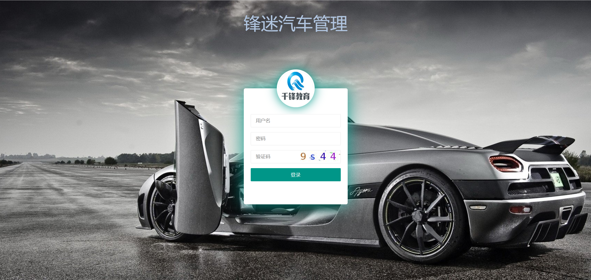
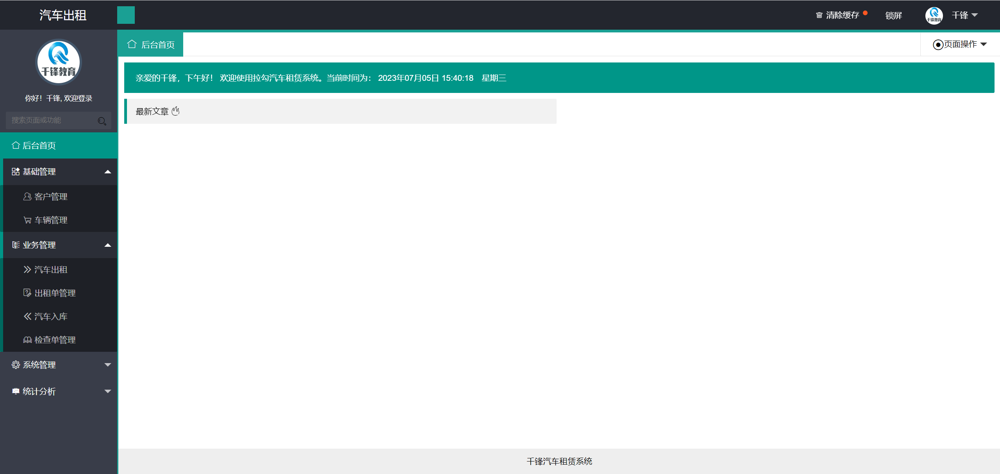
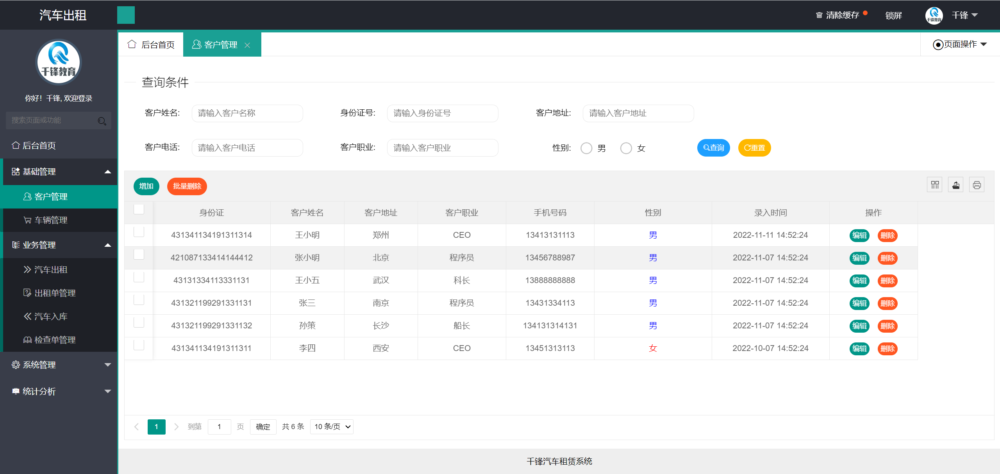
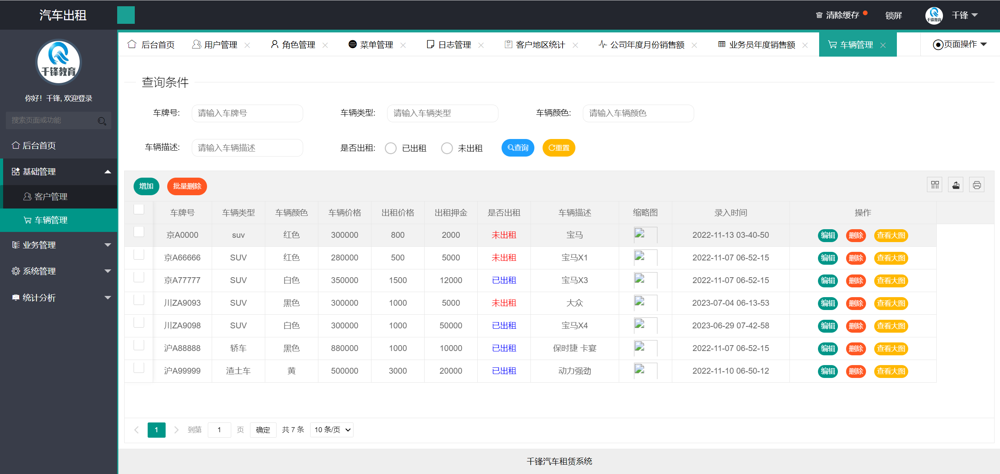
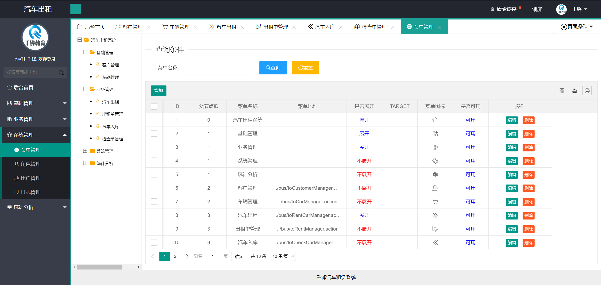
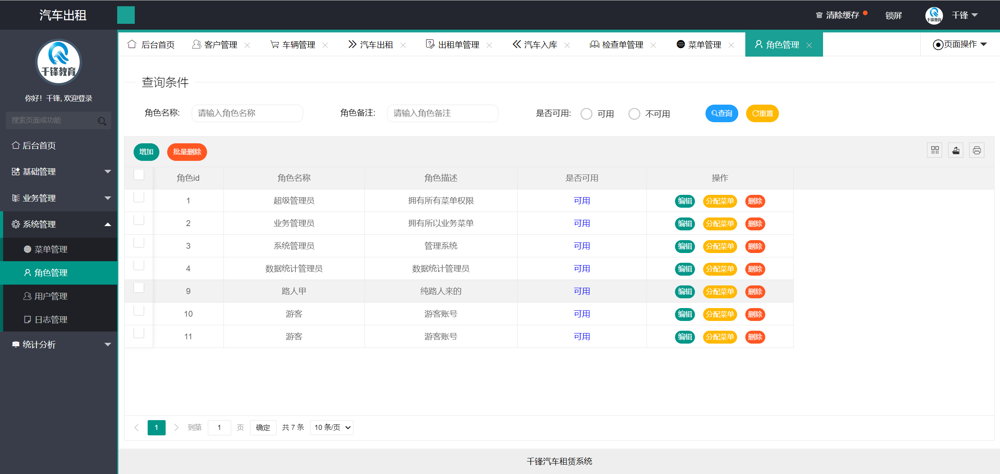
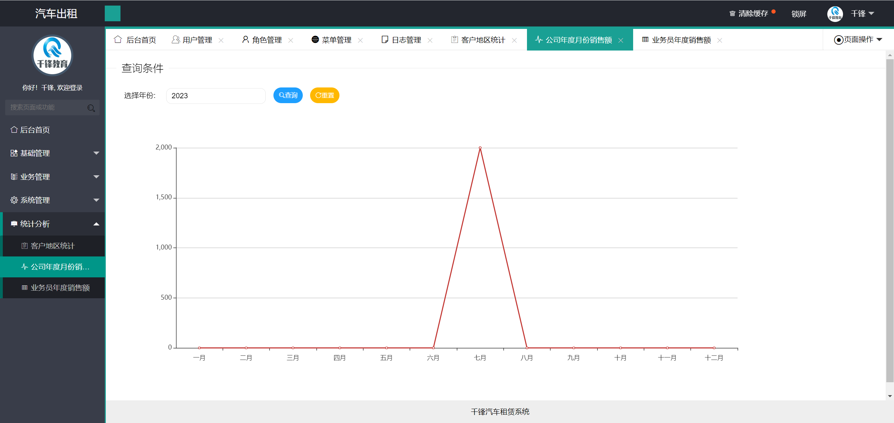
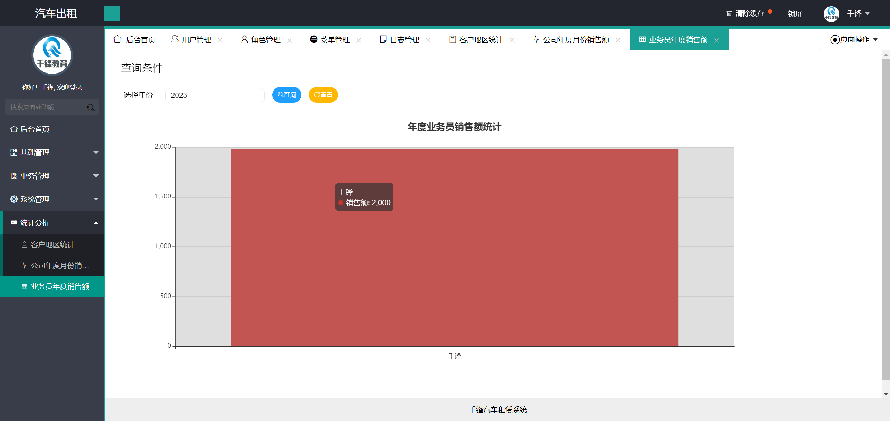
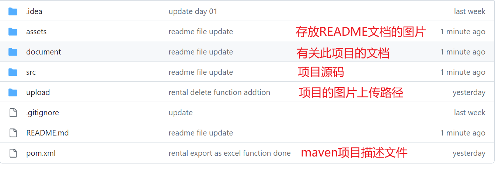
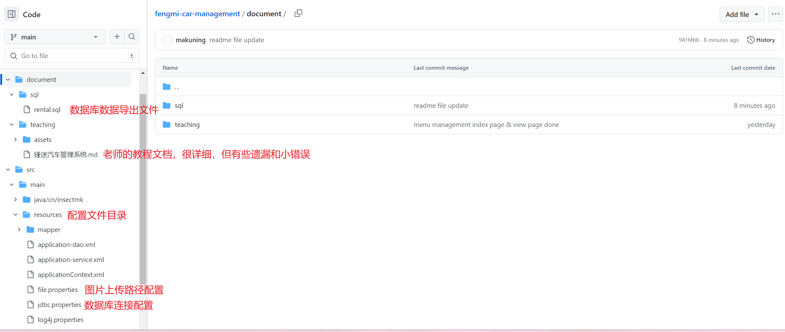

# 锋迷汽车管理系统

## 简介

[千锋教育](http://www.mobiletrain.org/)专周项目实战项目

使用技术：**Spring**，**Spring MVC**，**Mybatis**，**LayUI**。

项目本身设计有些问题，代码实现也有很多缺陷与BUG，安全性做的也有很大的问题。

本项目只适用于了解并练习MVC架构、MyBatis的使用逻辑与前后端之间的交互。

**项目亮点**

- 验证码生成
- 二维码生成
- Excel表格生成

[项目演示地址](http://car.rental.insectmk.cn/login/toLogin.action)，体验用户：账号**qianfeng**，密码**123456**

## 部分界面展示

### 界面





### 信息管理





### 权限管理





### 数据统计






## 仓库文件说明





## 运行项目

**详细步骤可以参考苏老师的步骤文档**，`"fengmi-car-management\document\teaching\锋迷汽车管理系统.md"`

本地需要以下环境

- [JDK1.8](https://www.oracle.com/java/technologies/javase/javase8-archive-downloads.html)
- [MySQL5.7](https://dev.mysql.com/downloads/mysql/5.7.html)
- [Tomcat8](https://tomcat.apache.org/download-80.cgi)
- [Maven3.6](https://maven.apache.org/)官网已不支持下载，不知道高版本是否兼容

本次项目使用的IDE是[Intellij IDEA 2022](https://www.jetbrains.com/idea/)，直接将整个仓库文件夹拖入IDEA，选择信任项目

在IDEA中配置好JDK、Tomcat与Maven

本地创建新的数据库，并运行项目导出的SQL文件`"fengmi-car-management\document\sql\rental.sql"`

更改数据库连接配置`"fengmi-car-management\src\main\resources\jdbc.properties"`

```properties
jdbc.driverClass=com.mysql.jdbc.Driver	# 数据库驱动
jdbc.jdbcUrl=jdbc:mysql://127.0.0.1/qf_car_rental?useUnicode=true&characterEncoding=UTF-8&useSSL=false	# 你的数据库连接地址
jdbc.user=qf_car_rental	# 数据库用户名
jdbc.password=mk123456	# 用户密码
```
