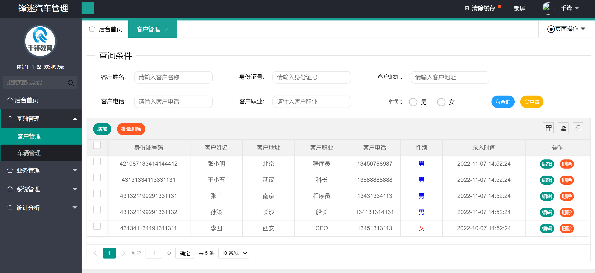
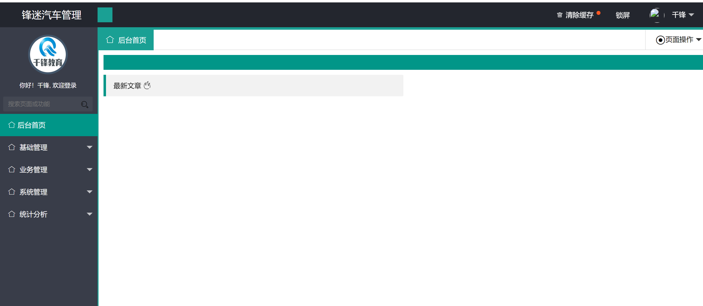

# 锋迷汽车管理系统

> 作者：强哥
>
> 版本：QF1.0
>
> 版权：千锋java教研院

## 第1章  需求分析与环境搭建

### 1.1需求描述

**项目描述**

千锋科技针针对与汽车做了管理系统，管理系统中不仅有客户的管理还有车辆租赁的管理，租赁车辆公司对于租车的流程，租车过程的问题，对于客户的维护及不同维度统计租车的情况做数据化管理，方便租车公司更好的维护车辆和车辆的信息。

功能：

**1.基础模块主要是客户信息和车辆信息管理；**

**2.业务模块主要是客户进行租车，归还车，保修单打印等；**

**3.系统模块维护用户角色日志等基础功能；**

**4.统计模块可以按时间对车辆，客户进行统计，以饼形图的形式展示。**

**运行环境**

jdk8+tomcat8+mysql5.7+IntelliJ IDEA+maven 

**项目技术(必填)**

spring+spring mvc+mybatis+layui+jquery 


### 1.2 项目演示





具体的功能依次使用


### 1.3 项目环境搭建

#### 1.3.1 构建项目

> 创建项目结构

采用maven的webapp骨架构建项目


项目的目录结构分别为三成: bus业务管理  sys系统管理   stat统计分析


#### 1.3.2 引入依赖

pom.xml

```xml
<?xml version="1.0" encoding="UTF-8"?>
<project xmlns="http://maven.apache.org/POM/4.0.0"
         xmlns:xsi="http://www.w3.org/2001/XMLSchema-instance"
         xsi:schemaLocation="http://maven.apache.org/POM/4.0.0 http://maven.apache.org/xsd/maven-4.0.0.xsd">
    <modelVersion>4.0.0</modelVersion>

    <groupId>com.qianfeng</groupId>
    <artifactId>carRental-demo</artifactId>
    <version>1.0-SNAPSHOT</version>
    <packaging>war</packaging>

    <name>carRental Maven Webapp</name>
    <!-- FIXME change it to the project's website -->
    <url>http://www.example.com</url>

    <properties>
        <project.build.sourceEncoding>UTF-8</project.build.sourceEncoding>
        <maven.compiler.source>1.8</maven.compiler.source>
        <maven.compiler.target>1.8</maven.compiler.target>
        <!--spring版本锁定-->
        <spring.version>5.0.2.RELEASE</spring.version>
        <slf4j.version>1.6.6</slf4j.version>
        <log4j.version>1.2.12</log4j.version>
        <mysql.version>5.1.6</mysql.version>
        <mybatis.version>3.4.5</mybatis.version>
    </properties>

    <dependencies>

        <!--引入pagehelper分页插件-->
        <dependency>
            <groupId>com.github.pagehelper</groupId>
            <artifactId>pagehelper</artifactId>
            <version>5.1.2</version>
        </dependency>


        <!--spring、springMVC-->
        <dependency>
            <groupId>org.aspectj</groupId>
            <artifactId>aspectjweaver</artifactId>
            <version>1.6.8</version>
        </dependency>

        <dependency>
            <groupId>org.springframework</groupId>
            <artifactId>spring-context</artifactId>
            <version>${spring.version}</version>
        </dependency>

        <dependency>
            <groupId>org.springframework</groupId>
            <artifactId>spring-web</artifactId>
            <version>${spring.version}</version>
        </dependency>

        <dependency>
            <groupId>org.springframework</groupId>
            <artifactId>spring-webmvc</artifactId>
            <version>${spring.version}</version>
        </dependency>

        <dependency>
            <groupId>org.springframework</groupId>
            <artifactId>spring-aop</artifactId>
            <version>${spring.version}</version>
        </dependency>

        <dependency>
            <groupId>org.springframework</groupId>
            <artifactId>spring-test</artifactId>
            <version>${spring.version}</version>
        </dependency>

        <dependency>
            <groupId>org.springframework</groupId>
            <artifactId>spring-tx</artifactId>
            <version>${spring.version}</version>
        </dependency>

        <dependency>
            <groupId>org.springframework</groupId>
            <artifactId>spring-jdbc</artifactId>
            <version>${spring.version}</version>
        </dependency>


        <dependency>
            <groupId>junit</groupId>
            <artifactId>junit</artifactId>
            <version>4.12</version>
            <scope>compile</scope>
        </dependency>

        <dependency>
            <groupId>mysql</groupId>
            <artifactId>mysql-connector-java</artifactId>
            <version>${mysql.version}</version>
        </dependency>

        <dependency>
            <groupId>javax.servlet</groupId>
            <artifactId>servlet-api</artifactId>
            <version>2.5</version>
            <scope>provided</scope>
        </dependency>

        <dependency>
            <groupId>javax.servlet.jsp</groupId>
            <artifactId>jsp-api</artifactId>
            <version>2.0</version>
            <scope>provided</scope>
        </dependency>

        <dependency>
            <groupId>jstl</groupId>
            <artifactId>jstl</artifactId>
            <version>1.2</version>
        </dependency>

        <!-- log start -->
        <dependency>
            <groupId>log4j</groupId>
            <artifactId>log4j</artifactId>
            <version>${log4j.version}</version>
        </dependency>

        <dependency>
            <groupId>org.slf4j</groupId>
            <artifactId>slf4j-api</artifactId>
            <version>${slf4j.version}</version>
        </dependency>

        <dependency>
            <groupId>org.slf4j</groupId>
            <artifactId>slf4j-log4j12</artifactId>
            <version>${slf4j.version}</version>
        </dependency>

        <dependency>
            <groupId>org.mybatis</groupId>
            <artifactId>mybatis</artifactId>
            <version>${mybatis.version}</version>
        </dependency>

        <!--spring整合mybatis-->
        <dependency>
            <groupId>org.mybatis</groupId>
            <artifactId>mybatis-spring</artifactId>
            <version>2.0.1</version>
        </dependency>

        <dependency>
            <groupId>com.mchange</groupId>
            <artifactId>c3p0</artifactId>
            <version>0.9.2</version>
        </dependency>

        <!--返回json字符串的支持-->
        <dependency>
            <groupId>com.fasterxml.jackson.core</groupId>
            <artifactId>jackson-databind</artifactId>
            <version>2.9.1</version>
        </dependency>

        <dependency>
            <groupId>com.fasterxml.jackson.core</groupId>
            <artifactId>jackson-core</artifactId>
            <version>2.9.0</version>
        </dependency>

        <dependency>
            <groupId>com.fasterxml.jackson.core</groupId>
            <artifactId>jackson-annotations</artifactId>
            <version>2.9.0</version>
        </dependency>

        <!--文件上传-->
        <dependency>
            <groupId>commons-io</groupId>
            <artifactId>commons-io</artifactId>
            <version>2.6</version>
        </dependency>

        <dependency>
            <groupId>commons-fileupload</groupId>
            <artifactId>commons-fileupload</artifactId>
            <version>1.3.3</version>
        </dependency>

        <dependency>
            <groupId>commons-logging</groupId>
            <artifactId>commons-logging</artifactId>
            <version>1.2</version>
        </dependency>

        <dependency>
            <groupId>javax.servlet</groupId>
            <artifactId>javax.servlet-api</artifactId>
            <version>3.1.0</version>
        </dependency>

        <dependency>
            <groupId>org.springframework</groupId>
            <artifactId>spring-aspects</artifactId>
            <version>4.3.7.RELEASE</version>
        </dependency>

        <!--druid数据库连接池-->
        <dependency>
            <groupId>com.alibaba</groupId>
            <artifactId>druid</artifactId>
            <version>1.1.20</version>
        </dependency>

        <!--定时任务-->
        <dependency>
            <groupId>org.quartz-scheduler</groupId>
            <artifactId>quartz</artifactId>
            <version>2.3.1</version>
        </dependency>

        <!--POI excel导出-->
        <dependency>
            <groupId>org.apache.poi</groupId>
            <artifactId>poi</artifactId>
            <version>4.1.0</version>
        </dependency>

        <!--hutool-->
        <dependency>
            <groupId>cn.hutool</groupId>
            <artifactId>hutool-all</artifactId>
            <version>4.6.8</version>
        </dependency>

    </dependencies>

    <build>
        <finalName>carRental</finalName>
        <pluginManagement><!-- lock down plugins versions to avoid using Maven defaults (may be moved to parent pom) -->
            <plugins>
                <plugin>
                    <artifactId>maven-clean-plugin</artifactId>
                    <version>3.1.0</version>
                </plugin>
                <!-- see http://maven.apache.org/ref/current/maven-core/default-bindings.html#Plugin_bindings_for_war_packaging -->
                <plugin>
                    <artifactId>maven-resources-plugin</artifactId>
                    <version>3.0.2</version>
                </plugin>
                <plugin>
                    <artifactId>maven-compiler-plugin</artifactId>
                    <version>3.8.0</version>
                </plugin>
                <plugin>
                    <artifactId>maven-surefire-plugin</artifactId>
                    <version>2.22.1</version>
                </plugin>
                <plugin>
                    <artifactId>maven-war-plugin</artifactId>
                    <version>3.2.2</version>
                </plugin>
                <plugin>
                    <artifactId>maven-install-plugin</artifactId>
                    <version>2.5.2</version>
                </plugin>
                <plugin>
                    <artifactId>maven-deploy-plugin</artifactId>
                    <version>2.8.2</version>
                </plugin>
            </plugins>
        </pluginManagement>
    </build>
</project>
```


#### 1.3.3 配置文件

jdbc.properties

```properties
jdbc.driverClass=com.mysql.jdbc.Driver
jdbc.jdbcUrl=jdbc:mysql://localhost:3306/test02?useUnicode=true&characterEncoding=UTF-8&useSSL=false
jdbc.user=root
jdbc.password=root
```


log4j.properties

```properties
# Global logging configuration
log4j.rootLogger=DEBUG, stdout
# MyBatis logging configuration...
log4j.logger.org.mybatis.example.BlogMapper=TRACE
# Console output...
log4j.appender.stdout=org.apache.log4j.ConsoleAppender
log4j.appender.stdout.layout=org.apache.log4j.PatternLayout
log4j.appender.stdout.layout.ConversionPattern=%5p [%t] - %m%n
```


application-dao.xml

```xml
<?xml version="1.0" encoding="UTF-8"?>
<beans xmlns="http://www.springframework.org/schema/beans"
       xmlns:xsi="http://www.w3.org/2001/XMLSchema-instance"
       xmlns:context="http://www.springframework.org/schema/context"
       xmlns:aop="http://www.springframework.org/schema/aop"
       xsi:schemaLocation="http://www.springframework.org/schema/beans http://www.springframework.org/schema/beans/spring-beans.xsd
		http://www.springframework.org/schema/context http://www.springframework.org/schema/context/spring-context.xsd
		http://www.springframework.org/schema/aop http://www.springframework.org/schema/aop/spring-aop.xsd">
    <!--引入db.properties-->
    <bean id="placeholderConfigurer" class="org.springframework.context.support.PropertySourcesPlaceholderConfigurer">
        <property name="locations" value="classpath:jdbc.properties"/>
    </bean>

    <!--声明dataSource 使用c3p0数据源-->
    <bean id="dataSource1" class="com.mchange.v2.c3p0.ComboPooledDataSource">
        <!--注入连接属性-->
        <property name="driverClass" value="${jdbc.driverClass}"/>
        <property name="jdbcUrl" value="${jdbc.jdbcUrl}"/>
        <property name="user" value="${jdbc.user}"/>
        <property name="password" value="${jdbc.password}"/>
        <!--初始化连接池大小-->
        <property name="initialPoolSize" value="5"/>
        <!--设置最大连接数-->
        <property name="maxPoolSize" value="50"/>
        <!--设置最小的连接数-->
        <property name="minPoolSize" value="10"/>
    </bean>

    <!--使用druid数据源-->
    <bean id="dataSource" class="com.alibaba.druid.pool.DruidDataSource" init-method="init">
        <!--注入连接属性-->
        <property name="driverClassName" value="${jdbc.driverClass}"/>
        <property name="url" value="${jdbc.jdbcUrl}"/>
        <property name="username" value="${jdbc.user}"/>
        <property name="password" value="${jdbc.password}"/>
        <!--初始化连接池大小-->
        <property name="initialSize" value="5"></property>
        <!--设置最大连接数-->
        <property name="maxActive" value="10"></property>
        <!--设置等待时间-->
        <property name="maxWait" value="5000"></property>
        <property name="filters" value="stat"></property>
    </bean>

    <!--声明sessionFactory 并注入mybatis.cfg.xml-->
    <bean id="sqlSessionFactory" class="org.mybatis.spring.SqlSessionFactoryBean">
        <!--注入数据源-->
        <property name="dataSource" ref="dataSource"></property>
        <property name="configLocation" value="classpath:mybatis-config.xml"/>
        <!--注入mapper.xml-->
        <property name="mapperLocations">
            <array>
                <value>classpath:mapper/*/*Mapper.xml</value>
            </array>
        </property>
    </bean>

    <!--扫描mapper接口-->
    <bean class="org.mybatis.spring.mapper.MapperScannerConfigurer">
        <!--注入mapper接口所在的包-->
        <property name="basePackage" value="com.qianfeng.bus.mapper,com.qianfeng.sys.mapper,com.qianfeng.stat.mapper">
        </property>
        <!--注入sqlSessionFactory-->
        <property name="sqlSessionFactoryBeanName" value="sqlSessionFactory"/>
    </bean>
</beans>
```


application-service.xml

```xml
<?xml version="1.0" encoding="UTF-8"?>
<beans xmlns="http://www.springframework.org/schema/beans"
       xmlns:xsi="http://www.w3.org/2001/XMLSchema-instance"
       xmlns:context="http://www.springframework.org/schema/context"
       xmlns:aop="http://www.springframework.org/schema/aop"
       xmlns:tx="http://www.springframework.org/schema/tx"
       xsi:schemaLocation="http://www.springframework.org/schema/beans http://www.springframework.org/schema/beans/spring-beans.xsd
		http://www.springframework.org/schema/context http://www.springframework.org/schema/context/spring-context.xsd
		http://www.springframework.org/schema/aop http://www.springframework.org/schema/aop/spring-aop.xsd
		http://www.springframework.org/schema/tx http://www.springframework.org/schema/tx/spring-tx.xsd">

        <!--扫描服务层-->
        <context:component-scan base-package="com.qianfeng.sys.service.impl"/>
        <context:component-scan base-package="com.qianfeng.bus.service.impl"/>
         <context:component-scan base-package="com.qianfeng.stat.service.impl"/>

    <!-- 1,声明事务管理器 -->
    <bean id="transactionManager" class="org.springframework.jdbc.datasource.DataSourceTransactionManager">
            <property name="dataSource" ref="dataSource"/>
    </bean>

    <!-- 2,声明事务的传播特性 也就是通知 -->
    <tx:advice id="advise" transaction-manager="transactionManager">
        <tx:attributes>
            <!-- 以add开头的方法名需要事务 -->
            <tx:method name="add*" propagation="REQUIRED"/>
            <tx:method name="save*" propagation="REQUIRED"/>
            <tx:method name="update*" propagation="REQUIRED"/>
            <tx:method name="delete*" propagation="REQUIRED"/>
            <tx:method name="change*" propagation="REQUIRED"/>
            <tx:method name="reset*" propagation="REQUIRED"/>
            <tx:method name="get*" read-only="true"/>
            <tx:method name="load*" read-only="true"/>
            <tx:method name="*" read-only="true"/>
        </tx:attributes>
    </tx:advice>
    <!-- 3进行AOP织入 -->
    <aop:config>
        <!-- 声明切面 -->
        <aop:pointcut expression="execution(* com.qianfeng.sys.service.impl.*.*(..))" id="pc1"/>
        <aop:pointcut expression="execution(* com.qianfeng.bus.service.impl.*.*(..))" id="pc2"/>
        <aop:pointcut expression="execution(* com.qianfeng.stat.service.impl.*.*(..))" id="pc3"/>
        <!-- 织入 -->
        <aop:advisor advice-ref="advise" pointcut-ref="pc1"/>
        <aop:advisor advice-ref="advise" pointcut-ref="pc2"/>
        <aop:advisor advice-ref="advise" pointcut-ref="pc3"/>
    </aop:config>
</beans>
```

applicationContext.xml

```xml
<?xml version="1.0" encoding="UTF-8"?>
<beans xmlns="http://www.springframework.org/schema/beans"
       xmlns:xsi="http://www.w3.org/2001/XMLSchema-instance"
       xmlns:context="http://www.springframework.org/schema/context"
       xmlns:aop="http://www.springframework.org/schema/aop"
       xsi:schemaLocation="http://www.springframework.org/schema/beans http://www.springframework.org/schema/beans/spring-beans.xsd
		http://www.springframework.org/schema/context http://www.springframework.org/schema/context/spring-context.xsd
		http://www.springframework.org/schema/aop http://www.springframework.org/schema/aop/spring-aop.xsd">

    <!--告知spring在创建容器时要扫描的包-->
    <context:component-scan base-package="com.qianfeng.sys,com.qianfeng.bus,com.qianfeng.stat">
    </context:component-scan>
    <import resource="classpath:application-dao.xml"/>
    <import resource="classpath:application-service.xml"/>
</beans>

```


springmvc.xml

```xml
<?xml version="1.0" encoding="UTF-8"?>
<beans xmlns="http://www.springframework.org/schema/beans"
       xmlns:xsi="http://www.w3.org/2001/XMLSchema-instance"
       xmlns:context="http://www.springframework.org/schema/context"
       xmlns:mvc="http://www.springframework.org/schema/mvc"
       xsi:schemaLocation="http://www.springframework.org/schema/mvc http://www.springframework.org/schema/mvc/spring-mvc.xsd
		http://www.springframework.org/schema/beans http://www.springframework.org/schema/beans/spring-beans.xsd
		http://www.springframework.org/schema/context http://www.springframework.org/schema/context/spring-context.xsd">
        <!--扫描controller-->
        <context:component-scan base-package="com.qianfeng.sys.controller"/>
        <context:component-scan base-package="com.qianfeng.bus.controller"/>
        <context:component-scan base-package="com.qianfeng.stat.controller"/>

        <!--配置映射器和适配器-->
        <mvc:annotation-driven/>

        <!--配置视图解析器-->
        <bean class="org.springframework.web.servlet.view.InternalResourceViewResolver">
            <property name="viewClass" value="org.springframework.web.servlet.view.JstlView"/>
            <property name="prefix" value="/WEB-INF/view/"/>
            <property name="suffix" value=".jsp"/>
        </bean>


        <!--配置静态文件放行-->
    	<!--会在Spring MVC上下文中定义一个org.springframework.web.servlet.resource.DefaultServletHttpRequestHandler，它会像一个检查员，对进入DispatcherServlet的URL进行筛查，如果发现是静态资源的请求，就将该请求转由Web应用服务器默认的Servlet处理，如果不是静态资源的请求，才由DispatcherServlet继续处理。-->
        <mvc:default-servlet-handler/>
</beans>
```


mybatis-config.xml

```xml
<?xml version="1.0" encoding="UTF-8" ?>
<!DOCTYPE configuration
        PUBLIC "-//mybatis.org//DTD Config 3.0//EN"
        "http://mybatis.org/dtd/mybatis-3-config.dtd">
<configuration>
    <settings>
        <setting name="mapUnderscoreToCamelCase" value="true"/>
    </settings>

    <typeAliases>
        <package name="com.qianfeng.domain"/>
    </typeAliases>

    <plugins>
        <plugin interceptor="com.github.pagehelper.PageInterceptor">
        </plugin>
    </plugins>
</configuration>
```


web.xml

```xml
<?xml version="1.0" encoding="UTF-8"?>
<web-app xmlns="http://xmlns.jcp.org/xml/ns/javaee"
         xmlns:xsi="http://www.w3.org/2001/XMLSchema-instance"
         xsi:schemaLocation="http://xmlns.jcp.org/xml/ns/javaee http://xmlns.jcp.org/xml/ns/javaee/web-app_3_1.xsd"
         version="3.1">
  <display-name>Archetype Created Web Application</display-name>


  <!-- 编码过滤器开始 -->
  <filter>
    <filter-name>EncodeingFilter</filter-name>
    <filter-class>org.springframework.web.filter.CharacterEncodingFilter</filter-class>
    <init-param>
      <param-name>encoding</param-name>
      <param-value>UTF-8</param-value>
    </init-param>
  </filter>
  <filter-mapping>
    <filter-name>EncodeingFilter</filter-name>
    <servlet-name>springmvc</servlet-name>
  </filter-mapping>
  <!-- 编码过滤器结束 -->


  <!-- 监听器开始 -->
  <listener>
    <listener-class>org.springframework.web.context.ContextLoaderListener</listener-class>
  </listener>
  <context-param>
    <param-name>contextConfigLocation</param-name>
    <param-value>classpath:applicationContext.xml</param-value>
  </context-param>
  <!-- 监听器结束 -->


  <!-- 前端控制器开始 -->
  <servlet>
    <servlet-name>springmvc</servlet-name>
    <servlet-class>org.springframework.web.servlet.DispatcherServlet</servlet-class>
    <init-param>
      <param-name>contextConfigLocation</param-name>
      <param-value>classpath:springmvc.xml</param-value>
    </init-param>
    <load-on-startup>1</load-on-startup>
  </servlet>
  <servlet-mapping>
    <servlet-name>springmvc</servlet-name>
    <url-pattern>*.action</url-pattern>
  </servlet-mapping>

</web-app>

```


#### 1.3.4 引入静态资源


### 1.4 通用模块实现

> 1.封装常量

关于项目中用到的描述信息，状态信息项目在接口中封装常量，方便我们以后调用

SysConstant 

```java
/**
 * 常量接口状态码
 */
public interface SysConstant {

    String USER_LOGIN_ERROR_MSG="用户名或码不正确";
    String USER_LOGIN_CODE_ERROR_MSG = "验证码不正确";

    /**
     *可用状态
     */
    Integer AVAILABLE_TRUE = 1;
    Integer AVAILABLE_FALSE = 0;

    /**
     * 用户类型
     */
    Integer USER_TYPE_SUPER = 1;
    Integer USER_TYPE_NORMAL = 2;


    /**
     * 是否展开
     */
    Integer SPREAD_TRUE = 1;
    Integer SPREAD_FALSE = 0;

    /**
     *操作状态
     * */

    String ADD_SUCCESS="添加成功";
    String ADD_ERROR="添加失败";

    String UPDATE_SUCCESS="修改成功";
    String UPDATE_ERROR="修改失败";

    String DELETE_SUCCESS="删除成功";
    String DELETE_ERROR="删除失败";

    String RESET_SUCCESS="重置成功";
    String RESET_ERROR="重置失败";

    String DISPATCH_SUCCESS="分配成功";
    String DISPATCH_ERROR="分配失败";

    Integer CODE_SUCCESS = 0;//操作成功
    Integer CODE_ERROR = -1;//操作失败

    /**
     * 公用常量
     */
    Integer CODE_ZERO = 0;
    Integer CODE_ONE = 1;
    Integer CODE_TWO = 2;
    Integer CODE_THREE = 3;

    /**
     * 用户默认密码
     */
    String USER_DEFAULT_PWD="123456";

    /**
     * 临时文件标记
     */
    String FILE_UPLOAD_TEMP = "_temp";

    /**
     * 默认图片地址
     */
    Object DEFAULT_CAR_IMG = "images/defaultcarimage.jpg";

    /**
     * 单号的前缀
     */
    String CAR_ORDER_CZ = "CZ";
    String CAR_ORDER_JC = "JC";

    /**
     * 归还状态
     */
    Integer RENT_BACK_FALSE = 0; //未归还
    Integer RENT_BACK_TRUE = 1; //已归还

    /**
     * 出租状态
     */
    Integer RENT_CAR_TRUE = 1; //已出租
    Integer RENT_CAR_FALSE = 0; //未出租
}

```


> 2.封装服务器返回对象

服务器返回数据类型我们统一封装到ResultObj对象中，并且提供静态方法返回常量信息。

```java
public class ResultObj {
    private Integer code;
    private String msg;


    /**
     * 添加成功
     */
    public static final ResultObj ADD_SUCCESS = new ResultObj(SysConstant.CODE_SUCCESS,SysConstant.ADD_SUCCESS);
    /**
     * 添加失败
     */
    public static final ResultObj ADD_ERROR = new ResultObj(SysConstant.CODE_ERROR,SysConstant.ADD_ERROR);
    /**
     * 更新成功
     */
    public static final ResultObj UPDATE_SUCCESS = new ResultObj(SysConstant.CODE_SUCCESS,SysConstant.UPDATE_SUCCESS);
    /**
     * 更新失败
     */
    public static final ResultObj UPDATE_ERROR = new ResultObj(SysConstant.CODE_ERROR,SysConstant.UPDATE_ERROR);
    /**
     * 删除成功
     */
    public static final ResultObj DELETE_SUCCESS = new ResultObj(SysConstant.CODE_SUCCESS,SysConstant.DELETE_SUCCESS);
    /**
     * 删除失败
     */
    public static final ResultObj DELETE_ERROR = new ResultObj(SysConstant.CODE_ERROR,SysConstant.DELETE_ERROR);
    /**
     * 重置成功
     */
    public static final ResultObj RESET_SUCCESS = new ResultObj(SysConstant.CODE_SUCCESS,SysConstant.RESET_SUCCESS);
    /**
     * 重置失败
     */
    public static final ResultObj RESET_ERROR = new ResultObj(SysConstant.CODE_ERROR,SysConstant.RESET_ERROR);
    /**
     * 分配成功
     */
    public static final ResultObj DISPATCH_SUCCESS = new ResultObj(SysConstant.CODE_SUCCESS,SysConstant.DISPATCH_SUCCESS);
    /**
     * 分配失败
     */
    public static final ResultObj DISPATCH_ERROR = new ResultObj(SysConstant.CODE_ERROR,SysConstant.DISPATCH_ERROR);

    /**
     * 状态码0 成功
     */
    public static final ResultObj STATUS_TRUE = new ResultObj(SysConstant.CODE_SUCCESS);

    /**
     * 状态码-1 失败
     */
    public static final ResultObj STATUS_FALSE = new ResultObj(SysConstant.CODE_ERROR);

    private ResultObj(Integer code, String msg) {
        this.code = code;
        this.msg = msg;
    }

    private ResultObj(Integer code) {
        this.code = code;
    }

    public Integer getCode() {
        return code;
    }

    public void setCode(Integer code) {
        this.code = code;
    }

    public String getMsg() {
        return msg;
    }

    public void setMsg(String msg) {
        this.msg = msg;
    }

}
```


### 1.5 项目环境测试

#### 1.5.1 测试目标

通过转账案例来测试ssm环境及ResultObj可以正常返回

#### 1.5.2 测试方式

1)创建account账户表

```sql
CREATE DATABASE `rental` DEFAULT CHARSET='utf8';
USE `rental`;
create table account (
	username varchar(32),
    money double
);
insert into account values ('jerry',1000);
insert into account values('tom',1000);
```


2)编写AccountMapper接口

```java
package com.qianfeng.mapper;

import org.apache.ibatis.annotations.Param;

public interface AccountMapper {

    //转入钱
    public void transferIn(@Param("name") String name, @Param("money")double money);

    //转出钱
    public void transferOut(@Param("name") String name, @Param("money")double money);
}

```

3)编写AccountMapper.xml 映射文件

```xml
<?xml version="1.0" encoding="UTF-8" ?>
<!DOCTYPE mapper PUBLIC "-//mybatis.org//DTD Mapper 3.0//EN" "http://mybatis.org/dtd/mybatis-3-mapper.dtd" >

<mapper namespace="com.qianfeng.mapper.AccountMapper">

    <!--  转入  -->
     <update id="transferIn"   >
         update account set money = money + #{money} where username = #{name}
     </update>

    <!--   转出 -->
    <update id="transferOut"   >
         update account set money = money - #{money} where username = #{name}
     </update>
</mapper>
```


4)编写AccountService

```java
package com.qianfeng.sys.service;

public interface IAccountService {

    //转账
    public int updateTransfer(String inName, String outName , double money);
}
```


5)编写AccountServiceImpl

```java
@Service
@Transactional  //事务控制
public class AccountServiceImpl implements IAccountService {

    @Autowired
    private AccountMapper mapper;

    @Override
    public int updateTransfer(String inName, String outName, double money) {
        try{
            //调用转入
            mapper.transferIn(inName,money);
            //调用转出
            mapper.transferOut(outName,money);
            return 0;
        }catch (Exception e){
            System.out.println(e);
            return 1;
        }
    }
}
```


6)Controller层代码测试类

```java
@Controller
@RequestMapping("/account")
public class AccountController {

    @Autowired
    private IAccountService service;

    @RequestMapping("transfer")
    @ResponseBody
    @Transactional
    public ResultObj accountTransfer(String inName, String outName, double money){
        int status = service.updateTransfer(inName, outName, money);
        //如果执行转账成功
        if(status > 0 ){
            return ResultObj.STATUS_TRUE;
        }else{
            return  ResultObj.STATUS_FALSE;
        }
    }
}
```


7) 使用postman测试接口

`http://localhost:8080/test_Rental/account/transfer.action?inName=jack&outName=rose&money=100 `


## 第2章 基础管理模块

### 2.1 用户登录

#### 2.1.1 需求分析

当用户在浏览器上输入请求登录页面地址时,用户跳转到登录页面, 用户输入完用户名和密码，则完成登录功能。


#### 2.1.2 数据库表关系

在数据库中对应有sys_user表，各个字段如下含义


sys_user表

```sql
create database rentalCar default charset='utf8';

use rentalCarl;

DROP TABLE IF EXISTS `sys_user`;

CREATE TABLE `sys_user` (
  `userid` int(11) NOT NULL AUTO_INCREMENT COMMENT '用户id',
  `loginname` varchar(255) DEFAULT NULL COMMENT '登录名称',
  `identity` varchar(255) DEFAULT NULL COMMENT '身份证号码',
  `realname` varchar(255) DEFAULT NULL COMMENT '真实姓名',
  `sex` int(255) DEFAULT NULL COMMENT '性别(0女1男)',
  `address` varchar(255) DEFAULT NULL COMMENT '地址',
  `phone` varchar(255) DEFAULT NULL COMMENT '电话号码',
  `pwd` varchar(255) DEFAULT NULL COMMENT '密码(密文)',
  `position` varchar(255) DEFAULT NULL COMMENT '职位',
  `type` int(255) DEFAULT '2' COMMENT '1，超级管理员,2，系统用户',
  `available` int(255) DEFAULT NULL COMMENT '是否可用(1可用 0不可用)',
  PRIMARY KEY (`userid`) USING BTREE
) ENGINE=InnoDB AUTO_INCREMENT=9 DEFAULT CHARSET=utf8 ROW_FORMAT=COMPACT;

/*Data for the table `sys_user` */

insert  into `sys_user`(`userid`,`loginname`,`identity`,`realname`,`sex`,`address`,`phone`,`pwd`,`position`,`type`,`available`) 
values 
(1,'qianfeng','4313341334413','千锋',1,'北京通州','13520109202','e10adc3949ba59abbe56e057f20f883e','CEO',1,1),
(2,'lisi','43311341311314341','李四',1,'武汉','1341314113131','e10adc3949ba59abbe56e057f20f883e','保洁',2,1),
(3,'wangwu','4313133131331312','王五',1,'武汉','13413131131','e10adc3949ba59abbe56e057f20f883e','领导',2,1),
(4,'xiaoming','45113141331131131','小明',0,'武昌','13451333131','e10adc3949ba59abbe56e057f20f883e','职员',2,1),
(5,'laowang','41113113331133','老王',1,'北京','13511333113','e10adc3949ba59abbe56e057f20f883e','总裁',2,1);
```


#### 2.1.3 接口设计

1)跳转：

```
http://localhost:8080/RentalCar/login/toLogin.action
```

2)生成验证码地址

```
http://localhost:8080/RentalCar/login/getCode.action
```

3)用户登录地址:

```
http://localhost:8080/RentalCar/login/login.action
```

- 请求方式：get
- 请求参数

| 参数名 | 参数说明     | 备注                 |
| ------ | ------------ | -------------------- |
| UserVo | 用户视图对象 | 封装用户前台展示信息 |

- 响应数据String

通过return String字符串完成页面跳转

- 登录成功return `system/main/index`

- 登录失败return `system/main/login`

#### 2.1.4 代码实现

1）实体User类

```java
public class User {
    //用户id
    private Integer userid;
    //登录名称
    private String loginname;
    //身份证号码
    private String identity;
    //真实姓名
    private String realname;
    //性别
    private Integer sex;
    //地址
    private String address;
    //电话
    private String phone;
    //密码
    private String pwd;
    //职位
    private String position;
    //用户类型
    private Integer type;
    //是否可用
    private Integer available;

    public Integer getUserid() {
        return userid;
    }

    public void setUserid(Integer userid) {
        this.userid = userid;
    }

    public String getLoginname() {
        return loginname;
    }

    public void setLoginname(String loginname) {
        this.loginname = loginname == null ? null : loginname.trim();
    }

    public String getIdentity() {
        return identity;
    }

    public void setIdentity(String identity) {
        this.identity = identity == null ? null : identity.trim();
    }

    public String getRealname() {
        return realname;
    }

    public void setRealname(String realname) {
        this.realname = realname == null ? null : realname.trim();
    }

    public Integer getSex() {
        return sex;
    }

    public void setSex(Integer sex) {
        this.sex = sex;
    }

    public String getAddress() {
        return address;
    }

    public void setAddress(String address) {
        this.address = address == null ? null : address.trim();
    }

    public String getPhone() {
        return phone;
    }

    public void setPhone(String phone) {
        this.phone = phone == null ? null : phone.trim();
    }

    public String getPwd() {
        return pwd;
    }

    public void setPwd(String pwd) {
        this.pwd = pwd == null ? null : pwd.trim();
    }

    public String getPosition() {
        return position;
    }

    public void setPosition(String position) {
        this.position = position == null ? null : position.trim();
    }

    public Integer getType() {
        return type;
    }

    public void setType(Integer type) {
        this.type = type;
    }

    public Integer getAvailable() {
        return available;
    }

    public void setAvailable(Integer available) {
        this.available = available;
    }
}

```


2）UserVo 用户视图对象，用于在页面展示用户信息

```java
public class UserVo extends User {
    /**
     * 分页参数
     */
    private Integer page;
    private Integer limit;

    private String code;

    /**
     * 接受多个角色的id
     */
    private Integer [] ids;


    public Integer[] getIds() {
        return ids;
    }

    public void setIds(Integer[] ids) {
        this.ids = ids;
    }

    public Integer getPage() {
        return page;
    }

    public void setPage(Integer page) {
        this.page = page;
    }

    public Integer getLimit() {
        return limit;
    }

    public void setLimit(Integer limit) {
        this.limit = limit;
    }

    public String getCode() {
        return code;
    }

    public void setCode(String code) {
        this.code = code;
    }
}

```


3）webUtils 工具类 , 该类提供一些静态通用方法

```java
public class WebUtils {
	
	public static ServletRequestAttributes getServletRequestAttributes() {
		return (ServletRequestAttributes) RequestContextHolder.getRequestAttributes();
	}
	
	/**
	 * 得到当前线程的请求对象
	 * @return
	 */
	public static HttpServletRequest getHttpServletRequest() {
		return getServletRequestAttributes().getRequest();
	}
	
	/**
	 * 得到当前线程的响应对象
	 */
	public static HttpServletResponse getHttpServletResponse() {
		return getServletRequestAttributes().getResponse();
	}
	
	/**
	 * 得到session对象
	 */
	public static HttpSession getHttpSession() {
		return getHttpServletRequest().getSession();
	}
	
	/**
	 * 得到servletContext对象
	 */
	public static String getServletContext() {
		return getHttpServletRequest().getServletPath();
	}

}

```


4）用户登录控制器LoginController 

```java
/**
 * 用户登录控制器
 */
@Controller
@RequestMapping("login")
public class LoginController {

    @Autowired
    private UserService userService;

    /**
     * @return 跳转到登录页面的方法
     */
    @RequestMapping("toLogin")
    public String toLogin(){
        return "system/main/login";
    }

    /**
     * .登陆方法
     * @param userVo
     * @param model
     * @return
     */
    @RequestMapping("login")
    public String login(UserVo userVo, Model model){
            String code = WebUtils.getHttpSession().getAttribute("code").toString();
        if(userVo.getCode().equals(code)){
            User user = this.userService.login(userVo);
            System.out.println("user = " + user);
            if(null!=user){
                //放入到session
                WebUtils.getHttpSession().setAttribute("user",user);

                return "system/main/index";
            }else {
                model.addAttribute("error", SysConstant.USER_LOGIN_ERROR_MSG);
                return "system/main/login";
            }
        }else {
            model.addAttribute("error", SysConstant.USER_LOGIN_CODE_ERROR_MSG);
            return "system/main/login";
        }
    }
    
    //获取验证码
    @RequestMapping("getCode")
    public void getCode(HttpServletResponse response, HttpSession session) throws IOException {
        //定义图形验证码的长和宽
        LineCaptcha lineCaptcha = CaptchaUtil.createLineCaptcha(116,36,4,5);
        session.setAttribute("code",lineCaptcha.getCode());
        ServletOutputStream outputStream = response.getOutputStream();
        ImageIO.write(lineCaptcha.getImage(),"JPEG",outputStream);

    }
}
```

5）业务层接口 UserService

```java
public interface UserService {
    /**
     * 用户登录
     * @param userVo
     * @return
     */
    User login(UserVo userVo);

}
```


6）业务层实现类

```java
@Service
public class UserServiceImpl implements UserService {

    @Autowired
    private UserMapper userMapper;


    @Override
    public User login(UserVo userVo) {
        //明文
        //生成密文
        String pwd = DigestUtils.md5DigestAsHex(userVo.getPwd().getBytes());
        userVo.setPwd(pwd);
        return userMapper.login(userVo);
    }
}
```

7）dao层接口UserMapper

```java
public interface UserMapper {
    /*
     *登录
     * */
    User login(User user);
}
```

8）UserMapper.xml 映射文件

```xml
<?xml version="1.0" encoding="UTF-8"?>
<!DOCTYPE mapper PUBLIC "-//mybatis.org//DTD Mapper 3.0//EN" "http://mybatis.org/dtd/mybatis-3-mapper.dtd">
<mapper namespace="com.qianfeng.sys.mapper.UserMapper">
  <resultMap id="BaseResultMap" type="com.qianfeng.sys.domain.User">
    <id column="userid" jdbcType="INTEGER" property="userid" />
    <result column="loginname" jdbcType="VARCHAR" property="loginname" />
    <result column="identity" jdbcType="VARCHAR" property="identity" />
    <result column="realname" jdbcType="VARCHAR" property="realname" />
    <result column="sex" jdbcType="INTEGER" property="sex" />
    <result column="address" jdbcType="VARCHAR" property="address" />
    <result column="phone" jdbcType="VARCHAR" property="phone" />
    <result column="pwd" jdbcType="VARCHAR" property="pwd" />
    <result column="position" jdbcType="VARCHAR" property="position" />
    <result column="type" jdbcType="INTEGER" property="type" />
    <result column="available" jdbcType="INTEGER" property="available" />
  </resultMap>
  <sql id="Base_Column_List">
    userid, loginname, identity, realname, sex, address, phone, pwd, position, type, 
    available
  </sql>
  <!-- 用户登陆 -->
   <select id="login"  resultMap="BaseResultMap">
    select 
    <include refid="Base_Column_List" />
    from sys_user
    where loginname=#{loginname} and pwd=#{pwd}
  </select>
</mapper>
```

9）login.jsp 登录前台代码实现

```html
<%@ page language="java" contentType="text/html; charset=UTF-8"
    pageEncoding="UTF-8"%>
<!DOCTYPE html>
<html class="loginHtml">
<head>
	<meta charset="utf-8">
	<title>登录-汽车出租系统</title>
	<meta name="renderer" content="webkit">
	<meta http-equiv="X-UA-Compatible" content="IE=edge,chrome=1">
	<meta name="viewport" content="width=device-width, initial-scale=1, maximum-scale=1">
	<meta name="apple-mobile-web-app-status-bar-style" content="black">
	<meta name="apple-mobile-web-app-capable" content="yes">
	<meta name="format-detection" content="telephone=no">
	<link rel="icon" href="${pageContext.request.contextPath}/resources/favicon.ico">
	<link rel="stylesheet" href="${pageContext.request.contextPath}/resources/layui/css/layui.css" media="all" />
	<link rel="stylesheet" href="${pageContext.request.contextPath}/resources/css/public.css" media="all" />
</head>
<body class="loginBody">
<br><br>
<h1 align="center"  style="color:LightSteelBlue ; font-size: 50px">千锋汽车租赁系统</h1>
	<br><br>
	<form class="layui-form" id="loginFrm" method="post" action="${pageContext.request.contextPath}/login/login.action">
		<div class="login_face"></div>
		<div class="layui-form-item input-item">
			<label for="loginname">用户名</label>
			<input type="text" placeholder="请输入用户名" autocomplete="off" name="loginname" id="loginname" class="layui-input" lay-verify="required">
		</div>
		<div class="layui-form-item input-item">
			<label for="pwd">密码</label>
			<input type="password" placeholder="请输入密码" autocomplete="off" name="pwd" id="pwd" class="layui-input" lay-verify="required">
		</div>
		<div class="layui-form-item input-item" id="imgCode">
			<label for="code">验证码</label>
			<input type="text" placeholder="请输入验证码" autocomplete="off" name="code" id="code" class="layui-input">
			
		</div>
		<div class="layui-form-item">
			<button class="layui-btn layui-block" lay-filter="login" lay-submit>登录</button>
		</div>
		<div class="layui-form-item layui-row" style="text-align: center;color: red;">
			${error}
		</div>
	</form>
	<script type="text/javascript" src="${pageContext.request.contextPath}/resources/layui/layui.js"></script>
	<script type="text/javascript" src="${pageContext.request.contextPath}/resources/js/cache.js"></script>
	<script type="text/javascript">
	layui.use(['form','layer','jquery'],function(){
	    var form = layui.form,
	        layer = parent.layer === undefined ? layui.layer : top.layer
	        $ = layui.jquery;
	    //登录按钮
	    form.on("submit(login)",function(data){
	        $(this).text("登录中...").attr("disabled","disabled").addClass("layui-disabled");
	        setTimeout(function(){
	           $("#loginFrm").submit();
	        },1000);
	        return false;
	    })

	    //表单输入效果
	    $(".loginBody .input-item").click(function(e){
	        e.stopPropagation();
	        $(this).addClass("layui-input-focus").find(".layui-input").focus();
	    })
	    $(".loginBody .layui-form-item .layui-input").focus(function(){
	        $(this).parent().addClass("layui-input-focus");
	    })
	    $(".loginBody .layui-form-item .layui-input").blur(function(){
	        $(this).parent().removeClass("layui-input-focus");
	        if($(this).val() != ''){
	            $(this).parent().addClass("layui-input-active");
	        }else{
	            $(this).parent().removeClass("layui-input-active");
	        }
	    })
	})

	</script>
</body>
</html>
```

10)DeskController 跳转到工作台

```java
/**
 * 工作台控制器
 */
@Controller
@RequestMapping("desk")
public class DeskController {

    /**
     * 跳转到工作台的页面
     * @return
     */
    @RequestMapping("toDeskManager")
    public String toDeskManager(){
        return "system/main/deskManger";
    }
}

```

11) index.jsp页面展示首页信息

```jsp
<div class="layui-tab-content clildFrame">
	<div class="layui-tab-item layui-show">
	<iframe src="${pageContext.request.contextPath}/desk/toDeskManager.action"></iframe>
	</div>
</div>
```


#### 2.1.5 登录效果

当用户登录完毕后，页面跳转到 `view/system/main/index.jsp` 效果如下图




### 2.2 客户管理

#### 2.2.1 需求分析

当用户点击 基础管理-客户管理，我们进入客户管理页面，客户管理中包含`分页展示客户信息`  `条件查询客户信息` `增加客户` `删除客户` `修改客户`


#### 2.2.2 数据库表关系

客户表: bus_customer 具体如下:


表结构及测试数据

```sql
create table `bus_customer` (
	`identity` varchar (255),
	`custname` varchar (255),
	`sex` double ,
	`address` varchar (255),
	`phone` varchar (255),
	`career` varchar (255),
	`createtime` datetime 
); 
insert into `bus_customer` (`identity`, `custname`, `sex`, `address`, `phone`, `career`, `createtime`) values('421087133414144412','张小明','1','北京','13456788987','程序员','2022-11-07 14:52:24');
insert into `bus_customer` (`identity`, `custname`, `sex`, `address`, `phone`, `career`, `createtime`) values('43131334113331131','王小五','1','武汉','13888888888','科长','2022-11-07 14:52:24');
insert into `bus_customer` (`identity`, `custname`, `sex`, `address`, `phone`, `career`, `createtime`) values('431321199291331131','张三','1','南京','13431334113','程序员','2022-11-07 14:52:24');
insert into `bus_customer` (`identity`, `custname`, `sex`, `address`, `phone`, `career`, `createtime`) values('431321199291331132','孙策','1','长沙','134131314131','船长','2022-11-07 14:52:24');
insert into `bus_customer` (`identity`, `custname`, `sex`, `address`, `phone`, `career`, `createtime`) values('431341134191311311','李四','0','西安','13451313113','CEO','2022-10-07 14:52:24');
insert into `bus_customer` (`identity`, `custname`, `sex`, `address`, `phone`, `career`, `createtime`) values('431341134191311314','王小明','1','郑州','13413131113','CEO','2022-11-11 14:52:24');

```

#### 2.2.3 跳转客户管理接口设计

- 跳转到客户管理页面

```
http://localhost:8080/carRental/bus/toCustomerManager.action
```

- 请求方式：get
- 请求参数: 无

- 响应数据String

通过return String字符串完成页面跳转路径如下:

- `business/customer/customerManager`


#### 2.2.3 代码实现

在com.qianfeng.bus.controller包下创建BusController

```java
@Controller
@RequestMapping("bus")
public class BusController {
    /**
     * 跳转到客户管理
     * @return
     */
    @RequestMapping("toCustomerManager")
    public String toCustomerManager(){
        return "business/customer/customerManager";
    }
}
```


application-dao.xml 添加配置，扫描bus包

```xml
    <!--扫描mapper接口-->
    <bean class="org.mybatis.spring.mapper.MapperScannerConfigurer">
        <!--注入mapper接口所在的包-->
        <property name="basePackage" value="com.qianfeng.sys.mapper,com.qianfeng.bus.mapper">
        </property>
        <!--注入sqlSessionFactory-->
        <property name="sqlSessionFactoryBeanName" value="sqlSessionFactory"/>
    </bean>
```

application-service.xml 添加配置，扫描bus包

```xml
 <context:component-scan base-package="com.qianfeng.bus.service.impl"/>
```

springmvc.xml 配置中添加，添加扫描bus包

```xml
<context:component-scan base-package="com.qianfeng.bus.controller"/>
```


#### 2.2.4 客户查询功能

##### 2.2.4.1 查询客户管理需求分析

当页面跳转到查询客户页面，页面发送异步请求，请求后台接口获取客户信息。
在展示客户列表页面，可以根据姓名、身份证号、地址、电话、职业、性别等字段进行模糊查询。


##### 2.2.4.2 查询客户接口设计

- 跳转到客户管理页面

```
http://localhost:8080/carRental/customer/loadAllCustomer.action
```

- 请求方式：get
- 请求参数: 

| 参数名     | 参数说明     | 备注                 |
| ---------- | ------------ | -------------------- |
| CustomerVo | 客户视图对象 | 封装客户前台展示信息 |

- 响应数据

| 参数名       | 参数说明                | 备注             |
| ------------ | ----------------------- | ---------------- |
| DataGridView | layui数据表格的数据对象 | 前台展示数据对象 |

##### 2.2.4.3 查询后台代码实现

1）封装layui数据表格的数据对象DataGridView

```java
public class DataGridView {
    /**
     * 封装layui数据表格的数据对象
     */
    private Integer code=0; 
    private String msg=""; 
    private Long count; 
    private Object data; 

    public DataGridView() {
    }

    public DataGridView(Object data) {
        super();
        this.data = data;
    }

    public DataGridView(Long count, Object data) {
        super();
        this.count = count;
        this.data = data;
    }

    public Integer getCode() {
        return code;
    }

    public void setCode(Integer code) {
        this.code = code;
    }

    public String getMsg() {
        return msg;
    }

    public void setMsg(String msg) {
        this.msg = msg;
    }

    public Long getCount() {
        return count;
    }

    public void setCount(Long count) {
        this.count = count;
    }

    public Object getData() {
        return data;
    }

    public void setData(Object data) {
        this.data = data;
    }
}

```


2）封装客户实体对象Customer

```java
package com.qianfeng.bus.domain;

import com.fasterxml.jackson.annotation.JsonFormat;

import java.util.Date;

public class Customer {
    private String identity;

    private String custname;

    private Integer sex;

    private String address;

    private String phone;

    private String career;

    @JsonFormat(pattern = "yyyy-MM-dd HH:mm:ss",timezone = "GMT+8")
    private Date createtime;

    public String getIdentity() {
        return identity;
    }

    public void setIdentity(String identity) {
        this.identity = identity == null ? null : identity.trim();
    }

    public String getCustname() {
        return custname;
    }

    public void setCustname(String custname) {
        this.custname = custname == null ? null : custname.trim();
    }

    public Integer getSex() {
        return sex;
    }

    public void setSex(Integer sex) {
        this.sex = sex;
    }

    public String getAddress() {
        return address;
    }

    public void setAddress(String address) {
        this.address = address == null ? null : address.trim();
    }

    public String getPhone() {
        return phone;
    }

    public void setPhone(String phone) {
        this.phone = phone == null ? null : phone.trim();
    }

    public String getCareer() {
        return career;
    }

    public void setCareer(String career) {
        this.career = career == null ? null : career.trim();
    }

    public Date getCreatetime() {
        return createtime;
    }

    public void setCreatetime(Date createtime) {
        this.createtime = createtime;
    }
}
```

3）封装客户视图对象CustomerVo

```java
public class CustomerVo extends Customer {

    /**
     * 分页参数
     */
    private Integer page;
    private Integer limit;

    //接受多个id
    private String [] ids;

    public Integer getPage() {
        return page;
    }

    public void setPage(Integer page) {
        this.page = page;
    }

    public Integer getLimit() {
        return limit;
    }

    public void setLimit(Integer limit) {
        this.limit = limit;
    }

    public String[] getIds() {
        return ids;
    }

    public void setIds(String[] ids) {
        this.ids = ids;
    }
}
```

4）CustomerController 控制器

```java
@RestController  //以json形式响应数据
@RequestMapping("customer")
public class CustomerController {

    @Autowired
    private CustomerService customerService;

    /**
     * 加载客户列表返回DataGridView
     * @param customerVo
     * @return
     */
    @RequestMapping("loadAllCustomer")
    public DataGridView loadAllCustomer(CustomerVo customerVo){
        return this.customerService.queryAllCustomer(customerVo);
    }
}
```

5）CustomerService接口

```java
public interface CustomerService {

    /**
     * 查询所有客户
     * @param customerVo
     * @return
     */
    public DataGridView queryAllCustomer(CustomerVo customerVo);
}
```


6）CustomerServiceImpl 实现类

```java
@Service
public class CustomerServiceImpl implements CustomerService {

    @Autowired
    private CustomerMapper customerMapper;

    /**
     * 查询所有客户信息 分页
     * @param customerVo
     * @return
     */
    @Override
    public DataGridView queryAllCustomer(CustomerVo customerVo) {
        Page<Object> page = PageHelper.startPage(customerVo.getPage(),customerVo.getLimit());
        List<Customer> data = this.customerMapper.queryAllCustomer(customerVo);

        return new DataGridView(page.getTotal(),data);
    }
}
```

7）CustomerMapper接口

```java
public interface CustomerMapper {
 
    /**
     * 查询
     * @param customer
     * @return
     */
    List<Customer> queryAllCustomer(Customer customer);
}
```

8）CustomerMapper.xml

```xml
<?xml version="1.0" encoding="UTF-8"?>
<!DOCTYPE mapper PUBLIC "-//mybatis.org//DTD Mapper 3.0//EN" "http://mybatis.org/dtd/mybatis-3-mapper.dtd">
<mapper namespace="com.qianfeng.bus.mapper.CustomerMapper">
  <resultMap id="BaseResultMap" type="com.qianfeng.bus.domain.Customer">
    <id column="identity" jdbcType="VARCHAR" property="identity" />
    <result column="custname" jdbcType="VARCHAR" property="custname" />
    <result column="sex" jdbcType="INTEGER" property="sex" />
    <result column="address" jdbcType="VARCHAR" property="address" />
    <result column="phone" jdbcType="VARCHAR" property="phone" />
    <result column="career" jdbcType="VARCHAR" property="career" />
    <result column="createtime" jdbcType="TIMESTAMP" property="createtime" />
  </resultMap>
  <sql id="Base_Column_List">
    identity, custname, sex, address, phone, career, createtime
  </sql>
<select id="queryAllCustomer" resultMap="BaseResultMap">
    select
    <include refid="Base_Column_List" />
    from bus_customer
    <where>
      <if test="identity!=null and identity!=''">
        and identity LIKE concat("%",#{identity},"%")
      </if>
      <if test="custname!=null and custname!=''">
        and custname LIKE concat("%",#{custname},"%")
      </if>
      <if test="phone!=null and phone!=''">
        and phone LIKE concat("%",#{phone},"%")
      </if>
      <if test="career!=null and career!=''">
        and career LIKE concat("%",#{career},"%")
      </if>
      <if test="address!=null and address!=''">
        and address LIKE concat("%",#{address},"%")
      </if>
      <if test="sex!=null">
        and sex=#{sex}
      </if>
    </where>
    order by createtime desc
  </select>
</mapper>
```


##### 2.2.4.4 查询客户前台代码实现

customerManager.jsp 前台展示客户页面

```jsp
<%@ page contentType="text/html;charset=UTF-8" language="java" %>
<html>
<head>
    <meta charset="utf-8">
    <title>客户管理</title>
    <meta name="renderer" content="webkit">
    <meta http-equiv="X-UA-Compatible" content="IE=edge,chrome=1">
    <meta http-equiv="Access-Control-Allow-Origin" content="*">
    <meta name="viewport" content="width=device-width, initial-scale=1, maximum-scale=1">
    <meta name="apple-mobile-web-app-status-bar-style" content="black">
    <meta name="apple-mobile-web-app-capable" content="yes">
    <meta name="format-detection" content="telephone=no">
    <%--<link rel="icon" href="favicon.ico">--%>
    <link rel="stylesheet" href="${pageContext.request.contextPath}/resources/layui/css/layui.css" media="all"/>
    <link rel="stylesheet" href="${pageContext.request.contextPath}/resources/css/public.css" media="all"/>
    <link rel="stylesheet" href="${pageContext.request.contextPath}/resources/layui_ext/dtree/dtree.css">
    <link rel="stylesheet" href="${pageContext.request.contextPath}/resources/layui_ext/dtree/font/dtreefont.css">
</head>
<body class="childrenBody">

<!-- 搜索条件开始 -->
<fieldset class="layui-elem-field layui-field-title" style="margin-top: 20px;">
    <legend>查询条件</legend>
</fieldset>
<form class="layui-form" method="post" id="searchFrm">

    <div class="layui-form-item">
        <div class="layui-inline">
            <label class="layui-form-label">客户姓名:</label>
            <div class="layui-input-inline" style="padding: 5px">
                <input type="text" name="custname" autocomplete="off" class="layui-input layui-input-inline"
                       placeholder="请输入客户名称" style="height: 30px;border-radius: 10px">
            </div>
        </div>
        <div class="layui-inline">
            <label class="layui-form-label">身份证号:</label>
            <div class="layui-input-inline" style="padding: 5px">
                <input type="text" name="identity" autocomplete="off" class="layui-input layui-input-inline"
                       placeholder="请输入身份证号" style="height: 30px;border-radius: 10px">
            </div>
        </div>
        <div class="layui-inline">
            <label class="layui-form-label">客户地址:</label>
            <div class="layui-input-inline" style="padding: 5px">
                <input type="text" name="address" autocomplete="off" class="layui-input layui-input-inline"
                       placeholder="请输入客户地址" style="height: 30px;border-radius: 10px">
            </div>
        </div>
    </div>
    <div class="layui-form-item">
        <div class="layui-inline">
            <label class="layui-form-label">客户电话:</label>
            <div class="layui-input-inline" style="padding: 5px">
                <input type="text" name="phone" autocomplete="off" class="layui-input layui-input-inline"
                       placeholder="请输入客户电话" style="height: 30px;border-radius: 10px">
            </div>
        </div>
        <div class="layui-inline">
            <label class="layui-form-label">客户职业:</label>
            <div class="layui-input-inline" style="padding: 5px">
                <input type="text" name="career" autocomplete="off" class="layui-input layui-input-inline"
                       placeholder="请输入客户职业" style="height: 30px;border-radius: 10px">
            </div>
        </div>
        <div class="layui-inline">
            <label class="layui-form-label">性别:</label>
            <div class="layui-input-inline">
                <input type="radio" name="sex" value="1" title="男">
                <input type="radio" name="sex" value="0" title="女">
            </div>
            <button type="button"
                    class="layui-btn layui-btn-normal layui-icon layui-icon-search layui-btn-radius layui-btn-sm"
                    id="doSearch" style="margin-top: 4px">查询
            </button>
            <button type="reset"
                    class="layui-btn layui-btn-warm layui-icon layui-icon-refresh layui-btn-radius layui-btn-sm"
                    style="margin-top: 4px">重置
            </button>
            <button type="button"
                    class="layui-btn layui-btn-green layui-icon layui-icon-download-circle layui-btn-radius layui-btn-sm"
                    id="doExport" style="margin-top: 4px">导出
            </button>
        </div>
    </div>

</form>

<!-- 数据表格开始 -->
<table class="layui-hide" id="customerTable" lay-filter="customerTable"></table>
<div id="customerToolBar" style="display: none;">
    <button type="button" class="layui-btn layui-btn-sm layui-btn-radius" lay-event="add">增加</button>
    <button type="button" class="layui-btn layui-btn-danger layui-btn-sm layui-btn-radius" lay-event="deleteBatch">
        批量删除
    </button>
</div>
<div id="customerBar" style="display: none;">
    <a class="layui-btn layui-btn-xs layui-btn-radius" lay-event="edit">编辑</a>
    <a class="layui-btn layui-btn-danger layui-btn-xs layui-btn-radius" lay-event="del">删除</a>
</div>

<!-- 添加和修改的弹出层-->
<div style="display: none;padding: 20px" id="saveOrUpdateDiv">
    <form class="layui-form" lay-filter="dataFrm" id="dataFrm">
        <div class="layui-form-item">
            <div class="layui-inline">
                <label class="layui-form-label">客户姓名:</label>
                <div class="layui-input-inline">
                    <input type="text" name="custname" lay-verify="required" placeholder="请输入客户姓名" autocomplete="off"
                           class="layui-input">
                </div>
            </div>
            <div class="layui-inline">
                <label class="layui-form-label">身份证号:</label>
                <div class="layui-input-inline">
                    <input type="text" name="identity" lay-verify="required" placeholder="请输入客户姓名" autocomplete="off"
                           class="layui-input">
                </div>
            </div>
        </div>
        <div class="layui-form-item">
            <div class="layui-inline">
                <label class="layui-form-label">客户地址:</label>
                <div class="layui-input-inline">
                    <input type="text" name="address" placeholder="请输入客户地址" autocomplete="off" class="layui-input">
                </div>
            </div>
            <div class="layui-inline">
                <label class="layui-form-label">客户职业:</label>
                <div class="layui-input-inline">
                    <input type="text" name="career" placeholder="请输入客户职业" autocomplete="off" class="layui-input">
                </div>
            </div>
        </div>
        <div class="layui-form-item">
            <div class="layui-inline">
                <label class="layui-form-label">客户电话:</label>
                <div class="layui-input-inline">
                    <input type="text" name="phone" lay-verify="required|phone" placeholder="请输入客户电话" autocomplete="off"
                           class="layui-input">
                </div>
            </div>
            <div class="layui-inline">
                <label class="layui-form-label">客户性别:</label>
                <div class="layui-input-inline">
                    <input type="radio" name="sex" value="1" checked="checked" title="男">
                    <input type="radio" name="sex" value="0" title="女">
                </div>
            </div>
        </div>
        <div class="layui-form-item">
            <div class="layui-input-block" style="text-align: center;padding-right: 120px">
                <button type="button"
                        class="layui-btn layui-btn-normal layui-btn-md layui-icon layui-icon-release layui-btn-radius"
                        lay-filter="doSubmit" lay-submit="">提交
                </button>
                <button type="reset"
                        class="layui-btn layui-btn-warm layui-btn-md layui-icon layui-icon-refresh layui-btn-radius">重置
                </button>
            </div>
        </div>
    </form>
</div>

<script src="${pageContext.request.contextPath}/resources/layui/layui.js"></script>
<script type="text/javascript">
    var tableIns;
    layui.use(['jquery', 'layer', 'form', 'table'], function () {
        var $ = layui.jquery;
        var layer = layui.layer;
        var form = layui.form;
        var table = layui.table;
        var dtree = layui.dtree;
        //渲染数据表格
        tableIns = table.render({
            elem: '#customerTable'   //渲染的目标对象
            , url: '${pageContext.request.contextPath}/customer/loadAllCustomer.action' //数据接口
            , title: '客户数据表'//数据导出来的标题
            , toolbar: "#customerToolBar"   //表格的工具条
            , height: 'full-210'
            , cellMinWidth: 100 //设置列的最小默认宽度
            , page: true  //是否启用分页
            , cols: [[   //列表数据
                {type: 'checkbox', fixed: 'left'}
                , {field: 'identity', title: '身份证号', align: 'center', width: '200'}
                , {field: 'custname', title: '客户姓名', align: 'center', width: '125'}
                , {field: 'address', title: '客户地址', align: 'center', width: '125'}
                , {field: 'career', title: '客户职业', align: 'center', width: '150'}
                , {field: 'phone', title: '手机号码', align: 'center', width: '150'}

                , {
                    field: 'sex', title: '性别', align: 'center', width: '120', templet: function (d) {
                        return d.sex == '1' ? '<font color=blue>男</font>' : '<font color=red>女</font>';
                    }
                }
                , {field: 'createtime', title: '录入时间', align: 'center', width: '200'}
                , {fixed: 'right', title: '操作', toolbar: '#customerBar', align: 'center', width: '150'}
            ]],
            done:function (data, curr, count) {
                //不是第一页时，如果当前返回的数据为0那么就返回上一页
                if(data.data.length==0&&curr!=1){
                    tableIns.reload({
                        page:{
                            curr:curr-1
                        }
                    })
                }
            }
        });

        //模糊查询
        $("#doSearch").click(function () {
            var params = $("#searchFrm").serialize();
            tableIns.reload({
                url: "${pageContext.request.contextPath}/customer/loadAllCustomer.action?" + params,
                page: {curr: 1}
            })
        });      
    });

</script>
</body>
</html>


```

#### 2.2.5 添加客户功能

##### 2.2.5.1 需求分析

当用户点击`增加`弹出增加客户窗口，可以输入客户信息，然后保存入库。


##### 2.2.5.2 添加客户接口设计

- 修改客户接口路径

```
http://localhost:8080/carRental/customer/addCustomer.action
```

- 请求方式：get
- 请求参数: 

| 参数名     | 参数说明     | 备注 |
| ---------- | ------------ | ---- |
| CustomerVo | 客户视图对象 |      |

- 响应数据

| 参数名    | 参数说明         | 备注 |
| --------- | ---------------- | ---- |
| ResultObj | 统一封装数据对象 |      |

##### 2.2.5.3 添加客户后台代码实现

1）CustomerController控制器

```java
    @RequestMapping("addCustomer")
    public ResultObj addCustomer(CustomerVo customerVo){
        try{
            customerVo.setCreatetime(new Date());
            this.customerService.addCustomer(customerVo);
            return ResultObj.ADD_SUCCESS;
        }catch (Exception e){
            e.printStackTrace();
            return ResultObj.ADD_ERROR;
        }
    }
```


2) CustomerService 接口

```java
    /**
     * 添加客户
     * @param customerVo
     */
    public void addCustomer(CustomerVo customerVo);
```


4) CustomerServiceImpl 实现类

```java
    /**
     * 添加一个客户
     * @param customerVo
     */
    @Override
    public void addCustomer(CustomerVo customerVo) {
        this.customerMapper.insertSelective(customerVo);
    }
```

5) CustomerMapper 持久层接口

```java
int insertSelective(Customer record);
```

6)  CustomerMapper.xml 映射文件

```xml
<insert id="insertSelective" parameterType="com.qianfeng.bus.domain.Customer">
    insert into bus_customer
    <trim prefix="(" suffix=")" suffixOverrides=",">
      <if test="identity != null">
        identity,
      </if>
      <if test="custname != null">
        custname,
      </if>
      <if test="sex != null">
        sex,
      </if>
      <if test="address != null">
        address,
      </if>
      <if test="phone != null">
        phone,
      </if>
      <if test="career != null">
        career,
      </if>
      <if test="createtime != null">
        createtime,
      </if>
    </trim>
    <trim prefix="values (" suffix=")" suffixOverrides=",">
      <if test="identity != null">
        #{identity,jdbcType=VARCHAR},
      </if>
      <if test="custname != null">
        #{custname,jdbcType=VARCHAR},
      </if>
      <if test="sex != null">
        #{sex,jdbcType=INTEGER},
      </if>
      <if test="address != null">
        #{address,jdbcType=VARCHAR},
      </if>
      <if test="phone != null">
        #{phone,jdbcType=VARCHAR},
      </if>
      <if test="career != null">
        #{career,jdbcType=VARCHAR},
      </if>
      <if test="createtime != null">
        #{createtime,jdbcType=TIMESTAMP},
      </if>
    </trim>
  </insert>
```


##### 2.2.4.5 添加客户前台代码

customerManager.jsp

```javascript
        //监听头部工具栏事件
        table.on("toolbar(customerTable)", function (obj) {
            switch (obj.event) {
                case 'add':
                    openAddCustomer();
                    break;
                case 'deleteBatch':
                    deleteBatch();
                    break;
            }
        });
		var url;
        var mainIndex;

        //打开添加页面
        function openAddCustomer() {
            mainIndex = layer.open({
                type: 1,
                title: '添加客户',
                content: $("#saveOrUpdateDiv"),
                area: ['700px', '320px'],
                success: function (index) {
                    //清空表单数据
                    $("#dataFrm")[0].reset();
                    url = "${pageContext.request.contextPath}/customer/addCustomer.action";
                }
            });
        }

       //保存
        form.on("submit(doSubmit)", function (obj) {
            //序列化表单数据
            var params = $("#dataFrm").serialize();
            $.post(url, params, function (obj) {
                layer.msg(obj.msg);
                //关闭弹出层
                layer.close(mainIndex)
                //刷新数据 表格
                tableIns.reload();
            })
        });
        
```


#### 2.2.6 删除客户功能

##### 2.2.6.1 需求分析

当点击删除按钮时,弹出是否确认删除，确认就直接删除，如果取消则不删除


##### 2.2.6.2 删除客户接口设计

- 删除客户接口路径

```
http://localhost:8080/carRental/customer/deleteCustomer.action
```

- 请求方式：get
- 请求参数: 

| 参数名   | 参数说明   | 备注   |
| -------- | ---------- | ------ |
| identity | 客户身份证 | String |

- 响应数据

| 参数名    | 参数说明         | 备注 |
| --------- | ---------------- | ---- |
| ResultObj | 统一封装数据对象 |      |

##### 2.2.6.3 删除客户后台代码实现

1）CustomerController控制器

```java
    /**
     * 删除一个客户
     * @param customerVo
     * @return
     */
    @RequestMapping("deleteCustomer")
    public ResultObj deleteCustomer(CustomerVo customerVo){
        try {
            this.customerService.deleteCustomer(customerVo.getIdentity());
            return ResultObj.DELETE_SUCCESS;
        }catch (Exception e){
            e.printStackTrace();
            return ResultObj.DELETE_ERROR;
        }
    }
```


2) CustomerService 接口

```java
 /**
     * 删除客户
     * @param identity
     */
    public void deleteCustomer(String identity);
```


4) CustomerServiceImpl 实现类

```java
    /**
     * 删除一个客户
     * @param identity
     */
    @Override
    public void deleteCustomer(String identity) {
        this.customerMapper.deleteByPrimaryKey(identity);
    }
```

5) CustomerMapper 持久层接口

```java
 int deleteByPrimaryKey(String identity);
```

6)  CustomerMapper.xml 映射文件

```xml
  <delete id="deleteByPrimaryKey" parameterType="java.lang.String">
    delete from bus_customer
    where identity = #{identity,jdbcType=VARCHAR}
  </delete>
```


##### 2.2.6.5 删除客户前台代码

customerManager.jsp

```javascript
//监听行工具事件
table.on('tool(customerTable)', function (obj) {
	var data = obj.data; //获得当前行数据
	var layEvent = obj.event; //获得 lay-event 对应的值（也可以是表头的 event 参数对应的值）
	if (layEvent === 'del') { //删除
		layer.confirm('真的删除【' + data.custname + '】这个客户么？', function (index) {
			//向服务端发送删除指令
			$.post("${pageContext.request.contextPath}/customer/deleteCustomer.action", {identity: data.identity}, function (res) {
				layer.msg(res.msg);
				//刷新数据表格
				tableIns.reload();
			})
		});
	}
});

```


#### 2.2.5 修改客户功能

##### 2.2.5.1 需求分析

当用户点击`修改`弹出回显客户修改信息，可以修改客户信息，然后保存入库。

注意：修改是根据身份证进行修改的，因此身份证是不能更变的。


##### 2.2.5.2 修改客户接口设计

- 修改客户接口路径

```
http://localhost:8080/carRental/customer/updateCustomer.action
```

- 请求方式：post
- 请求参数: 

| 参数名     | 参数说明     | 备注 |
| ---------- | ------------ | ---- |
| CustomerVo | 客户视图对象 |      |

- 响应数据

| 参数名    | 参数说明         | 备注 |
| --------- | ---------------- | ---- |
| ResultObj | 统一封装数据对象 |      |

##### 2.2.4.3 修改客户后台代码实现

1）CustomerController控制器

```java
    /**
     * 修改一个客户
     * @param customerVo
     * @return
     */
    @RequestMapping("updateCustomer")
    public ResultObj updateCustomer(CustomerVo customerVo){
        try{
            this.customerService.updateCustomer(customerVo);
            return ResultObj.UPDATE_SUCCESS;
        }catch (Exception e){
            e.printStackTrace();
            return ResultObj.UPDATE_ERROR;
        }
    }
```


2) CustomerService 接口

```java
    /**
     * 修改客户
     * @param customerVo
     */
    public void updateCustomer(CustomerVo customerVo);
```


4) CustomerServiceImpl 实现类

```java
    /**
     * 更新一个客户
     * @param customerVo
     */
    @Override
    public void updateCustomer(CustomerVo customerVo) {
        this.customerMapper.updateByPrimaryKeySelective(customerVo);
    }
```

5) CustomerMapper 持久层接口

```java
int updateByPrimaryKeySelective(Customer record);
```

6)  CustomerMapper.xml 映射文件

```xml
<update id="updateByPrimaryKeySelective" parameterType="com.qianfeng.bus.domain.Customer">
    update bus_customer
    <set>
      <if test="custname != null">
        custname = #{custname,jdbcType=VARCHAR},
      </if>
      <if test="sex != null">
        sex = #{sex,jdbcType=INTEGER},
      </if>
      <if test="address != null">
        address = #{address,jdbcType=VARCHAR},
      </if>
      <if test="phone != null">
        phone = #{phone,jdbcType=VARCHAR},
      </if>
      <if test="career != null">
        career = #{career,jdbcType=VARCHAR},
      </if>
      <if test="createtime != null">
        createtime = #{createtime,jdbcType=TIMESTAMP},
      </if>
    </set>
    where identity = #{identity,jdbcType=VARCHAR}
  </update>
```


##### 2.2.4.5 修改客户前台代码

customerManager.jsp

```javascript
table.on('tool(customerTable)', function (obj) {
    var data = obj.data; //获得当前行数据
    var layEvent = obj.event; //获得 lay-event 对应的值（也可以是表头的 event 参数对应的值）
    if (layEvent === 'del') { //删除
        layer.confirm('真的删除【' + data.custname + '】这个客户么？', function (index) {
            //向服务端发送删除指令
            $.post("${pageContext.request.contextPath}/customer/deleteCustomer.action", {identity: data.identity}, function (res) {
                layer.msg(res.msg);
                //刷新数据表格
                tableIns.reload();
            })
        });
    } else if (layEvent === 'edit') { //编辑
        //编辑，打开修改界面
        openUpdateCustomer(data);
    }
});

//打开修改页面
function openUpdateCustomer(data) {
    mainIndex = layer.open({
        type: 1,
        title: '修改客户',
        content: $("#saveOrUpdateDiv"),
        area: ['700px', '320px'],
        success: function (index) {
            form.val("dataFrm", data);
            url = "${pageContext.request.contextPath}/customer/updateCustomer.action";
        }
    });
}
```


#### 2.2.5 批量删除客户功能

##### 2.2.5.1 需求分析

勾选准备删除的客户信息，点击批量删除，如果点击确定，则这些客户信息被删除，如果点击取消则不删除。


##### 2.2.5.2 批量删除客户接口设计

- 批量删除请求路径

```
http://localhost:8080/carRental/customer/batchDeleteCustomer.action
```

- 请求方式：get
- 请求参数: 

| 参数名     | 参数说明     | 备注 |
| ---------- | ------------ | ---- |
| CustomerVo | 客户视图对象 |      |

- 响应数据

| 参数名    | 参数说明         | 备注 |
| --------- | ---------------- | ---- |
| ResultObj | 统一封装数据对象 |      |

##### 2.2.4.3 批量删除客户后台实现

1）CustomerController控制器

```java
    /**
     * 批量删除客户
     * @param customerVo
     * @return
     */
    @RequestMapping("deleteBatchCustomer")
    public ResultObj deleteBatchCustomer(CustomerVo customerVo){
        try{
            this.customerService.deleteBatchCustomer(customerVo.getIds());
            return ResultObj.DELETE_SUCCESS;
        }catch (Exception e){
            e.printStackTrace();
            return ResultObj.DELETE_ERROR;
        }
    }
```


2) CustomerService 接口

```java
   /**
     * 批量删除客户
     * @param identitys
     */
    public void deleteBatchCustomer(String[] identitys);
```


4) CustomerServiceImpl 实现类

```java
    /**
     * 批量删除客户
     * @param identitys
     */
    @Override
    public void deleteBatchCustomer(String[] identitys) {
        for (String identity : identitys) {
            this.deleteCustomer(identity);
        }

    }
```

5) CustomerMapper 持久层接口

```java
int deleteByPrimaryKey(String identity);
```

6)  CustomerMapper.xml 映射文件

```xml
  <delete id="deleteByPrimaryKey" parameterType="java.lang.String">
    delete from bus_customer
    where identity = #{identity,jdbcType=VARCHAR}
  </delete>
```


##### 2.2.4.5  批量删除客户前台代码

customerManager.jsp

```javascript
//监听头部工具栏事件
table.on("toolbar(customerTable)", function (obj) {
    switch (obj.event) {
        case 'add':
            openAddCustomer();
            break;
        case 'deleteBatch':
            deleteBatch();
            break;
    }
});

//批量删除
function deleteBatch() {
    //得到选中的数据行
    var checkStatus = table.checkStatus('customerTable');
    var data = checkStatus.data;
    layer.alert(data.length);
    var params = "";
    $.each(data, function (i, item) {
        if (i == 0) {
            params += "ids=" + item.identity;
        } else {
            params += "&ids=" + item.identity;
        }
    });
    layer.confirm('真的要删除这些客户么？', function (index) {
        //向服务端发送删除指令
        $.post("${pageContext.request.contextPath}/customer/deleteBatchCustomer.action", params, function (res) {
            layer.msg(res.msg);
            //刷新数据表格
            tableIns.reload();
        })
    });
}
```


### 2.3 车辆管理 

#### 2.3.1 需求分析

租车管理系统要对车辆进行维护，因此对于车辆有新增功能，删除功能，查看图片，以及根据条件进行检索等功能。 关于车辆的维护具体如下图


#### 2.3.2 数据库表关系

客户表: bus_car 具体如下:


表结构及测试数据

```sql
    CREATE TABLE `bus_car` (
      `carnumber` varchar(255) NOT NULL COMMENT '车牌',
      `cartype` varchar(255) DEFAULT NULL COMMENT '车辆类型',
      `color` varchar(255) DEFAULT NULL COMMENT '颜色',
      `price` double(10,2) DEFAULT NULL COMMENT '车辆价格',
      `rentprice` double(10,2) DEFAULT NULL COMMENT '车辆租金',
      `deposit` double DEFAULT NULL COMMENT '押金',
      `isrenting` int(11) DEFAULT NULL COMMENT '是否租出(0未租出 1已租出)',
      `description` varchar(255) DEFAULT NULL COMMENT '描述',
      `carimg` varchar(255) DEFAULT NULL COMMENT '车辆图片',
      `createtime` datetime DEFAULT NULL COMMENT '创建时间',
      PRIMARY KEY (`carnumber`)
    ) ENGINE=InnoDB DEFAULT CHARSET=utf8;

    /*Data for the table `bus_car` */

    insert  into `bus_car`(`carnumber`,`cartype`,`color`,`price`,`rentprice`,`deposit`,`isrenting`,`description`,`carimg`,`createtime`)
     values ('京A0000','suv','红色',300000.00,800.00,2000,0,'宝马','2022-11-13/202208131140493025234.png','2022-11-13 11:40:50'),
     ('京A66666','SUV','红色',280000.00,500.00,5000,0,'宝马X1','images/001.png','2022-11-07 14:52:15'),
     ('京A77777','SUV','白色',350000.00,1500.00,12000,0,'宝马X3','images/002.png','2022-11-07 14:52:15'),
     ('沪A88888','轿车','黑色',880000.00,1000.00,10000,0,'保时捷 卡宴','images/003.png','2022-11-07 14:52:15'),
     ('沪A99999','渣土车','黄',500000.00,3000.00,20000,1,'动力强劲','images/004.png','2022-11-10 14:50:12');
```

#### 2.3.3 跳转车辆管理接口设计

- 跳转到车辆管理页面

```
http://localhost:8080/carRental/bus/toCarManager.action
```

- 请求方式：get
- 请求参数: 无
- 响应数据String

通过return String字符串完成页面跳转路径如下:

- `business/car/carManager`

#### 2.3.3 代码实现

在com.qianfeng.bus.controller包下创建BusController

```java
    /**
     * 跳转到车辆管理
     * @return
     */
    @RequestMapping("toCarManager")
    public String toCarManager(){
        return "business/car/carManager";
    }
```

前台index.jsp代码

```jsp
<dd>
    <a data-url="../bus/toCarManager.action">
        <i class="layui-icon" data-icon="">
            <cite>车辆管理</cite>
        </i>
    </a>
</dd>
```


#### 2.3.4 车辆查询功能

##### 2.3.4.1 车辆查询需求分析

当页面跳转到查询车辆页面，页面发送异步请求，请求后台接口获取客户信息。
在展示客户列表页面，可以根据车牌号、车辆类型、车辆颜色、车辆描述、是否出租等字段进行模糊查询。


##### 2.3.4.2 查询车辆接口设计

- 查询车辆接口路径

```
http://localhost:8080/carRental/car/loadAllCar.action
```

- 请求方式：get
- 请求参数: 

| 参数名 | 参数说明     | 备注             |
| ------ | ------------ | ---------------- |
| CarVo  | 车辆视图对象 | 封装车辆展示信息 |

- 响应数据

| 参数名       | 参数说明                | 备注             |
| ------------ | ----------------------- | ---------------- |
| DataGridView | layui数据表格的数据对象 | 前台展示数据对象 |

##### 2.3.4.3 查询后台代码实现

1）封装客户实体对象Car

```java
public class Car {
    private String carnumber;

    private String cartype;

    private String color;

    private Double price;

    private Double rentprice;

    private Double deposit;

    private Integer isrenting;

    private String description;

    private String carimg;

    @JsonFormat(pattern = "yyyy-MM-dd HH-mm-ss",timezone = "GTM+8")
    private Date createtime;

    public String getCarnumber() {
        return carnumber;
    }

    public void setCarnumber(String carnumber) {
        this.carnumber = carnumber == null ? null : carnumber.trim();
    }

    public String getCartype() {
        return cartype;
    }

    public void setCartype(String cartype) {
        this.cartype = cartype == null ? null : cartype.trim();
    }

    public String getColor() {
        return color;
    }

    public void setColor(String color) {
        this.color = color == null ? null : color.trim();
    }

    public Double getPrice() {
        return price;
    }

    public void setPrice(Double price) {
        this.price = price;
    }

    public Double getRentprice() {
        return rentprice;
    }

    public void setRentprice(Double rentprice) {
        this.rentprice = rentprice;
    }

    public Double getDeposit() {
        return deposit;
    }

    public void setDeposit(Double deposit) {
        this.deposit = deposit;
    }

    public Integer getIsrenting() {
        return isrenting;
    }

    public void setIsrenting(Integer isrenting) {
        this.isrenting = isrenting;
    }

    public String getDescription() {
        return description;
    }

    public void setDescription(String description) {
        this.description = description == null ? null : description.trim();
    }

    public String getCarimg() {
        return carimg;
    }

    public void setCarimg(String carimg) {
        this.carimg = carimg == null ? null : carimg.trim();
    }

    public Date getCreatetime() {
        return createtime;
    }

    public void setCreatetime(Date createtime) {
        this.createtime = createtime;
    }

```

2）封装汽车视图对象CarVo

```java
public class CarVo extends Car {

    /**
     * 分页参数
     */
    private Integer page;
    private Integer limit;

    //接受多个id
    private String [] ids;

    public Integer getPage() {
        return page;
    }

    public void setPage(Integer page) {
        this.page = page;
    }

    public Integer getLimit() {
        return limit;
    }

    public void setLimit(Integer limit) {
        this.limit = limit;
    }

    public String[] getIds() {
        return ids;
    }

    public void setIds(String[] ids) {
        this.ids = ids;
    }
}

```

3）CarController 控制器

```java
@RestController
@RequestMapping("car")
public class CarController {

    @Autowired
    private CarService carService;

    /**
     * 加载车辆列表返回DataGridView
     * @param carVo
     * @return
     */
    @RequestMapping("loadAllCar")
    public DataGridView loadAllCar(CarVo carVo){
        return this.carService.queryAllCar(carVo);
    }
}
```

5）CarService 接口

```java
public interface CarService {

    /**
     * 查询所有车辆
     * @param carVo
     * @return
     */
    public DataGridView queryAllCar(CarVo carVo);
```


6）CarServiceImpl 实现类

```java
@Service
public class CarServiceImpl implements CarService {

    @Autowired
    private CarMapper carMapper;

    /**
     * 查询所有信息
     * @param carVo
     * @return
     */
    @Override
    public DataGridView queryAllCar(CarVo carVo) {
        Page<Object> page = PageHelper.startPage(carVo.getPage(),carVo.getLimit());
        List<Car> data = this.carMapper.queryAllCar(carVo);

        return new DataGridView(page.getTotal(),data);
    }
}
```

7）CarMapper 接口

```java
public interface CarMapper {

    List<Car> queryAllCar(CarVo carVo);
}
```

8）CustomerMapper.xml

```xml
<?xml version="1.0" encoding="UTF-8"?>
<!DOCTYPE mapper PUBLIC "-//mybatis.org//DTD Mapper 3.0//EN" "http://mybatis.org/dtd/mybatis-3-mapper.dtd">
<mapper namespace="com.qianfeng.bus.mapper.CarMapper">
  <resultMap id="BaseResultMap" type="com.qianfeng.bus.domain.Car">
    <id column="carnumber" jdbcType="VARCHAR" property="carnumber" />
    <result column="cartype" jdbcType="VARCHAR" property="cartype" />
    <result column="color" jdbcType="VARCHAR" property="color" />
    <result column="price" jdbcType="DOUBLE" property="price" />
    <result column="rentprice" jdbcType="DOUBLE"
            property="rentprice" />
    <result column="deposit" jdbcType="DOUBLE" property="deposit" />
    <result column="isrenting" jdbcType="INTEGER"
            property="isrenting" />
    <result column="description" jdbcType="VARCHAR"
            property="description" />
    <result column="carimg" jdbcType="VARCHAR" property="carimg" />
    <result column="createtime" jdbcType="TIMESTAMP"
            property="createtime" />
  </resultMap>
  <sql id="Base_Column_List">
    carnumber, cartype, color, price, rentprice, deposit, isrenting, description,
    carimg,
    createtime
  </sql>
<!-- 查询 -->
  <select id="queryAllCar" resultMap="BaseResultMap">
    select
    <include refid="Base_Column_List" />
    from bus_car
    <where>
      <if test="carnumber!=null and carnumber!=''">
        and carnumber like concat("%",#{carnumber},"%")
      </if>
      <if test="cartype!=null and cartype!=''">
        and cartype like concat("%",#{cartype},"%")
      </if>
      <if test="color!=null and color!=''">
        and color like concat("%",#{color},"%")
      </if>
      <if test="description!=null and description!=''">
        and description like concat("%",#{description},"%")
      </if>
      <if test="isrenting!=null">
        and isrenting=#{isrenting}
      </if>
    </where>
  </select>
</mapper>
```


##### 2.3.4.4 查询车辆前台代码实现

carManager.jsp 前台展示客户页面

```jsp
<%@ page contentType="text/html;charset=UTF-8" language="java" %>
<html>
<head>
    <meta charset="utf-8">
    <title>车辆管理</title>
    <meta name="renderer" content="webkit">
    <meta http-equiv="X-UA-Compatible" content="IE=edge,chrome=1">
    <meta http-equiv="Access-Control-Allow-Origin" content="*">
    <meta name="viewport" content="width=device-width, initial-scale=1, maximum-scale=1">
    <meta name="apple-mobile-web-app-status-bar-style" content="black">
    <meta name="apple-mobile-web-app-capable" content="yes">
    <meta name="format-detection" content="telephone=no">
    <%--<link rel="icon" href="favicon.ico">--%>
    <link rel="stylesheet" href="${pageContext.request.contextPath}/resources/layui/css/layui.css" media="all"/>
    <link rel="stylesheet" href="${pageContext.request.contextPath}/resources/css/public.css" media="all"/>
</head>
<body class="childrenBody">

<!-- 搜索条件开始 -->
<fieldset class="layui-elem-field layui-field-title" style="margin-top: 20px;">
    <legend>查询条件</legend>
</fieldset>
<form class="layui-form" method="post" id="searchFrm">

    <div class="layui-form-item">
        <div class="layui-inline">
            <label class="layui-form-label">车牌号:</label>
            <div class="layui-input-inline" style="padding: 5px">
                <input type="text" name="carnumber" autocomplete="off" class="layui-input layui-input-inline"
                       placeholder="请输入车牌号" style="height: 30px;border-radius: 10px">
            </div>
        </div>
        <div class="layui-inline">
            <label class="layui-form-label">车辆类型:</label>
            <div class="layui-input-inline" style="padding: 5px">
                <input type="text" name="cartype" autocomplete="off" class="layui-input layui-input-inline"
                       placeholder="请输入车辆类型" style="height: 30px;border-radius: 10px">
            </div>
        </div>
        <div class="layui-inline">
            <label class="layui-form-label">车辆颜色:</label>
            <div class="layui-input-inline" style="padding: 5px">
                <input type="text" name="color" autocomplete="off" class="layui-input layui-input-inline"
                       placeholder="请输入车辆颜色" style="height: 30px;border-radius: 10px">
            </div>
        </div>
    </div>
    <div class="layui-form-item">
        <div class="layui-inline">
            <label class="layui-form-label">车辆描述:</label>
            <div class="layui-input-inline" style="padding: 5px">
                <input type="text" name="description" autocomplete="off" class="layui-input layui-input-inline"
                       placeholder="请输入车辆描述" style="height: 30px;border-radius: 10px">
            </div>
        </div>
        <div class="layui-inline">
            <label class="layui-form-label">是否出租:</label>
            <div class="layui-input-inline">
                <input type="radio" name="isrenting" value="1" title="已出租">
                <input type="radio" name="isrenting" value="0" title="未出租">
            </div>
            <button type="button"
                    class="layui-btn layui-btn-normal layui-icon layui-icon-search layui-btn-radius layui-btn-sm"
                    id="doSearch" style="margin-top: 4px">查询
            </button>
            <button type="reset"
                    class="layui-btn layui-btn-warm layui-icon layui-icon-refresh layui-btn-radius layui-btn-sm"
                    style="margin-top: 4px">重置
            </button>
        </div>
    </div>

</form>

<!-- 数据表格开始 -->
<table class="layui-hide" id="carTable" lay-filter="carTable"></table>
<div id="carToolBar" style="display: none;">
    <button type="button" class="layui-btn layui-btn-sm layui-btn-radius" lay-event="add">增加</button>
    <button type="button" class="layui-btn layui-btn-danger layui-btn-sm layui-btn-radius" lay-event="deleteBatch">
        批量删除
    </button>
</div>
<div id="carBar" style="display: none;">
    <a class="layui-btn layui-btn-xs layui-btn-radius" lay-event="edit">编辑</a>
    <a class="layui-btn layui-btn-danger layui-btn-xs layui-btn-radius" lay-event="del">删除</a>
    <a class="layui-btn layui-btn-warm layui-btn-xs layui-btn-radius" lay-event="viewImage">查看大图</a>
</div>

<!-- 添加和修改的弹出层-->
<div style="display: none;padding: 20px" id="saveOrUpdateDiv">
    <form class="layui-form layui-row layui-col-space10" lay-filter="dataFrm" id="dataFrm">
        <div class="layui-col-md12 layui-col-xs12">
            <div class="layui-row layui-col-space10">
                <div class="layui-col-md9 layui-col-xs7">

                    <div class="layui-form-item magt3">
                        <label class="layui-form-label">车牌号:</label>
                        <div class="layui-input-block" style="padding: 5px">
                            <input type="text" name="carnumber" id="carnumber" autocomplete="off" class="layui-input"
                                   lay-verify="required"
                                   placeholder="请输入车牌号" style="height: 30px;border-radius: 10px">
                        </div>
                    </div>
                    <div class="layui-form-item">
                        <label class="layui-form-label">车辆类型:</label>
                        <div class="layui-input-block" style="padding: 5px">
                            <input type="text" name="cartype" autocomplete="off" class="layui-input"
                                   placeholder="请输入车辆类型" style="height: 30px;border-radius: 10px">
                        </div>
                    </div>
                    <div class="layui-form-item">
                        <label class="layui-form-label">车辆颜色:</label>
                        <div class="layui-input-block" style="padding: 5px">
                            <input type="text" name="color" autocomplete="off" class="layui-input"
                                   placeholder="请输入车辆颜色" style="height: 30px;border-radius: 10px">
                        </div>
                    </div>
                </div>
                <div class="layui-col-md3 layui-col-xs5">
                    <div class="layui-upload-list thumbBox mag0 magt3" id="carimgDiv">
                        <%--显示要上传的图片--%>
                        
                        <%--保存当前显示图片的地址--%>
                        <input type="hidden" name="carimg" id="carimg">
                    </div>
                </div>
            </div>
            <div class="layui-form-item magb0">
                <label class="layui-form-label">车辆描述:</label>
                <div class="layui-input-block" style="padding: 5px">
                    <input type="text" name="description" autocomplete="off" class="layui-input"
                           placeholder="请输入车辆描述" style="height: 30px;border-radius: 10px">
                </div>
            </div>
            <div class="layui-form-item magb0">
                <div class="layui-inline">
                    <label class="layui-form-label">车辆价格:</label>
                    <div class="layui-input-block" style="padding: 5px">
                        <input type="text" name="price" class="layui-input" lay-verify="required|number"
                               placeholder="请输入车辆价格" style="height: 30px;border-radius: 10px">
                    </div>
                </div>
                <div class="layui-inline">
                    <label class="layui-form-label">出租价格:</label>
                    <div class="layui-input-block" style="padding: 5px">
                        <input type="text" name="rentprice" class="layui-input" lay-verify="required|number"
                               placeholder="请输入车辆出租价格" style="height: 30px;border-radius: 10px">
                    </div>
                </div>
            </div>
            <div class="layui-form-item magb0">
                <div class="layui-inline">
                    <label class="layui-form-label">出租押金:</label>
                    <div class="layui-input-block" style="padding: 5px">
                        <input type="text" name="deposit" class="layui-input" lay-verify="required|number"
                               placeholder="请输入车辆出租押金" style="height: 30px;border-radius: 10px">
                    </div>
                </div>
                <div class="layui-inline">
                    <label class="layui-form-label">是否出租:</label>
                    <div class="layui-input-inline">
                        <input type="radio" name="isrenting" value="1" title="已出租">
                        <input type="radio" name="isrenting" value="0" checked="checked" title="未出租">
                    </div>
                </div>
            </div>
            <div class="layui-form-item magb0">
                <div class="layui-input-block" style="text-align: center;padding-right: 120px">
                    <button type="button"
                            class="layui-btn layui-btn-normal layui-btn-md layui-icon layui-icon-release layui-btn-radius"
                            lay-filter="doSubmit" lay-submit="">提交
                    </button>
                    <button type="reset"
                            class="layui-btn layui-btn-warm layui-btn-md layui-icon layui-icon-refresh layui-btn-radius">
                        重置
                    </button>
                </div>
            </div>
        </div>
    </form>
</div>

<%--查看大图弹出的层开始--%>
<div id="viewCarImageDiv" style="display: none;text-align: center">
    
</div>

<script src="${pageContext.request.contextPath}/resources/layui/layui.js"></script>
<script type="text/javascript">
    var tableIns;
    layui.use(['jquery', 'layer', 'form', 'table', 'upload'], function () {
        var $ = layui.jquery;
        var layer = layui.layer;
        var form = layui.form;
        var table = layui.table;
        var dtree = layui.dtree;
        var upload = layui.upload;
        //渲染数据表格
        tableIns = table.render({
            elem: '#carTable'   //渲染的目标对象
            , url: '${pageContext.request.contextPath}/car/loadAllCar.action' //数据接口
            , title: '车辆数据表'//数据导出来的标题
            , toolbar: "#carToolBar"   //表格的工具条
            , height: 'full-205'
            , cellMinWidth: 100 //设置列的最小默认宽度
            , page: true  //是否启用分页
            , cols: [[   //列表数据
                {type: 'checkbox', fixed: 'left'}
                , {field: 'carnumber', title: '车牌号', align: 'center', width: '110'}
                , {field: 'cartype', title: '车辆类型', align: 'center', width: '90'}
                , {field: 'color', title: '车辆颜色', align: 'center', width: '90'}
                , {field: 'price', title: '车辆价格', align: 'center', width: '90'}
                , {field: 'rentprice', title: '出租价格', align: 'center', width: '90'}
                , {field: 'deposit', title: '出租押金', align: 'center', width: '90'}
                , {
                    field: 'isrenting', title: '出租状态', align: 'center', width: '90', templet: function (d) {
                        return d.isrenting == '1' ? '<font color=blue>已出租</font>' : '<font color=red>未出租</font>';
                    }
                }
                , {field: 'description', title: '车辆描述', align: 'center', width: '150'}
                , {
                    field: 'carimg', title: '缩略图', align: 'center', width: '80', templet: function (d) {
                        return "";
                    }
                }
                , {field: 'createtime', title: '录入时间', align: 'center', width: '165'}
                , {fixed: 'right', title: '操作', toolbar: '#carBar', align: 'center', width: '190'}
            ]],
            done: function (data, curr, count) {
                //不是第一页时，如果当前返回的数据为0那么就返回上一页
                if (data.data.length == 0 && curr != 1) {
                    tableIns.reload({
                        page: {
                            curr: curr - 1
                        }
                    })
                }
            }
        });

        //模糊查询
        $("#doSearch").click(function () {
            var params = $("#searchFrm").serialize();
//            alert(params);
            tableIns.reload({
                url: "${pageContext.request.contextPath}/car/loadAllCar.action?" + params,
                page: {curr: 1}
            })
        });
});

</script>
</body>
</html>

```


#### 2.3.5 下载缩略图和查看大图

##### 2.3.5.1 需求描述

由于展示的列表展示的缩略图和展示大图，不能显示，因此我们要将图片展示出来。


##### 2.3.5.2  思路分析

在carManager.jsp页面中缩略图会自动发送请求

```jsp

```

点击查看大图也会请求

```javascript
$("#view_carimg").attr("src","${pageContext.request.contextPath}/file/downloadShowFile.action?path="+data.carimg);
```

因此我们在后台要完成图片的查询展示


##### 2.3.5.3 编码实现

1）配置文件

file.properties 上传/下载文件的目录

```properties
path=D:/upload/
```

2）AppFileUtils 工具类 ，提供了文件上传，文件下载等功能

```java
public class AppFileUtils {
	
	/**
	 * 得到文件上传的路径
	 */
	public static String PATH="D:/upload/";
	static {
		InputStream stream = AppFileUtils.class.getClassLoader().getResourceAsStream("file.properties");
		Properties properties=new Properties();
		try {
			properties.load(stream);
			PATH=properties.getProperty("path");
		} catch (IOException e) {
			e.printStackTrace();
		}
	}

	/**
	 * 文件下载
	 * @param response
	 * @param path
	 * @param oldName
	 * @return
	 */
	public static ResponseEntity<Object> downloadFile(HttpServletResponse response, String path, String oldName) {
		//4,使用绝对路径+相对路径去找到文件对象
		File file=new File(AppFileUtils.PATH,path);
		//5,判断文件是否存在
		if(file.exists()) {
			try {
				try {
					//如果名字有中文 要处理编码
					oldName=URLEncoder.encode(oldName, "UTF-8");
				} catch (Exception e) {
					e.printStackTrace();
				}
				//把file转成一个bytes
				byte [] bytes= FileUtils.readFileToByteArray(file);
				HttpHeaders header=new HttpHeaders();
				//封装响应内容类型(APPLICATION_OCTET_STREAM 响应的内容不限定)
				header.setContentType(MediaType.APPLICATION_OCTET_STREAM);
				//设置下载的文件的名称
				header.setContentDispositionFormData("attachment", oldName);
				//创建ResponseEntity对象
				ResponseEntity<Object> entity=
						new ResponseEntity<Object>(bytes, header, HttpStatus.CREATED);
				return entity;
			} catch (Exception e) {
				e.printStackTrace();

			}
			return null;
		}else {
			PrintWriter out;
			try {
				out = response.getWriter();
				out.write("文件不存在");
				out.flush();
				out.close();
			} catch (IOException e) {
				// TODO Auto-generated catch block
				e.printStackTrace();
			}
			return null;
		}
	}

	/**
	 * 根据相对路径删除硬盘上文件
	 * @param path
	 */
	public static void deleteFileUsePath(String path) {
		String realPath=PATH+path;
		//根据文件
		File file=new File(realPath);
		if(file.exists()) {
			file.delete();
		}
	}

	/**
	 * 更改文件名
	 * @param carimg
	 * @param suffix
	 */
    public static String updateFileName(String carimg,String suffix) {
		//找到文件
		try{
			File file = new File(PATH,carimg);
			if (file.exists()){
				file.renameTo(new File(PATH,carimg.replace(suffix,"")));
				return carimg.replace(suffix,"");
			}
		}catch (Exception e){
			e.printStackTrace();
		}
		return null;
	}

	/**
	 * 根据路径删除图片
	 * @param carimg
	 */
	public static void removeFileByPath(String carimg) {
		//找到文件
		try{
			File file = new File(PATH,carimg);
			if (file.exists()){
				file.delete();
			}
		}catch (Exception e){
			e.printStackTrace();
		}
	}
}
```


3）FileController 文件控制器

```java
/**
 * 文件上传下载的控制器
 *
 */
@Controller
@RequestMapping("file")
public class FileController {

    /**
	 * 添加
	 * @throws IOException
	 * @throws IllegalStateException
	 */
    @RequestMapping("uploadFile")
    @ResponseBody
    public DataGridView uploadFile(MultipartFile mf) throws IllegalStateException, IOException {
        // 文件上传的父目录
        String parentPath = AppFileUtils.PATH;
        // 得到当前日期作为文件夹名称
        String dirName = RandomUtils.getCurrentDateForString();
        // 构造文件夹对象
        File dirFile = new File(parentPath, dirName);
        if (!dirFile.exists()) {
            dirFile.mkdirs();// 创建文件夹
        }
        // 得到文件原名
        String oldName = mf.getOriginalFilename();
        // 根据文件原名得到新名
        String newName =RandomUtils.createFileNameUseTime(oldName,SysConstant.FILE_UPLOAD_TEMP);
        File dest = new File(dirFile, newName);
        mf.transferTo(dest);

        Map<String,Object> map=new HashMap<>();
        map.put("src", dirName+"/"+newName);
        return new DataGridView(map);		
    }


	/**
	 * 不下载只显示
	 */
	@RequestMapping("downloadShowFile")
	public ResponseEntity<Object> downloadShowFile(String path, HttpServletResponse response) {
		return AppFileUtils.downloadFile(response, path, "");	
	}
	
	/**
	 * 下载图片
	 * @param path
	 * @param response
	 * @return
	 */
	@RequestMapping("downloadFile")
	public ResponseEntity<Object> downloadFile(String path, HttpServletResponse response) {
		String oldName="";
		return AppFileUtils.downloadFile(response, path, oldName);	
	}
}
```


2.查看大图


我们需要给行更具栏绑定监听查看图片的事件

carManager.jsp

```javascript
//监听行工具事件
table.on('tool(carTable)', function (obj) {
    var data = obj.data; //获得当前行数据
    var layEvent = obj.event; //获得 lay-event 对应的值（也可以是表头的 event 参数对应的值）
    if (layEvent === 'viewImage'){ //查看大图
        showCarImage(data);
    }
});

//查看大图
function showCarImage(data) {
    mainIndex = layer.open({
        type: 1,
        title: "【"+data.carnumber+'】的车辆图片',
        content: $("#viewCarImageDiv"),
        area: ['750px', '500px'],
        success: function (index) {
            $("#view_carimg").attr("src","${pageContext.request.contextPath}/file/downloadShowFile.action?path="+data.carimg);
        }
    });
}
```


#### 2.3.6 添加车辆功能

##### 2.3.6.1 需求分析

当用户点击`增加`弹出增加车辆窗口，输出车辆相关信息，并且完成图片上传，讲入库的信息保存到数据，图片上传到制定位置。


##### 2.3.6.2 添加车辆接口设计

- 修改车辆接口路径

```
http://localhost:8080/carRental/car/addCar.action
```

- 请求方式：post
- 请求参数: 

| 参数名 | 参数说明     | 备注 |
| ------ | ------------ | ---- |
| CarVo  | 车辆视图对象 |      |

- 响应数据

| 参数名    | 参数说明         | 备注 |
| --------- | ---------------- | ---- |
| ResultObj | 统一封装数据对象 |      |

##### 2.3.6.3 添加车辆后台代码实现

1）CarController 控制器

```java
/**
     * 添加一个车辆
     * @param carVo
     * @return
     */
@RequestMapping("addCar")
public ResultObj addCar(CarVo carVo){
    try{
        carVo.setCreatetime(new Date());
        //如果不是默认图片就去掉图片的_temp的后缀
        if(!carVo.getCarimg().equals(SysConstant.DEFAULT_CAR_IMG)){
            String filePath = AppFileUtils.updateFileName(carVo.getCarimg(),             SysConstant.FILE_UPLOAD_TEMP);
            carVo.setCarimg(filePath);
        }
        this.carService.addCar(carVo);
        return ResultObj.ADD_SUCCESS;
    }catch (Exception e){
        e.printStackTrace();
        return ResultObj.ADD_ERROR;
    }
}
```

2)FileController 上传图片

```java
  /**
     * 添加
     *
     * @throws IOException
     * @throws IllegalStateException
     */
    @RequestMapping("uploadFile")
    @ResponseBody
    public DataGridView uploadFile(MultipartFile mf) throws IllegalStateException, IOException {
        // 文件上传的父目录
        String parentPath = AppFileUtils.PATH;
        // 得到当前日期作为文件夹名称
        String dirName = RandomUtils.getCurrentDateForString();
        // 构造文件夹对象
        File dirFile = new File(parentPath, dirName);
        if (!dirFile.exists()) {
            dirFile.mkdirs();// 创建文件夹
        }
        // 得到文件原名
        String oldName = mf.getOriginalFilename();
        // 根据文件原名得到新名
        String newName = RandomUtils.createFileNameUseTime(oldName, SysConstant.FILE_UPLOAD_TEMP);
        File dest = new File(dirFile, newName);
        mf.transferTo(dest);

        Map<String,Object> map=new HashMap<>();
        map.put("src", dirName+"/"+newName);
        return new DataGridView(map);

    }
```

3)RandomUtils 工具类

```java
package com.qianfeng.sys.utils;

import java.text.SimpleDateFormat;
import java.util.Date;
import java.util.Random;
import java.util.UUID;

/**
 * 随机工具类
 *
 */
public class RandomUtils {

	private static SimpleDateFormat sdf1=new SimpleDateFormat("yyyy-MM-dd");
	private static SimpleDateFormat sdf2=new SimpleDateFormat("yyyyMMddHHmmssSSS");
	private static SimpleDateFormat sdf3=new SimpleDateFormat("yyyyMMdd_HHmmss_SSS");
	private static Random random=new Random();
	
	/**
	 * 得到当前日期
	 */
	public static String getCurrentDateForString() {
		return sdf1.format(new Date());
	}

	/**
	 * 生成文件名使用时间+4位随机数
	 * @param fileName 文件名称
	 */
	public static String createFileNameUseTime(String fileName) {
		String fileSuffix=fileName.substring(fileName.lastIndexOf("."),fileName.length());
		String time=sdf2.format(new Date());
		Integer num=random.nextInt(9000)+1000;
		return time+num+fileSuffix;
	}

	/**
	 * 生成文件名使用时间+4位随机数
	 * @param fileName 文件名称
	 * @param suffix  临时文件的后缀
	 */
	public static String createFileNameUseTime(String fileName,String suffix) {
		String fileSuffix=fileName.substring(fileName.lastIndexOf("."),fileName.length());
		String time=sdf2.format(new Date());
		Integer num=random.nextInt(9000)+1000;
		return time+num+fileSuffix+suffix;
	}
	
	/**
	 * 生成文件名使用UUID
	 * @param fileName 文件名称
	 */
	public static String createFileNameUseUUID(String fileName) {
		String fileSuffix=fileName.substring(fileName.lastIndexOf("."),fileName.length());
		return UUID.randomUUID().toString().replace("-", "").toUpperCase()+fileSuffix;
	}

	/**
	 * 根据时间+五位随机数生成字符串
	 * @param preffx
	 * @return
	 */
    public static String createRandomStringUseTime(String preffx) {

    	return preffx+"_"+sdf3.format(new Date())+"_"+(random.nextInt(90000)+10000);
    }
}

```

4) springmvc.xml

```xml
    <!--配置文件上传-->
    <bean id="multipartResolver"
          class="org.springframework.web.multipart.commons.CommonsMultipartResolver">
        <!--设置文件名的编码-->
        <property name="defaultEncoding" value="utf-8"/>
        <!--配置上传文件的支持-->
        <property name="maxUploadSize" value="20971520"/>
    </bean>
```

5）更改文件名称方法 AppFileUtils

```java
	/**
	 * 更改文件名
	 * @param carimg
	 * @param suffix
	 */
    public static String updateFileName(String carimg,String suffix) {
		//找到文件
		try{
			File file = new File(PATH,carimg);
			if (file.exists()){
				file.renameTo(new File(PATH,carimg.replace(suffix,"")));
				return carimg.replace(suffix,"");
			}
		}catch (Exception e){
			e.printStackTrace();
		}
		return null;
	}
```


6) CarService 接口

```java
 /**
   * 添加车辆
   * @param carVo
   */
 public void addCar(CarVo carVo);
```


7) CarServiceImpl 实现类

```java
    /**
     * 添加一个车辆
     * @param carVo
     */
    @Override
    public void addCar(CarVo carVo) {
        this.carMapper.insertSelective(carVo);
    }
```

8) CarMapper 持久层接口

```java
    int insertSelective(Car record);
```

9)  CarMapper.xml 映射文件

```xml
<insert id="insertSelective"
          parameterType="com.qianfeng.bus.domain.Car">
    insert into bus_car
    <trim prefix="(" suffix=")" suffixOverrides=",">
      <if test="carnumber != null">
        carnumber,
      </if>
      <if test="cartype != null">
        cartype,
      </if>
      <if test="color != null">
        color,
      </if>
      <if test="price != null">
        price,
      </if>
      <if test="rentprice != null">
        rentprice,
      </if>
      <if test="deposit != null">
        deposit,
      </if>
      <if test="isrenting != null">
        isrenting,
      </if>
      <if test="description != null">
        description,
      </if>
      <if test="carimg != null">
        carimg,
      </if>
      <if test="createtime != null">
        createtime,
      </if>
    </trim>
    <trim prefix="values (" suffix=")" suffixOverrides=",">
      <if test="carnumber != null">
        #{carnumber,jdbcType=VARCHAR},
      </if>
      <if test="cartype != null">
        #{cartype,jdbcType=VARCHAR},
      </if>
      <if test="color != null">
        #{color,jdbcType=VARCHAR},
      </if>
      <if test="price != null">
        #{price,jdbcType=DOUBLE},
      </if>
      <if test="rentprice != null">
        #{rentprice,jdbcType=DOUBLE},
      </if>
      <if test="deposit != null">
        #{deposit,jdbcType=DOUBLE},
      </if>
      <if test="isrenting != null">
        #{isrenting,jdbcType=INTEGER},
      </if>
      <if test="description != null">
        #{description,jdbcType=VARCHAR},
      </if>
      <if test="carimg != null">
        #{carimg,jdbcType=VARCHAR},
      </if>
      <if test="createtime != null">
        #{createtime,jdbcType=TIMESTAMP},
      </if>
    </trim>
  </insert>
```


##### 2.3.6.4 添加车辆前台代码

carManager.jsp.jsp

```javascript
//监听头部工具栏事件
table.on("toolbar(carTable)", function (obj) {
    switch (obj.event) {
        case 'add':
            openAddCar();
            break;
        case 'deleteBatch':
            deleteBatch();
            break;
    }
});

//打开添加页面
function openAddCar() {
    mainIndex = layer.open({
        type: 1,
        title: '添加车辆',
        content: $("#saveOrUpdateDiv"),
        area: ['700px', '480px'],
        success: function (index) {
            //清空表单数据
            $("#dataFrm")[0].reset();
            //设置默认图片
            $("#showCarImg").attr("src", "${pageContext.request.contextPath}/file/downloadShowFile.action?path=images/defaultcarimage.jpg");
            $("#carimg").val("images/defaultcarimage.jpg");
            url = "${pageContext.request.contextPath}/car/addCar.action";
            $("#carnumber").removeAttr("readonly","readonly");
        }
    });
}

//保存
form.on("submit(doSubmit)", function (obj) {
    //序列化表单数据
    var params = $("#dataFrm").serialize();
    $.post(url, params, function (obj) {
        layer.msg(obj.msg);
        //关闭弹出层
        layer.close(mainIndex)
        //刷新数据 表格
        tableIns.reload();
    })
});

//上传图片
upload.render({
    elem: '#carimgDiv',
    url: '${pageContext.request.contextPath}/file/uploadFile.action',
    method: "post",  //此处是为了演示之用，实际使用中请将此删除，默认用post方式提交
    acceptMime: 'images/*',
    field: "mf",
    done: function (res, index, upload) {
        $('#showCarImg').attr('src', "${pageContext.request.contextPath}/file/downloadShowFile.action?path=" + res.data.src);
        $('#carimg').val(res.data.src);
        $('#carimgDiv').css("background", "#fff");
    }
});
```


#### 2.2.7 删除车辆功能

##### 2.2.7.1 需求分析

当点击删除按钮时,弹出是否确认删除，删除车辆，并且删除之前上传的图片。


##### 2.2.7.2 删除车辆接口设计

- 删除车辆接口路径

```
http://localhost:8080/carRental/car/deleteCar.action
```

- 请求方式：get
- 请求参数: 

| 参数名    | 参数说明 | 备注 |
| --------- | -------- | ---- |
| carnumber | 车牌号   |      |

- 响应数据

| 参数名    | 参数说明         | 备注 |
| --------- | ---------------- | ---- |
| ResultObj | 统一封装数据对象 |      |

##### 2.2.7.3 删除车辆后台代码实现

1）CarController 控制器

```java
    /**
     * 删除一个车辆
     * @param carVo
     * @return
     */
    @RequestMapping("deleteCar")
    public ResultObj deleteCar(CarVo carVo){
        try {
            this.carService.deleteCar(carVo.getCarnumber());
            return ResultObj.DELETE_SUCCESS;
        }catch (Exception e){
            e.printStackTrace();
            return ResultObj.DELETE_ERROR;
        }
    }
```


2) CarService 接口

```java
    /**
     * 根据id删除车辆
     * @param carnumber
     */
    public void deleteCar(String carnumber);
```


4) CarServiceImpl 实现类

```java
    /**
     * 删除一个车辆
     * @param carnumber
     */
    @Override
    public void deleteCar(String carnumber) {
        //先删除图片
        Car car = this.carMapper.selectByPrimaryKey(carnumber);
        //如果不是默认图片就删除
        if (!car.getCarimg().equals(SysConstant.DEFAULT_CAR_IMG)){
            AppFileUtils.deleteFileUsePath(car.getCarimg());
        }
        //删除数据库的数据
        this.carMapper.deleteByPrimaryKey(carnumber);
    }
```

5) CarMapper 持久层接口

```java
Car selectByPrimaryKey(String carnumber);

int deleteByPrimaryKey(String carnumber);
```

6)  CarMapper.xml 映射文件

```xml
  <delete id="deleteByPrimaryKey" parameterType="java.lang.String">
    delete from bus_car
    where carnumber = #{carnumber,jdbcType=VARCHAR}
  </delete>

  <select id="selectByPrimaryKey" parameterType="java.lang.String"
          resultMap="BaseResultMap">
    select
    <include refid="Base_Column_List" />
    from bus_car
    where carnumber = #{carnumber,jdbcType=VARCHAR}
  </select>
```


##### 2.2.7.4 删除车辆前台代码

customerManager.jsp

```javascript
//编写行工具栏监听
table.on('tool(carTable)',function (obj) {
    //获取当前行数数据
    var data =  obj.data;
    console.log(data)
    if(obj.event == 'viewImage'){
        showCarImage(data);
    }else if(obj.event == 'del'){
        layer.confirm("是否确认删除【"+data.carnumber+"】这个车辆？",function (index) {
            //发送ajax删除
            $.get("${pageContext.request.contextPath}/car/deleteCar.action",{"carnumber":data.carnumber},function (result) {
                layer.msg(result.msg);
                //刷新表格数据
                tableIns.reload();
            })
        })
    }
})
```


#### 2.2.8 修改车辆功能

##### 2.2.8.1 需求分析

当点击修改按钮时,弹出修改车辆，并且修改之前上传的图片。


##### 2.2.8.2 修改车辆接口设计

- 修改客户接口路径

```
http://localhost:8080/carRental/car/updateCar.action
```

- 请求方式：post
- 请求参数: 

| 参数名 | 参数说明     | 备注 |
| ------ | ------------ | ---- |
| CarVo  | 车辆视图对象 |      |

- 响应数据

| 参数名    | 参数说明         | 备注 |
| --------- | ---------------- | ---- |
| ResultObj | 统一封装数据对象 |      |

##### 2.2.8.3 修改车辆后台代码实现

1）CarController 控制器

```java
    /**
     * 修改车辆
     * @param carVo
     * @return
     */
    @RequestMapping("updateCar")
    public ResultObj updateCar(CarVo carVo){
        try{
            String carimg = carVo.getCarimg();
            if (carimg.endsWith(SysConstant.FILE_UPLOAD_TEMP)) {
                String filePath =AppFileUtils.updateFileName(carVo.getCarimg(), SysConstant.FILE_UPLOAD_TEMP);
                carVo.setCarimg(filePath);
                //把原来的删除
                Car car = this.carService.queryCarByCarNumber(carVo.getCarnumber());
                AppFileUtils.removeFileByPath(car.getCarimg());

            }
            this.carService.updateCar(carVo);
            return ResultObj.UPDATE_SUCCESS;
        }catch (Exception e){
            e.printStackTrace();
            return ResultObj.UPDATE_ERROR;
        }
    }
```


2) CarService 接口

```java
    /**
     * 根据车牌号查询
     * @param carnumber
     * @return
     */
    Car queryCarByCarNumber(String carnumber);

    /**
     * 修改车辆
     * @param carVo
     */
    public void updateCar(CarVo carVo);
```


4) CarServiceImpl 实现类

```java
    @Override
    public Car queryCarByCarNumber(String carnumber) {
        return this.carMapper.selectByPrimaryKey(carnumber);
    }

    /**
     * 更新一个车辆
     * @param carVo
     */
    @Override
    public void updateCar(CarVo carVo) {
        this.carMapper.updateByPrimaryKeySelective(carVo);
    }
```

5) CarMapper 持久层接口

```java
int updateByPrimaryKeySelective(Car record);
```

6)  CarMapper.xml 映射文件

```xml
<update id="updateByPrimaryKeySelective"
          parameterType="com.qianfeng.bus.domain.Car">
    update bus_car
    <set>
      <if test="cartype != null">
        cartype = #{cartype,jdbcType=VARCHAR},
      </if>
      <if test="color != null">
        color = #{color,jdbcType=VARCHAR},
      </if>
      <if test="price != null">
        price = #{price,jdbcType=DOUBLE},
      </if>
      <if test="rentprice != null">
        rentprice = #{rentprice,jdbcType=DOUBLE},
      </if>
      <if test="deposit != null">
        deposit = #{deposit,jdbcType=DOUBLE},
      </if>
      <if test="isrenting != null">
        isrenting = #{isrenting,jdbcType=INTEGER},
      </if>
      <if test="description != null">
        description = #{description,jdbcType=VARCHAR},
      </if>
      <if test="carimg != null">
        carimg = #{carimg,jdbcType=VARCHAR},
      </if>
      <if test="createtime != null">
        createtime = #{createtime,jdbcType=TIMESTAMP},
      </if>
    </set>
    where carnumber = #{carnumber,jdbcType=VARCHAR}
  </update>
```


##### 2.2.8.4 修改车辆前台代码

carManager.jsp

```javascript
//监听行工具事件
table.on('tool(carTable)', function (obj) {
    var data = obj.data; //获得当前行数据
    var layEvent = obj.event; //获得 lay-event 对应的值（也可以是表头的 event 参数对应的值）
    if (layEvent === 'del') { //删除
        layer.confirm('真的删除【' + data.carnumber + '】这个车辆么？', function (index) {
            //向服务端发送删除指令
            $.post("${pageContext.request.contextPath}/car/deleteCar.action", {carnumber: data.carnumber}, function (res) {
                layer.msg(res.msg);
                //刷新数据表格
                tableIns.reload();
            })
        });
    } else if (layEvent === 'edit') { //编辑
        //编辑，打开修改界面
        openUpdateCar(data);
    }else if (layEvent === 'viewImage'){ //查看大图
        showCarImage(data);
    }
});

//打开修改页面
function openUpdateCar(data) {
    mainIndex = layer.open({
        type: 1,
        title: '修改车辆',
        content: $("#saveOrUpdateDiv"),
        area: ['700px', '480px'],
        success: function (index) {
            form.val("dataFrm", data);
            $("#showCarImg").attr("src", "${pageContext.request.contextPath}/file/downloadShowFile.action?path=" + data.carimg);
            url = "${pageContext.request.contextPath}/car/updateCar.action";
            $("#carnumber").attr("readonly","readonly");
        }
    });
}
```


#### 2.2.9 批量删除车辆功能

##### 2.2.9.1 需求分析

当用户勾选了要删除的车辆，点击批量删除，再点击确定删除，则这些车辆信息及图片信息都会被删除。


##### 2.2.9.2批量删除车辆接口设计

- 修改车辆接口路径

```
http://localhost:8080/carRental/car/deleteBatchCar.action
```

- 请求方式：post
- 请求参数: 

| 参数名 | 参数说明     | 备注 |
| ------ | ------------ | ---- |
| CarVo  | 车辆视图对象 |      |

- 响应数据

| 参数名    | 参数说明         | 备注 |
| --------- | ---------------- | ---- |
| ResultObj | 统一封装数据对象 |      |

##### 2.2.9.3 批量删除车辆后台实现

1）CarController 控制器

```java
    /**
     * 批量删除车辆
     * @param carVo
     * @return
     */
    @RequestMapping("deleteBatchCar")
    public ResultObj deleteBatchCar(CarVo carVo){
        try{
            this.carService.deleteBatchCar(carVo.getIds());
            return ResultObj.DELETE_SUCCESS;
        }catch (Exception e){
            e.printStackTrace();
            return ResultObj.DELETE_ERROR;
        }
    }
```


2) CarService 接口

```java
    /**
     * 批量删除车辆
     * @param carnumbers
     */
    public void deleteBatchCar(String[] carnumbers);
```


4) CarServiceImpl 实现类

```java
    /**
     * 批量删除车辆
     * @param carnumbers
     */
    @Override
    public void deleteBatchCar(String[] carnumbers) {
        for (String carnumber : carnumbers) {
            this.deleteCar(carnumber);
        }
    }
```


##### 2.2.9.4 批量删除车辆前台代码

carManager.jsp

```javascript
//监听头部工具栏事件
table.on("toolbar(carTable)", function (obj) {
    switch (obj.event) {
        case 'add':
            openAddCar();
            break;
        case 'deleteBatch':
            deleteBatch();
            break;
    }
});

//批量删除
function deleteBatch() {
    //得到选中的数据行
    var checkStatus = table.checkStatus('carTable');
    var data = checkStatus.data;
    var params = "";
    $.each(data, function (i, item) {
        if (i == 0) {
            params += "ids=" + item.carnumber;
        } else {
            params += "&ids=" + item.carnumber;
        }
    });
    layer.confirm('真的要删除这些车辆么？', function (index) {
        //向服务端发送删除指令
        $.post("${pageContext.request.contextPath}/car/deleteBatchCar.action", params, function (res) {
            layer.msg(res.msg);
            //刷新数据表格
            tableIns.reload();
        })
    });
}
```


## 第3章 业务管理

### 3.1 租车业务需求分析

租车业务整体分为四个功能分别是：汽车出租、出租单管理、汽车入库、检查单管理。


### 3.2 汽车出租

#### 3.2.1 需求分析

当我们点击`汽车出租`进入到一个搜索页面，接下来我们可以输入用户的身份证号码点击搜索。

这里我们会判断该身份证号码在是否是我们已经存在的客户，如果该客户存在，我们则将`未出租`的车辆展示在页面，我们可以选择其中一条信息，点击出租汽车，弹出如下的信息框，我们可以指定`起租时间``还车时间``出租价格`等信息。当提交信息时，该车辆已经租出去了，该辆车就和客户完成绑定。


#### 3.2.2 数据库表结构


数据库表信息

```sql
CREATE TABLE `bus_rent` (
	`rentid` VARCHAR (765),
	`price` DOUBLE ,
	`begindate` DATETIME ,
	`returndate` DATETIME ,
	`rentflag` DOUBLE ,
	`identity` VARCHAR (765),
	`carnumber` VARCHAR (765),
	`opername` VARCHAR (765),
	`createtime` DATETIME 
); 

#测试数据
INSERT INTO `bus_rent` (`rentid`, `price`, `begindate`, `returndate`, `rentflag`, `identity`, `carnumber`, `opername`, `createtime`) VALUES('CZ_20220820_142535_142_33930','1200.00','2022-08-20 14:25:35','2022-08-17 00:00:00','0','421087133414144412','京A0000','千锋','2022-08-20 14:25:44');
INSERT INTO `bus_rent` (`rentid`, `price`, `begindate`, `returndate`, `rentflag`, `identity`, `carnumber`, `opername`, `createtime`) VALUES('CZ_20220820_152207_989_73622','800.00','2022-08-20 15:22:07','2022-08-17 00:00:00','0','43131334113331131','京A0000','千锋','2022-08-20 15:22:15');
INSERT INTO `bus_rent` (`rentid`, `price`, `begindate`, `returndate`, `rentflag`, `identity`, `carnumber`, `opername`, `createtime`) VALUES('CZ_20220820_152221_620_78063','800.00','2022-08-20 15:22:21','2022-08-24 00:00:00','0','421087133414144412','京A66666','千锋','2022-08-20 15:22:27');
INSERT INTO `bus_rent` (`rentid`, `price`, `begindate`, `returndate`, `rentflag`, `identity`, `carnumber`, `opername`, `createtime`) VALUES('CZ_20220820_152231_076_51761','3000.00','2022-08-20 15:22:31','2022-08-10 00:00:00','0','421087133414144412','沪A99999','千锋','2022-08-20 15:22:36');
INSERT INTO `bus_rent` (`rentid`, `price`, `begindate`, `returndate`, `rentflag`, `identity`, `carnumber`, `opername`, `createtime`) VALUES('CZ_20220820_152249_892_77610','2000.00','2022-08-28 15:22:49','2022-08-31 00:00:00','0','421087133414144412','沪A88888','千锋','2022-08-20 15:23:10');
```


#### 3.2.4 跳转到租车页面接口

```
http://localhost:8080/carRental/bus/toRentCarManager.action
```

- 请求方式：get
- 请求参数: 无
- 响应数据String

通过return String字符串完成页面跳转路径如下:

- `business/rent/rentCarManager`

代码实现

```java
/**
 * 跳转到车辆出租
 * @return
 */
@RequestMapping("toRentCarManager")
public String toRentCarManager(){
    return "business/rent/rentCarManager";
}
```

#### 3.2.5 查找身份证是否存在接口

- 查找身份证号是否存在路径

```
http://localhost:8080/carRental/rent/checkCustomerExist.action
```

- 请求方式：get
- 请求参数: 

| 参数名 | 参数说明     | 备注 |
| ------ | ------------ | ---- |
| RentVo | 租赁视图对象 |      |

- 响应数据

| 参数名    | 参数说明         | 备注 |
| --------- | ---------------- | ---- |
| ResultObj | 统一封装数据对象 |      |

后台代码实现

Rent实体对象

```java
public class Rent {
    private String rentid;

    private Double price;
    @DateTimeFormat(pattern = "yyyy-MM-dd HH:mm:ss")
    @JsonFormat(pattern = "yyyy-MM-dd HH:mm:ss",timezone = "GMT+8")
    private Date begindate;
    @DateTimeFormat(pattern = "yyyy-MM-dd HH:mm:ss")
    @JsonFormat(pattern = "yyyy-MM-dd HH:mm:ss",timezone = "GMT+8")
    private Date returndate;

    private Integer rentflag;

    private String identity;

    private String carnumber;

    private String opername;
    @JsonFormat(pattern = "yyyy-MM-dd HH:mm:ss",timezone = "GMT+8")
    private Date createtime;

    public String getRentid() {
        return rentid;
    }

    public void setRentid(String rentid) {
        this.rentid = rentid == null ? null : rentid.trim();
    }

    public Double getPrice() {
        return price;
    }

    public void setPrice(Double price) {
        this.price = price;
    }

    public Date getBegindate() {
        return begindate;
    }

    public void setBegindate(Date begindate) {
        this.begindate = begindate;
    }

    public Date getReturndate() {
        return returndate;
    }

    public void setReturndate(Date returndate) {
        this.returndate = returndate;
    }

    public Integer getRentflag() {
        return rentflag;
    }

    public void setRentflag(Integer rentflag) {
        this.rentflag = rentflag;
    }

    public String getIdentity() {
        return identity;
    }

    public void setIdentity(String identity) {
        this.identity = identity == null ? null : identity.trim();
    }

    public String getCarnumber() {
        return carnumber;
    }

    public void setCarnumber(String carnumber) {
        this.carnumber = carnumber == null ? null : carnumber.trim();
    }

    public String getOpername() {
        return opername;
    }

    public void setOpername(String opername) {
        this.opername = opername == null ? null : opername.trim();
    }

    public Date getCreatetime() {
        return createtime;
    }

    public void setCreatetime(Date createtime) {
        this.createtime = createtime;
    }
}
```

RentVo 视图对象

```java
public class RentVo extends Rent {

    /**
     * 分页参数
     */
    private Integer page;
    private Integer limit;

    /**
     * 扩展表单参数  将前台时间提交到后台
     */
    @DateTimeFormat(pattern = "yyyy-MM-dd HH:mm:ss")
    private Date startTime;
    @DateTimeFormat(pattern = "yyyy-MM-dd HH:mm:ss")
    private Date endTime;

    public Date getStartTime() {
        return startTime;
    }

    public void setStartTime(Date startTime) {
        this.startTime = startTime;
    }

    public Date getEndTime() {
        return endTime;
    }

    public void setEndTime(Date endTime) {
        this.endTime = endTime;
    }

    public Integer getPage() {
        return page;
    }

    public void setPage(Integer page) {
        this.page = page;
    }

    public Integer getLimit() {
        return limit;
    }

    public void setLimit(Integer limit) {
        this.limit = limit;
    }

}
```


RentController 控制器

```java
/**
 *汽车出租管理的控制器
 */
@RestController
@RequestMapping("rent")
public class RentController {

    @Autowired
    private RentService rentService;

    @Autowired
    private CustomerService customerService;

    /**
     *检查身份证号是否存在
     * @param rentVo
     * @return
     */
    @RequestMapping("checkCustomerExist")
    public ResultObj checkCustomerExist(RentVo rentVo){
        Customer customer = customerService.queryCustomerByIdentity(rentVo.getIdentity());
        if(customer!=null){
            return ResultObj.STATUS_TRUE;
        }else {
            return ResultObj.STATUS_FALSE;
        }
    }
}
```

CustomerService接口

```java
    /**
     * 根据身份号查询客户信息
     * @param identity
     * @return
     */
    public Customer queryCustomerByIdentity(String identity);
```

CustomerServiceImpl 实现类

```java
    /**
     * 通过身份证号查询客户
     * @param identity
     * @return
     */
    @Override
    public Customer queryCustomerByIdentity(String identity) {
        return this.customerMapper.selectByPrimaryKey(identity);
    }
```

CustomerMapper 接口

```java
 Customer selectByPrimaryKey(String identity);
```

CustomerMapper.xml

```xml
  <select id="selectByPrimaryKey" parameterType="java.lang.String" resultMap="BaseResultMap">
    select 
    <include refid="Base_Column_List" />
    from bus_customer
    where identity = #{identity,jdbcType=VARCHAR}
  </select>
```


rentCarManager.jsp前台代码

```javascript
<script type="text/javascript">
    var tableIns;
    layui.use(['jquery', 'layer', 'form', 'table', 'laydate'], function () {
        var $ = layui.jquery;
        var layer = layui.layer;
        var form = layui.form;
        var table = layui.table;
        var dtree = layui.dtree;
        var laydate = layui.laydate;

        laydate.render({
            elem:'#begindate',
            type:'datetime'
        });
        laydate.render({
            elem:'#returndate',
            type:'datetime'
        });

        function initCarData() {
            //渲染数据表格
            tableIns = table.render({
                elem: '#carTable'   //渲染的目标对象
                , url: '${pageContext.request.contextPath}/car/loadAllCar.action?isrenting=0' //数据接口
                , title: '车辆列表'//数据导出来的标题
                , height: 'full-150'
                , page: true  //是否启用分页
                , cols: [[   //列表数据
                    , {field: 'carnumber', title: '车牌号', align: 'center', width: '95'}
                    , {field: 'cartype', title: '出租类型', align: 'center', width: '90'}
                    , {field: 'color', title: '出租颜色', align: 'center', width: '90'}
                    , {field: 'price', title: '汽车价格', align: 'center', width: '90'}
                    , {field: 'rentprice', title: '出租价格', align: 'center', width: '90'}
                    , {field: 'deposit', title: '出租押金', align: 'center', width: '90'}
                    , {
                        field: 'isrenting', title: '出租状态', align: 'center', width: '90', templet: function (d) {
                            return d.isrenting == '1' ? '<font color=blue>已出租</font>' : '<font color=red>未出租</font>';
                        }
                    }
                    , {field: 'description', title: '出租描述', align: 'center', width: '150'}
                    , {
                        field: 'carimg', title: '缩略图', align: 'center', width: '80', templet: function (d) {
                            return "";
                        }
                    }
                    , {field: 'createtime', title: '录入时间', align: 'center', width: '170'}
                    , {fixed: 'right', title: '操作', toolbar: '#carBar', align: 'center', width: '220'}
                ]]
            });

        }

        //模糊查询
        $("#doSearch").click(function () {
            var params = $("#searchFrm").serialize();
            $.post("${pageContext.request.contextPath}/rent/checkCustomerExist.action", params, function (obj) {
                if (obj.code >= 0) { //此客户存在，code的返回值为0
                    $("#content").show();
                    initCarData(); //初始化未出租汽车的所有数据
                } else {
                    layer.msg("客户身份证号不存在，请更正后在查询");
                    //隐藏数据表格
                    $("#content").hide();
                }
            })
        });

        //监听行工具事件
        table.on('tool(carTable)', function (obj) {
            var data = obj.data; //获得当前行数据
            var layEvent = obj.event; //获得 lay-event 对应的值（也可以是表头的 event 参数对应的值）
            if (layEvent === 'rentCar') { //汽车出租
                //汽车出租，打开添加汽车出租页面
                openRentCar(data);
            } else if (layEvent === 'viewImage') { //查看大图
                showCarImage(data);
            }
        });

        //查看大图
        function showCarImage(data) {
            mainIndex = layer.open({
                type: 1,
                title: "【" + data.carnumber + '】的出租图片',
                content: $("#viewCarImageDiv"),
                area: ['1100px', '550px'],
                success: function (index) {
                    $("#view_carimg").attr("src", "${pageContext.request.contextPath}/file/downloadShowFile.action?path=" + data.carimg);
                }
            });
        }

    });

</script>
```


#### 3.2.6  初始化出租单接口

当我们选中一条车辆信息,点击`车辆出租`时会新开一个窗口，初始化出租单信息


- 初始化添加出租单接口路径

```
http://localhost:8080/carRental/rent/initRentFrom.action
```

- 请求方式：get
- 请求参数: 

| 参数名 | 参数说明     | 备注 |
| ------ | ------------ | ---- |
| RentVo | 租赁视图对象 |      |

- 响应数据

| 参数名 | 参数说明     | 备注 |
| ------ | ------------ | ---- |
| RentVo | 租赁视图对象 |      |

代码实现

RentController

```java
/**
 * 初始化添加出租单的表单的数据
 * @param rentVo
 * @return
 */
@RequestMapping("initRentFrom")
public RentVo initRentFrom(RentVo rentVo){
    //生成出租单号
    rentVo.setRentid(RandomUtils.createRandomStringUseTime(SysConstant.CAR_ORDER_CZ));
    //设置起租时间
    rentVo.setBegindate(new Date());
    //设置操作员
    User user = (User) WebUtils.getHttpSession().getAttribute("user");
    rentVo.setOpername(user.getRealname());
    return rentVo;
}
```


rentCarManager.jsp 前台代码

```javascript
var mainIndex;
//打开添加页面
function openRentCar(data) {
    mainIndex = layer.open({
        type: 1,
        title: '添加汽车出租',
        content: $("#saveOrUpdateDiv"),
        area: ['690px', '380px'],
        success: function (index) {
            //清空表单数据
            $("#dataFrm")[0].reset();
            //请求数据,分别拿到出租价格，身份证号，车牌号
            var price=data.rentprice;
            var identity=$("#identity").val();
            var carnumber=data.carnumber;
            $.get("${pageContext.request.contextPath}/rent/initRentFrom.action",{
                identity:identity,
                price:price,
                carnumber:carnumber
            },function (obj) {
                //赋值
                form.val("dataFrm",obj);
            })
        }
    });
}
```

#### 3.2.7 添加汽车出租

点击出租汽车,弹出如下框,下列输入框中我们可以修改的是起租时间，还车时间和出租价格

当我们点击提交，数据车辆出租状态就更变为`已出租`


- 保存出租单信息接口

```
http://localhost:8080/carRental/rent/saveRent.action
```

- 请求方式：post
- 请求参数: 

| 参数名 | 参数说明     | 备注 |
| ------ | ------------ | ---- |
| RentVo | 租赁视图对象 |      |

- 响应数据

| 参数名    | 参数说明         | 备注 |
| --------- | ---------------- | ---- |
| ResultObj | 统一封装数据对象 |      |


代码实现

RentController控制器

```java
    /**
     * 保存出租单信息
     * @param rentVo
     * @return
     */
    @RequestMapping("saveRent")
    public ResultObj saveRent(RentVo rentVo) {
        try {
            //设置创建时间
            rentVo.setCreatetime(new Date());
            //设置归还状态
            rentVo.setRentflag(SysConstant.RENT_BACK_FALSE);
            //保存
            this.rentService.addRent(rentVo);
            return ResultObj.ADD_SUCCESS;
        } catch (Exception e) {
            e.printStackTrace();
            return ResultObj.ADD_ERROR;
        }
    }
```


RentService 接口

```java
/**
 * @author qianfeng
 */
public interface RentService {

    void addRent(RentVo rentVo);
}
```


RentServiceImpl实现类

```java
/**
 *
 * @author qianfeng
 */
@Service
public class RentServiceImpl implements RentService {

    @Autowired
    private RentMapper rentMapper;

    @Autowired
    private CarMapper carMapper;

    @Override
    public void addRent(RentVo rentVo) {
        this.rentMapper.insertSelective(rentVo);
        //更改车辆出租的状态
        Car car = new Car();
        car.setCarnumber(rentVo.getCarnumber());
        //设置状态为已出租
        car.setIsrenting(SysConstant.RENT_BACK_TRUE);
        carMapper.updateByPrimaryKeySelective(car);
    }
```

RentMapper 接口

```java
public interface RentMapper {
    int insertSelective(Rent record);
}
```

RentMapper.xml

```xml
<?xml version="1.0" encoding="UTF-8"?>
<!DOCTYPE mapper PUBLIC "-//mybatis.org//DTD Mapper 3.0//EN" "http://mybatis.org/dtd/mybatis-3-mapper.dtd">
<mapper namespace="com.qianfeng.bus.mapper.RentMapper">

  <resultMap id="BaseResultMap" type="com.qianfeng.bus.domain.Rent">
    <id column="rentid" jdbcType="VARCHAR" property="rentid" />
    <result column="price" jdbcType="DOUBLE" property="price" />
    <result column="begindate" jdbcType="TIMESTAMP" property="begindate" />
    <result column="returndate" jdbcType="TIMESTAMP" property="returndate" />
    <result column="rentflag" jdbcType="INTEGER" property="rentflag" />
    <result column="identity" jdbcType="VARCHAR" property="identity" />
    <result column="carnumber" jdbcType="VARCHAR" property="carnumber" />
    <result column="opername" jdbcType="VARCHAR" property="opername" />
    <result column="createtime" jdbcType="TIMESTAMP" property="createtime" />
  </resultMap>
  <sql id="Base_Column_List">
    rentid, price, begindate, returndate, rentflag, identity, carnumber, opername, createtime
  </sql> 
<insert id="insertSelective" parameterType="com.qianfeng.bus.domain.Rent">
    insert into bus_rent
    <trim prefix="(" suffix=")" suffixOverrides=",">
      <if test="rentid != null">
        rentid,
      </if>
      <if test="price != null">
        price,
      </if>
      <if test="begindate != null">
        begindate,
      </if>
      <if test="returndate != null">
        returndate,
      </if>
      <if test="rentflag != null">
        rentflag,
      </if>
      <if test="identity != null">
        identity,
      </if>
      <if test="carnumber != null">
        carnumber,
      </if>
      <if test="opername != null">
        opername,
      </if>
      <if test="createtime != null">
        createtime,
      </if>
    </trim>
    <trim prefix="values (" suffix=")" suffixOverrides=",">
      <if test="rentid != null">
        #{rentid,jdbcType=VARCHAR},
      </if>
      <if test="price != null">
        #{price,jdbcType=DOUBLE},
      </if>
      <if test="begindate != null">
        #{begindate,jdbcType=TIMESTAMP},
      </if>
      <if test="returndate != null">
        #{returndate,jdbcType=TIMESTAMP},
      </if>
      <if test="rentflag != null">
        #{rentflag,jdbcType=INTEGER},
      </if>
      <if test="identity != null">
        #{identity,jdbcType=VARCHAR},
      </if>
      <if test="carnumber != null">
        #{carnumber,jdbcType=VARCHAR},
      </if>
      <if test="opername != null">
        #{opername,jdbcType=VARCHAR},
      </if>
      <if test="createtime != null">
        #{createtime,jdbcType=TIMESTAMP},
      </if>
    </trim>
  </insert>
</mapper>
```


前台rentCarManager.jsp

```javascript
//保存
form.on("submit(doSubmit)", function (obj) {
    //序列化表单数据
    var params = $("#dataFrm").serialize();
    $.post("${pageContext.request.contextPath}/rent/saveRent.action", params, function (obj) {
        layer.msg(obj.msg);
        //关闭弹出层
        layer.close(mainIndex);
        $("#content").hide();
    })
});
```


### 3.3 出租单管理

#### 3.3.1 出租单查询需求

当点击左侧出租单管理，分页显示出租单信息，具体如下图


#### 3.3.2  跳转到出租单管理

- 查找身份证号是否存在路径

```
http://localhost:8080/carRental/bus/toRentManager.action
```

- 请求方式：get
- 请求参数: 无
- 响应数据String

通过return String字符串完成页面跳转路径如下:

- `business/rent/rentManager`

代码实现

```java
    /**
     * 跳转到出租单管理的页面
     * @return
     */
    @RequestMapping("toRentManager")
    public String toRentManager(){
        return "business/rent/rentManager";
    }
```

#### 3.3.3 查询出租单管理

- 分页查询出租单

```
http://localhost:8080/carRental/rent/loadAllRent.action
```

- 请求方式：get
- 请求参数: 

| 参数名 | 参数说明     | 备注 |
| ------ | ------------ | ---- |
| RentVo | 租赁视图对象 |      |

- 响应数据

| 参数名       | 参数说明         | 备注 |
| ------------ | ---------------- | ---- |
| DataGridView | 统一数据视图对象 |      |

后台代码实现

RentController 控制器

```java
    /**
     * 查询
     */
    @RequestMapping("loadAllRent")
    public DataGridView loadAllRent(RentVo rentVo){
        return this.rentService.queryAllRent(rentVo);
    }
```

RentService 接口

```java
    /**
     * 查询
     * @param rentVo
     */
    DataGridView queryAllRent(RentVo rentVo);
```

RentServiceImpl 实现类

```java
    @Override
    public DataGridView queryAllRent(RentVo rentVo) {
        Page<Object> page = PageHelper.startPage(rentVo.getPage(),rentVo.getLimit());
        List<Rent> data = this.rentMapper.queryAllRent(rentVo);
        return new DataGridView(page.getTotal(),data);
    }
```

RentMapper接口

```java
    /**
     * @return 查询
     */
    List<Rent> queryAllRent(Rent rent);
```

RentMapper.xml 

```xml
  <!--查询-->
  <select id="queryAllRent" resultMap="BaseResultMap">
      select
      <include refid="Base_Column_List"/>
      from bus_rent
    <where>
      <if test="rentid!=null and rentid!=''">
        and rentid like concat("%",#{rentid},"%")
      </if>
      <if test="carnumber!=null and carnumber!=''">
        and carnumber like concat("%",#{carnumber},"%")
      </if>
      <if test="identity!=null and identity!=''">
        and identity like concat("%",#{identity},"%")
      </if>
      <if test="startTime!=null">
        and createtime >=#{startTime}
      </if>
      <if test="endTime!=null">
        and createtime <![CDATA[<=]]>#{endTime}
      </if>
      <if test="rentflag!=null">
        and rentflag=#{rentflag}
      </if>
    </where>
    order by createtime desc
  </select>
```


rentManager.jsp前台代码

```jsp
<script type="text/javascript">
    var tableIns;
    layui.use(['jquery', 'layer', 'form', 'table', 'laydate'], function () {
        var $ = layui.jquery;
        var layer = layui.layer;
        var form = layui.form;
        var table = layui.table;
        var laydate = layui.laydate;

        //查询条件的
        laydate.render({
            elem: '#startTime',
            type: 'datetime'
        });
        laydate.render({
            elem: '#endTime',
            type: 'datetime'
        });

        //编辑修改弹出层的
        laydate.render({
            elem:'#begindate',
            type:'datetime'
        });
        laydate.render({
            elem:'#returndate',
            type:'datetime'
        });

        //渲染数据表格
        tableIns = table.render({
            elem: '#rentTable'   //渲染的目标对象
            , url: '${pageContext.request.contextPath}/rent/loadAllRent.action' //数据接口
            , title: '出租单数据表'//数据导出来的标题
            , toolbar: "#rentToolBar"   //表格的工具条
            , height: 'full-210'
            , cellMinWidth: 100 //设置列的最小默认宽度
            , page: true  //是否启用分页
            , cols: [[   //列表数据
                , {field: 'rentid', title: '出租单号', align: 'center', width: '259'}
                , {field: 'identity', title: '身份证号', align: 'center', width: '180'}
                , {field: 'carnumber', title: '车牌号', align: 'center', width: '105'}
                , {field: 'price', title: '出租价格', align: 'center', width: '90'}
                , {
                    field: 'rentflag', title: '归还状态', align: 'center', width: '100', templet: function (d) {
                        return d.rentflag == '1' ? '<font color=blue>已归还</font>' : '<font color=red>未归还</font>';
                    }
                }
                , {field: 'begindate', title: '起租时间', align: 'center', width: '170'}
                , {field: 'returndate', title: '还车时间', align: 'center', width: '170'}
                , {field: 'opername', title: '操作员', align: 'center', width: '120'}
                , {field: 'createtime', title: '录入时间', align: 'center', width: '180'}
                , {fixed: 'right', title: '操作', toolbar: '#rentBar', align: 'center', width: '200'}
            ]],
            done: function (data, curr, count) {
                //不是第一页时，如果当前返回的数据为0那么就返回上一页
                if (data.data.length == 0 && curr != 1) {
                    tableIns.reload({
                        page: {
                            curr: curr - 1
                        }
                    })
                }
            }
        });

        //模糊查询
        $("#doSearch").click(function () {
            var params = $("#searchFrm").serialize();
            tableIns.reload({
                url: "${pageContext.request.contextPath}/rent/loadAllRent.action?" + params,
                page: {curr: 1}
            })
        });
    });
</script>
```


#### 3.3.4  编辑出租单

出租单管理页面，用户点击`编辑`展示出租单信息，用户可以修改出租单部分信息如：`起租时间` `还车时间` `出租价格`这些信息,其他信息不能。


- 编辑出租单接口路径

```
http://localhost:8080/carRental/rent/updateRent.action
```

- 请求方式：get
- 请求参数: 

| 参数名 | 参数说明     | 备注 |
| ------ | ------------ | ---- |
| RentVo | 租赁视图对象 |      |

- 响应数据

| 参数名    | 参数说明     | 备注 |
| --------- | ------------ | ---- |
| ResultObj | 统一返回对象 |      |

代码实现

RentController

```java
    /**
     * 修改出租单信息
     * @param rentVo
     * @return
     */
    @RequestMapping("updateRent")
    public ResultObj updateRent(RentVo rentVo){
        try {
            //修改
            this.rentService.updateRent(rentVo);
            return ResultObj.UPDATE_SUCCESS;
        }catch (Exception e){
            e.printStackTrace();
            return ResultObj.UPDATE_ERROR;
        }
    }
```

RentService 接口

```java
    /**
     * 修改出租单
     * @param rentVo
     */
    void updateRent(RentVo rentVo);
```

RentServiceImpl 实现类

```java
    @Override
    public void updateRent(RentVo rentVo) {
        this.rentMapper.updateByPrimaryKeySelective(rentVo);
    }
```

RentMapper接口

```java
int updateByPrimaryKeySelective(Rent record);
```

RentMapper.xml 

```xml
<update id="updateByPrimaryKeySelective" parameterType="com.qianfeng.bus.domain.Rent">
    update bus_rent
    <set>
      <if test="price != null">
        price = #{price,jdbcType=DOUBLE},
      </if>
      <if test="begindate != null">
        begindate = #{begindate,jdbcType=TIMESTAMP},
      </if>
      <if test="returndate != null">
        returndate = #{returndate,jdbcType=TIMESTAMP},
      </if>
      <if test="rentflag != null">
        rentflag = #{rentflag,jdbcType=INTEGER},
      </if>
      <if test="identity != null">
        identity = #{identity,jdbcType=VARCHAR},
      </if>
      <if test="carnumber != null">
        carnumber = #{carnumber,jdbcType=VARCHAR},
      </if>
      <if test="opername != null">
        opername = #{opername,jdbcType=VARCHAR},
      </if>
      <if test="createtime != null">
        createtime = #{createtime,jdbcType=TIMESTAMP},
      </if>
    </set>
    where rentid = #{rentid,jdbcType=VARCHAR}
  </update>
```

rentManager.jsp 前台代码

```javascript
        //监听行工具事件
        table.on('tool(rentTable)', function (obj) {
            var data = obj.data; //获得当前行数据
            var layEvent = obj.event; //获得 lay-event 对应的值（也可以是表头的 event 参数对应的值）
            if (layEvent === 'del') { //删除
                layer.confirm('真的删除【' + data.rentid + '】这个出租单么？', function (index) {
                    //向服务端发送删除指令
                    $.post("${pageContext.request.contextPath}/rent/deleteRent.action", {rentid: data.rentid}, function (res) {
                        layer.msg(res.msg);
                        //刷新数据表格
                        tableIns.reload();
                    })
                });
            } else if (layEvent === 'edit') { //编辑
                //编辑，打开修改界面
                openUpdateRent(data);
            }else if(layEvent==='exportRent'){//导出出租单
                window.location.href="${pageContext.request.contextPath}/stat/exportRent.action?rentid="+data.rentid;
            }
        });

        var url;
        var mainIndex;

        //打开修改页面
        function openUpdateRent(data) {
            mainIndex = layer.open({
                type: 1,
                title: '修改出租单',
                content: $("#saveOrUpdateDiv"),
                area: ['750px', '420px'],
                success: function (index) {
                    form.val("dataFrm", data);
                    url = "${pageContext.request.contextPath}/rent/updateRent.action";
                }
            });
        }

        //保存
        form.on("submit(doSubmit)", function (obj) {
            //序列化表单数据
            var params = $("#dataFrm").serialize();
            $.post(url, params, function (obj) {
                layer.msg(obj.msg);
                //关闭弹出层
                layer.close(mainIndex)
                //刷新数据 表格
                tableIns.reload();
            })
        });
```


#### 3.3.5 删除出租单

点击删除,会询问是否确认删除出租单,如果确认则该信息被删除


- 删除出租单路径

```
http://localhost:8080/carRental/rent/deleteRent.action
```

- 请求方式：get
- 请求参数: 

| 参数名 | 参数说明       | 备注 |
| ------ | -------------- | ---- |
| RentVo | 出租单试图对象 |      |

- 响应数据

| 参数名    | 参数说明         | 备注 |
| --------- | ---------------- | ---- |
| ResultObj | 统一封装响应对象 |      |

代码实现

RentController

```java
    /**
     * 删除出租单信息
     * @param rentVo
     * @return
     */
    @RequestMapping("deleteRent")
    public ResultObj deleteRent(RentVo rentVo){
        try {
            //删除
            this.rentService.deleteRent(rentVo.getRentid());
            return ResultObj.DELETE_SUCCESS;
        }catch (Exception e){
            e.printStackTrace();
            return ResultObj.DELETE_ERROR;
        }
    }
```

RentService接口

```java
    /**
     * 删除出租单
     * @param rentid
     */
    void deleteRent(String rentid);
```

RentServiceImpl 实现类

```java
    @Override
    public void deleteRent(String rentid) {
        //更改汽车状态，将已出租的状态转换成未出租的状态
        Rent rent = this.rentMapper.selectByPrimaryKey(rentid);
        Car car = new Car();
        car.setCarnumber(rent.getCarnumber());
        //转换成未出租的状态
        car.setIsrenting(SysConstant.RENT_CAR_FALSE);
        carMapper.updateByPrimaryKeySelective(car);
        this.rentMapper.deleteByPrimaryKey(rentid);
    }
```

RentMapper 接口

```java
public interface RentMapper {
    int deleteByPrimaryKey(String rentid);
}
```

RentMapper.xml

```xml
  <delete id="deleteByPrimaryKey" parameterType="java.lang.String">
    delete from bus_rent
    where rentid = #{rentid,jdbcType=VARCHAR}
  </delete>
```


前台rentManager.jsp页面

```javascript
        //监听行工具事件
        table.on('tool(rentTable)', function (obj) {
            var data = obj.data; //获得当前行数据
            var layEvent = obj.event; //获得 lay-event 对应的值（也可以是表头的 event 参数对应的值）
            if (layEvent === 'del') { //删除
                layer.confirm('真的删除【' + data.rentid + '】这个出租单么？', function (index) {
                    //向服务端发送删除指令
                    $.get("${pageContext.request.contextPath}/rent/deleteRent.action", {rentid: data.rentid}, function (res) {
                        layer.msg(res.msg);
                        //刷新数据表格
                        tableIns.reload();
                    })
                });
            } else if (layEvent === 'edit') { //编辑
                //编辑，打开修改界面
                openUpdateRent(data);
            }else if(layEvent==='exportRent'){//导出出租单
                window.location.href="${pageContext.request.contextPath}/stat/exportRent.action?rentid="+data.rentid;
            }
        });

```


#### 3.3.6 导出出租单

点击导出出租单，程序会以下载附件的方式下载excel ，内容如下图2


- 初始化添加出租单接口路径

```
http://localhost:8080/carRental/stat/exportRent.action
```

- 请求方式：get
- 请求参数: 

| 参数名 | 参数说明 | 备注 |
| ------ | -------- | ---- |
| rentid | 租赁编号 |      |

- 响应数据

| 参数名                 | 参数说明     | 备注 |
| ---------------------- | ------------ | ---- |
| ResponseEntity<Object> | 响应实体对象 |      |

代码实现

在stat包下StatController 

```java
/**
 * 统计分析
 */
@RequestMapping("stat")
@Controller
public class StatController {

    @Autowired
    private CustomerService customerService;

    @Autowired
    private RentService rentService;


    /**
     * 导出出租单数据
     * @param rentid
     */
    @RequestMapping("exportRent")
    public ResponseEntity<Object> exportRent(String rentid){
        //根据出租单号查询出租单信息
        Rent rent = rentService.queryRentByRentId(rentid);
        //根据身份证号查询客户信息
        Customer customer = customerService.queryCustomerByIdentity(rent.getIdentity());
        String fileName=customer.getCustname()+"-的出租单.xls";
        String sheetName=customer.getCustname()+"出租单";
        ByteArrayOutputStream bos = ExportRentUtils.exportRent(rent,customer,sheetName);

        try {
            //处理文件名乱码
            fileName= URLEncoder.encode(fileName,"UTF-8");
            //创建 封装响应头信息的对象
            HttpHeaders headers = new HttpHeaders();
            //封装响应内容类型(APPLICATION_OCTET_STREAM 响应的内容不限定)
            headers.setContentType(MediaType.APPLICATION_OCTET_STREAM);
            //设置下载的文件的名称
            headers.setContentDispositionFormData("attachment",fileName);
            return new ResponseEntity<Object>(bos.toByteArray(),headers, HttpStatus.CREATED);
        } catch (UnsupportedEncodingException e) {
            e.printStackTrace();
        }
        return null;
    }
}
```

util包下ExportRentUtils工具类

```java
/**
 * 出租单数据库导出
 */
public class ExportRentUtils {

    /**
     * 导出出租单的数据
     * @param rent
     * @param sheetName
     * @param customer
     * @return
     */
    public static ByteArrayOutputStream exportRent(Rent rent, Customer customer, String sheetName) {

        //1.组装excel文档
        //1.1创建工作簿
        HSSFWorkbook workbook = new HSSFWorkbook();
        //1.2创建样式
        HSSFCellStyle baseStyle = ExportHSSFCellStyle.createBaseStyle(workbook);
        HSSFCellStyle titleStyle = ExportHSSFCellStyle.createTitleStyle(workbook);
        //1.3在工作簿创建sheet
        HSSFSheet sheet = workbook.createSheet(sheetName);
        //1.4设置sheet
        sheet.setDefaultColumnWidth(30);
        sheet.setColumnWidth(1,50*256);
        //1.5合并
        CellRangeAddress region1 = new CellRangeAddress(0, 0, 0, 3);
        sheet.addMergedRegion(region1);

        //1.6.1创建第一行
        int index=0;
        HSSFRow row1 = sheet.createRow(index);
        //1.6.2在第一行里面创建一个单元格
        HSSFCell row1_cell1 = row1.createCell(0);
        //1.6.3设置标题样式
        row1_cell1.setCellStyle(titleStyle);
        //1.6.4设置单元格内容
        row1_cell1.setCellValue(customer.getCustname()+"的出租单信息");

        //1.7.1创建第二行
        index++;
        HSSFRow row2 = sheet.createRow(index);
        //设置行高
        row2.setHeightInPoints(150);

        HSSFCell row2_cell1 = row2.createCell(0);
        row2_cell1.setCellStyle(baseStyle);
        row2_cell1.setCellValue("出租单号：");

        HSSFCell row2_cell2 = row2.createCell(1);
        row2_cell2.setCellStyle(baseStyle);
        row2_cell2.setCellValue(rent.getRentid());

        HSSFCell row2_cell3 = row2.createCell(2);
        row2_cell3.setCellStyle(baseStyle);
        row2_cell3.setCellValue("二维码：");

        HSSFCell row2_cell4 = row2.createCell(3);
        row2_cell4.setCellStyle(baseStyle);
        row2_cell4.setCellValue("");

        InputStream logoStream = ExportCustomerUtils.class.getClassLoader().getResourceAsStream("logo.jpg");
        //画图片
        BufferedImage image = ZXingCodeEncodeUtils.createZxingCodeUseLogo(rent.getRentid(), 150, 150, logoStream);
        ByteArrayOutputStream bos = new ByteArrayOutputStream();
        try {
            ImageIO.write(image,"JPEG",bos);
        } catch (IOException e) {
            e.printStackTrace();
        }

        //画图的顶级管理器，一个sheet只能获取一个
        HSSFPatriarch patriarch = sheet.createDrawingPatriarch();

        /**
         * 参数4  设置图片的平铺程度  最大值是255  255代表铺满当前单元格 小于255就铺不满
         * 参数5  列的开始坐标
         * 参数6  行的开始坐标
         * 参数7  列的结束坐标
         * 参数8  行的结束坐标
         */
        HSSFClientAnchor anchor = new HSSFClientAnchor(0, 0, 0, 255, (short) 3, 1, (short) 4, 1);
        anchor.setAnchorType(ClientAnchor.AnchorType.DONT_MOVE_AND_RESIZE);
        patriarch.createPicture(anchor,workbook.addPicture(bos.toByteArray(), HSSFWorkbook.PICTURE_TYPE_JPEG));

        //1.7.1创建第三行
        index++;
        HSSFRow row3 = sheet.createRow(index);

        HSSFCell row3_cell1 = row3.createCell(0);
        row3_cell1.setCellStyle(baseStyle);
        row3_cell1.setCellValue("客户姓名：");

        HSSFCell row3_cell2 = row3.createCell(1);
        row3_cell2.setCellStyle(baseStyle);
        row3_cell2.setCellValue(customer.getCustname());

        HSSFCell row3_cell3 = row3.createCell(2);
        row3_cell3.setCellStyle(baseStyle);
        row3_cell3.setCellValue("身份证号：");

        HSSFCell row3_cell4 = row3.createCell(3);
        row3_cell4.setCellStyle(baseStyle);
        row3_cell4.setCellValue(customer.getIdentity());

        //1.7.1创建第四行
        index++;
        HSSFRow row4 = sheet.createRow(index);

        HSSFCell row4_cell1 = row4.createCell(0);
        row4_cell1.setCellStyle(baseStyle);
        row4_cell1.setCellValue("起租时间");

        HSSFCell row4_cell2 = row4.createCell(1);
        row4_cell2.setCellStyle(baseStyle);
        row4_cell2.setCellValue(rent.getBegindate().toLocaleString());

        HSSFCell row4_cell3 = row4.createCell(2);
        row4_cell3.setCellStyle(baseStyle);
        row4_cell3.setCellValue("还车时间：");

        HSSFCell row4_cell4 = row4.createCell(3);
        row4_cell4.setCellStyle(baseStyle);
        row4_cell4.setCellValue(rent.getReturndate().toLocaleString());

        //1.7.1创建第三行
        index++;
        HSSFRow row5 = sheet.createRow(index);

        HSSFCell row5_cell1 = row5.createCell(0);
        row5_cell1.setCellStyle(baseStyle);
        row5_cell1.setCellValue("车牌号：");

        HSSFCell row5_cell2 = row5.createCell(1);
        row5_cell2.setCellStyle(baseStyle);
        row5_cell2.setCellValue(rent.getCarnumber());

        HSSFCell row5_cell3 = row5.createCell(2);
        row5_cell3.setCellStyle(baseStyle);
        row5_cell3.setCellValue("出租价格：");

        HSSFCell row5_cell4 = row5.createCell(3);
        row5_cell4.setCellStyle(baseStyle);
        row5_cell4.setCellValue(rent.getPrice());

        //第六行 - 空行
        index++;
        //第七行
        index++;
        HSSFRow row7 = sheet.createRow(index);
        HSSFCell row7_cell3 = row7.createCell(2);
        row7_cell3.setCellStyle(baseStyle);
        row7_cell3.setCellValue("打印时间：");
        HSSFCell row7_cell4 = row7.createCell(3);
        row7_cell4.setCellStyle(baseStyle);
        row7_cell4.setCellValue(new Date().toLocaleString());

        //第八行
        index++;
        HSSFRow row8 = sheet.createRow(index);
        HSSFCell row8_cell3 = row8.createCell(2);
        row8_cell3.setCellStyle(baseStyle);
        row8_cell3.setCellValue("操作员：");
        HSSFCell row8_cell4 = row8.createCell(3);
        row8_cell4.setCellStyle(baseStyle);
        row8_cell4.setCellValue(rent.getOpername());

        //第九行
        index++;
        HSSFRow row9 = sheet.createRow(index);
        HSSFCell row9_cell3 = row9.createCell(2);
        row9_cell3.setCellStyle(baseStyle);
        row9_cell3.setCellValue("客户签名：");


        //到此excel组装完毕

        ByteArrayOutputStream outputStream = new ByteArrayOutputStream();
        //把workbook里面的数据写到outputStream

        try {
            workbook.write(outputStream);
        } catch (IOException e) {
            e.printStackTrace();
        }

        return outputStream;
    }
}

```

ExportHSSFCellStyle 导出样式工具类

```java
public class ExportHSSFCellStyle {

	/**
	 * 创建基础样式  
	 * 水平和垂直居中
	 */
	public static HSSFCellStyle createBaseStyle(HSSFWorkbook workbook) {
		HSSFCellStyle style = workbook.createCellStyle();
		//设置水平居中
		style.setAlignment(HorizontalAlignment.CENTER);
		//设置垂直居中
		style.setVerticalAlignment(VerticalAlignment.CENTER);
		return style;
	}
	
	/**
	 * 创建数据表格的头的样式 
	 */
	public static HSSFCellStyle createTableTitleStyle(HSSFWorkbook workbook) {
		HSSFCellStyle style = createBaseStyle(workbook);
		
		//设置字体
		HSSFFont font=workbook.createFont();
		font.setBold(true);//是否加粗
		font.setItalic(true);//是否斜体
		font.setFontHeightInPoints((short)20); //设置字体大小
		font.setColor(HSSFColor.HSSFColorPredefined.DARK_YELLOW.getIndex());//设置颜色
		font.setFontName("黑体");//设置字体
		style.setFont(font);
		
		return style;
	}
	
	
	/**
	 * 创建小标题样式
	 */
	public static HSSFCellStyle createSubTitleStyle(HSSFWorkbook workbook) {
		HSSFCellStyle style = createBaseStyle(workbook);
		//设置字体
		HSSFFont font=workbook.createFont();
		font.setBold(true);//是否加粗
		font.setFontHeightInPoints((short)25); //设置字体大小
		font.setColor(HSSFColor.HSSFColorPredefined.SKY_BLUE.getIndex());//设置颜色
		font.setFontName("黑体");//设置字体
		style.setFont(font);
		return style;
	}
	
	
	
	/**
	 * 创建标题样式
	 */
	public static HSSFCellStyle createTitleStyle(HSSFWorkbook workbook) {
		HSSFCellStyle style = createBaseStyle(workbook);
		//设置字体
		HSSFFont font=workbook.createFont();
		font.setBold(true);//是否加粗
		font.setFontHeightInPoints((short)35); //设置字体大小
		font.setColor(HSSFColor.HSSFColorPredefined.RED.getIndex());//设置颜色
		font.setFontName("华文行楷");//设置字体
		style.setFont(font);
		return style;
	}
	

}

```


生成二维码工具类

```xml
   <dependency>
      <groupId>com.google.zxing</groupId>
      <artifactId>core</artifactId>
      <version>3.4.0</version>
    </dependency>

    <dependency>
      <groupId>com.google.zxing</groupId>
      <artifactId>javase</artifactId>
      <version>3.4.0</version>
    </dependency>
```


```java
/**
 * 生成二维码
 */
public class ZXingCodeEncodeUtils {

	// 二维码颜色
	private static final int BLACK = 0xFF000000;
	// 二维码背景颜色
	private static final int WHITE = 0xFFFFFFFF;

	// 二维码格式参数
	private static final EnumMap<EncodeHintType, Object> hints = new EnumMap<EncodeHintType, Object>(
			EncodeHintType.class);

	static {
		/*
		 * 二维码的纠错级别(排错率),4个级别： L (7%)、 M (15%)、 Q (25%)、 H (30%)(最高H)
		 * 纠错信息同样存储在二维码中，纠错级别越高，纠错信息占用的空间越多，那么能存储的有用讯息就越少；共有四级； 选择M，扫描速度快。
		 */
		hints.put(EncodeHintType.ERROR_CORRECTION, ErrorCorrectionLevel.H);
		// 二维码边界空白大小 1,2,3,4 (4为默认,最大)
		hints.put(EncodeHintType.MARGIN, 1);
		hints.put(EncodeHintType.CHARACTER_SET, "UTF-8");// 设置放入的字符的编码
	}

	/**
	 * 生成二维码保存到D盘
	 */
	public static void createZXingCodeSaveToDisk(String content, int width, int height, String savePath,
			String imageType) {
		try {
			BufferedImage image=createZXingCodeNormal(content, width, height);
			// 保存图片到硬盘
			File file = new File(savePath);
			if (!file.exists()) {
				file.createNewFile();
			}
			ImageIO.write(image, imageType, file);
			System.out.println("生成成功");
		} catch (Exception e) {
			e.printStackTrace();
		}
	}

	/**
	 * 生成二维码返回图片对象
	 */
	public static BufferedImage createZXingCodeNormal(String content, int width, int height) {
		try {
			BitMatrix encode = new MultiFormatWriter().encode(content, BarcodeFormat.QR_CODE, width, height, hints);
			// 得到二维码的宽度
			int code_width = encode.getWidth();
			int code_height = encode.getHeight();
			// 创建图片
			BufferedImage image = new BufferedImage(code_width, code_height, BufferedImage.TYPE_INT_RGB);
			// 把二维码里面的信息写到图片里面
			for (int i = 0; i < code_width; i++) {
				for (int j = 0; j < code_height; j++) {
					image.setRGB(i, j, encode.get(i, j) ? BLACK : WHITE);
				}
			}
			return image;
		} catch (Exception e) {
			e.printStackTrace();
		}
		return null;
	}
	
	
	/**
	 * 生成一张带logo的二维码
	 * @param logoStream  logo的流对象
	 * 
	 */
	public static void createZxingCodeUseLogoSaveToDisk(String content, int width, int height, String savePath,
			String imageType,InputStream logoStream) {
		try {
			BufferedImage codeImage=createZxingCodeUseLogo(content, width, height, logoStream);
			// 保存图片到硬盘
			File file = new File(savePath);
			if (!file.exists()) {
				file.createNewFile();
			}
			ImageIO.write(codeImage, imageType, file);
			
		} catch (Exception e) {
			e.printStackTrace();
		}
	}
	
	/**
	 * 生成一张带logo的二维码  返回BuffredeImage
	 * @param logoStream  logo的流对象
	 * 
	 */
	public static BufferedImage createZxingCodeUseLogo(String content, int width, int height,InputStream logoStream) {
		
		try {
			//生成二维码图片
			BufferedImage codeNormal = createZXingCodeNormal(content, width, height);
			if(null!=codeNormal) {
				//判断logoStream是否为空
				if(null!=logoStream) {
					//拿到可以操作当前图片的画笔
					Graphics2D graphics = codeNormal.createGraphics();
					//得到logo图片的对象
					BufferedImage logoImage = ImageIO.read(logoStream);
					//得到logo的原始宽高
					int old_logo_width = logoImage.getWidth();
					int old_logo_height = logoImage.getHeight();
					
					
					//得到二维码的宽高
					int code_width=codeNormal.getWidth();
					int code_height=codeNormal.getHeight();
					
					//算出logo在二维码里面能存在的最大值
					int logo_max_width=code_width/5;
					int logo_max_height=code_height/5;
					
					//计算logo的可用宽高
					int logo_width=logo_max_width<old_logo_width?logo_max_width:old_logo_width;
					int logo_height=logo_max_height<old_logo_height?logo_max_height:old_logo_height;
					
					//计算logo的开始点的坐标
					int x=(code_width-logo_width)/2;
					int y=(code_height-logo_height)/2;
					
					/**
					 * logoImage logo图片对象
					 * x 开始画的x轴坐标
					 * y 开始画的y轴的坐
					 * logo_width 要画的x轴的长度
					 * logo_height 要画的y车的长度
					 * arg5  null
					 */
					graphics.drawImage(logoImage, x, y, logo_width, logo_height, null);
					
					graphics.setStroke(new BasicStroke(2));
					graphics.setColor(Color.WHITE);
					//画白色边框
					graphics.drawRoundRect(x, y, logo_width, logo_height, 15, 15);
					graphics.dispose();//让画上的去的内容生效
					return codeNormal;
				}
			}else {
				System.out.println("生成失败");
			}
			
		} catch (Exception e) {
			e.printStackTrace();
			System.out.println("生成失败");
		}
		return null;
	}
	

	public static void main(String[] args) {
//		createZXingCodeSaveToDisk("老王", 400, 400, "D:/laowang.gif", "JPEG");
		InputStream logoStream=ZXingCodeEncodeUtils.class.getClassLoader().getResourceAsStream("logo.jpg");
		createZxingCodeUseLogoSaveToDisk("老王", 400, 400, "D:/laowang.gif", "JPEG", logoStream);
		
	}
}
```


rentManager.jsp前台页面

```javascript
        //监听行工具事件
        table.on('tool(rentTable)', function (obj) {
            var data = obj.data; //获得当前行数据
            var layEvent = obj.event; //获得 lay-event 对应的值（也可以是表头的 event 参数对应的值）
            if (layEvent === 'del') { //删除
                layer.confirm('真的删除【' + data.rentid + '】这个出租单么？', function (index) {
                    //向服务端发送删除指令
                    $.post("${pageContext.request.contextPath}/rent/deleteRent.action", {rentid: data.rentid}, function (res) {
                        layer.msg(res.msg);
                        //刷新数据表格
                        tableIns.reload();
                    })
                });
            } else if (layEvent === 'edit') { //编辑
                //编辑，打开修改界面
                openUpdateRent(data);
            }else if(layEvent==='exportRent'){//导出出租单
                window.location.href="${pageContext.request.contextPath}/stat/exportRent.action?rentid="+data.rentid;
            }
        });
```


### 3.4 汽车入库

#### 3.4.1 需求分析

首先在汽车入库搜索栏根据订单编号搜索车辆，可以根据订单信息查到车辆，填写相关检查信息后保存，这样借出的车辆就归还了。


数据库表信息

bus_check 表信息

```sql
DROP TABLE IF EXISTS `bus_check`;

CREATE TABLE `bus_check` (
  `checkid` varchar(255) NOT NULL, #检查单id
  `checkdate` datetime DEFAULT NULL,  #检查时间
  `checkdesc` varchar(255) DEFAULT NULL,  #检查描述
  `problem` varchar(255) DEFAULT NULL,   #存在问题
  `paymoney` double(255,0) DEFAULT NULL, #赔付金额
  `opername` varchar(255) DEFAULT NULL, #操作人员
  `rentid` varchar(255) DEFAULT NULL,   #租赁编号
  `createtime` datetime DEFAULT NULL,   #创建时间
  PRIMARY KEY (`checkid`)
) ENGINE=InnoDB DEFAULT CHARSET=utf8;

/*Data for the table `bus_check` */

insert  into `bus_check`(`checkid`,`checkdate`,`checkdesc`,`problem`,`paymoney`,`opername`,`rentid`,`createtime`) 
values ('JC_20220812_170407_0385_63960','2022-06-12 00:00:00','在G50高速超速','超速',500,'王五','CZ_20220811_171304_0732_57330','2022-05-07 14:55:30'),
('JC_20220812_172559_0323_71959','2022-06-13 00:00:00','无','无',0,'王五','CZ_20220812_164747_0573_26177','2022-05-07 14:55:30'),
('JC_20220718_091454_0191_93480','2022-07-18 00:00:00','无','无',0,'王五','CZ_20220718_091206_0365_62161','2022-05-07 14:55:30'),
('JC_20221024_170206_355_7589','2022-10-24 17:02:06','无','无',0,'超级管理员','CZ_20221024_102327_735_9111','2022-05-07 14:55:30'),
('JC_20221201_105333_218_89516','2022-12-02 00:00:00','1231321','111122',200,'超级管理员','CZ_20220812_164808_0385_37625','2022-05-07 14:55:30'),
('JC_20221201_111951_947_77152','2022-12-03 00:00:00','无','无',0,'超级管理员','CZ_20221201_111936_383_31565','2022-05-07 14:55:30'),
('JC_2022_0901_175053_57325085','2022-09-01 00:00:00','在G50  1127-1130段超速20%未达50%','有违章未处理',500,'超级管理员','CZ_2022_0901_175000_97637709','2022-05-07 14:55:30'),
('JC_20220322_142814_147_8624','2022-03-22 14:28:14','222','11',100,'超级管理员','CZ_20220320_141553_303_8141','2022-05-07 14:55:30'),
('JC_20220611_111021_41215259','2022-06-11 11:10:21','没有1','无1',0,'超级管理员','CZ_20220611_094617_32192683','2022-06-11 11:10:32'),
('JC_20220727_173816_738_26810','2022-07-27 17:38:16','无1','无1',1,'超级管理员','CZ_20220727_152634_863_83662','2022-07-27 17:38:24'),
('JC_20220820_142450_572_41589','2022-08-20 14:24:50','正常','无问题',0,'千锋','CZ_20220820_142327_400_51213','2022-08-20 14:25:10'),
('JC_20220825_214343_455_88043','2022-08-25 21:43:43','123','无',0,'千锋','CZ_20220820_212458_083_86680','2022-08-25 21:43:57');

```


#### 3.4.2 跳转到汽车入库页面

```
http://localhost:8080/carRental/bus/toCheckCarManager.action
```

- 请求方式：get
- 请求参数: 无
- 响应数据String

通过return String字符串完成页面跳转路径如下:

- `business/bus/toCheckCarManager`

代码实现

```java
    /**
     * 跳转到汽车入库管理的页面
     * @return
     */
    @RequestMapping("toCheckCarManager")
    public String toCheckCarManager(){
        return "business/check/checkCarManager";
    }
```


#### 3.4.3 出租单是否存在

- 出租单是否存在

```
http://localhost:8080/carRental/check/checkRentExist.action
```

- 请求方式：post
- 请求参数: 

| 参数名 | 参数说明 | 备注 |
| ------ | -------- | ---- |
| rentid | 租赁编号 |      |

- 响应数据

| 参数名 | 参数说明     | 备注 |
| ------ | ------------ | ---- |
| Rent   | 租赁实体对象 |      |


CheckController 控制器

```java
/**
 * @author qianfeng
 */
@RestController
@RequestMapping("check")
public class CheckController {

    @Autowired
    private RentService rentService;


    @RequestMapping("checkRentExist")
    public Rent checkRentExist(String rentid){
        //出租单号不存在，返回一个null，出租单号存在，返回一个rent对象
        Rent rent = rentService.queryRentByRentId(rentid);
        return rent;
    }
}
```


#### 3.4.4 初始化检查单数据

根据出租单号加载检查单的表单数据

```
http://localhost:8080/carRental/check/initCheckFormData.action
```

- 请求方式：post
- 请求参数: 

| 参数名 | 参数说明 | 备注 |
| ------ | -------- | ---- |
| rentid | 租赁编号 |      |

- 响应数据

| 参数名             | 参数说明   | 备注 |
| ------------------ | ---------- | ---- |
| Map<String,Object> | 检查单信息 |      |

代码实现

Check检查单实体

```java
package com.qianfeng.bus.domain;

import com.fasterxml.jackson.annotation.JsonFormat;
import org.springframework.format.annotation.DateTimeFormat;

import java.util.Date;

public class Check {
    private String checkid;

    @DateTimeFormat(pattern = "yyyy-MM-dd HH:mm:ss")
    @JsonFormat(pattern = "yyyy-MM-dd HH:mm:ss",timezone = "GMT+8")
    private Date checkdate;

    private String checkdesc;

    private String problem;

    private Double paymoney;

    private String opername;

    private String rentid;

    @JsonFormat(pattern = "yyyy-MM-dd HH:mm:ss",timezone = "GMT+8")
    private Date createtime;

    public String getCheckid() {
        return checkid;
    }

    public void setCheckid(String checkid) {
        this.checkid = checkid == null ? null : checkid.trim();
    }

    public Date getCheckdate() {
        return checkdate;
    }

    public void setCheckdate(Date checkdate) {
        this.checkdate = checkdate;
    }

    public String getCheckdesc() {
        return checkdesc;
    }

    public void setCheckdesc(String checkdesc) {
        this.checkdesc = checkdesc == null ? null : checkdesc.trim();
    }

    public String getProblem() {
        return problem;
    }

    public void setProblem(String problem) {
        this.problem = problem == null ? null : problem.trim();
    }

    public Double getPaymoney() {
        return paymoney;
    }

    public void setPaymoney(Double paymoney) {
        this.paymoney = paymoney;
    }

    public String getOpername() {
        return opername;
    }

    public void setOpername(String opername) {
        this.opername = opername == null ? null : opername.trim();
    }

    public String getRentid() {
        return rentid;
    }

    public void setRentid(String rentid) {
        this.rentid = rentid == null ? null : rentid.trim();
    }

    public Date getCreatetime() {
        return createtime;
    }

    public void setCreatetime(Date createtime) {
        this.createtime = createtime;
    }
}
```


checkVo检查单视图对象

```java
package com.qianfeng.bus.vo;

import com.qianfeng.bus.domain.Check;
import org.springframework.format.annotation.DateTimeFormat;

import java.util.Date;

public class CheckVo extends Check {
    /**
     * 分页参数
     */
    private Integer page;
    private Integer limit;

    //接受多个id
    private String [] ids;

    /**
     * 扩展表单参数  将前台时间提交到后台
     */
    @DateTimeFormat(pattern = "yyyy-MM-dd HH:mm:ss")
    private Date startTime;
    @DateTimeFormat(pattern = "yyyy-MM-dd HH:mm:ss")
    private Date endTime;

    public Date getStartTime() {
        return startTime;
    }

    public void setStartTime(Date startTime) {
        this.startTime = startTime;
    }

    public Date getEndTime() {
        return endTime;
    }

    public void setEndTime(Date endTime) {
        this.endTime = endTime;
    }

    public Integer getPage() {
        return page;
    }

    public void setPage(Integer page) {
        this.page = page;
    }

    public Integer getLimit() {
        return limit;
    }

    public void setLimit(Integer limit) {
        this.limit = limit;
    }

    public String[] getIds() {
        return ids;
    }

    public void setIds(String[] ids) {
        this.ids = ids;
    }
}

```


RentController

```java
 	@Autowired
    private CheckService checkService;
	/**
     * 根据出租单号加载检查单的表单数据
     * @param rentid
     * @return
     */
    @RequestMapping("initCheckFormData")
    public Map<String,Object> initCheckFormData(String rentid){
        return this.checkService.initCheckFormData(rentid);
    }
```


RentService接口

```java
public interface CheckService {
    /**
     * 根据出租单号加载检测单的表单数据
     * @param rentid
     * @return
     */
    Map<String,Object> initCheckFormData(String rentid);
}
```


RentServiceImpl 实现类

```java
@Service
public class CheckServiceImpl implements CheckService {
    @Autowired
    private CheckMapper checkMapper;

    @Autowired
    private CustomerMapper customerMapper;

    @Autowired
    private RentMapper rentMapper;

    @Autowired
    private CarMapper carMapper;

    @Override
    public Map<String, Object> initCheckFormData(String rentid) {
        //查询出租单
        Rent rent = this.rentMapper.selectByPrimaryKey(rentid);
        //查询客户
        Customer customer = this.customerMapper.selectByPrimaryKey(rent.getIdentity());
        //查询车辆
        Car car = this.carMapper.selectByPrimaryKey(rent.getCarnumber());
        //组装check
        Check check = new Check();
        check.setCheckid(RandomUtils.createRandomStringUseTime(SysConstant.CAR_ORDER_JC));
        check.setRentid(rentid);
        check.setCheckdate(new Date());
        User user =(User) WebUtils.getHttpSession().getAttribute("user");
        check.setOpername(user.getRealname());
        Map<String, Object> map = new HashMap<>();
        map.put("rent",rent);
        map.put("customer",customer);
        map.put("car",car);
        map.put("check",check);

        return map;
    }
```


checkCarManager.jsp 汽车入库页面

```javascript
<script type="text/javascript">

    layui.use(['jquery', 'layer', 'form', 'table', 'laydate'], function () {
    var $ = layui.jquery;
    var layer = layui.layer;
    var form = layui.form;
    var table = layui.table;
    var dtree = layui.dtree;
    var laydate = layui.laydate;

    //根据出租单号查询
    $("#doSearch").click(function () {
        var rentid = $("#search_rentid").val();
        $.post("${pageContext.request.contextPath}/check/checkRentExist.action", {rentid: rentid}, function (obj) {
            if (obj === "") { //出租单号不存在，返回值为null
                layer.msg("您输入的出租单号不存在，请更正后再查询");
                //隐藏数据表格
                $("#content").hide();
            } else {
                if (obj.rentflag == 1) {
                    layer.msg("您输入的出租单号相关车辆已经归还，无需再入库");
                    $("#content").hide();
                } else {
                    //初始化表单数据和卡片面板数据
                    initCheckFormData(rentid);
                    $("#content").show();
                }
            }
        })
    });

    //加载表单数据和 卡片面板数据
    function initCheckFormData(rentid) {
        $.post("${pageContext.request.contextPath}/check/initCheckFormData.action",{rentid:rentid},function (obj) {
            //检查单
            var check=obj.check;
            form.val("checkFrm",check);

            //客户
            var customer=obj.customer;
            $("#customer_identity").html("身份证号: "+customer.identity);
            $("#customer_custname").html("客户姓名: "+customer.custname);
            $("#customer_sex").html("客户性别: "+(customer.sex==1?'男':'女'));
            $("#customer_address").html("客户地址: "+customer.address);
            $("#customer_phone").html("客户电话: "+customer.phone);
            $("#customer_career").html("客户职位: "+customer.career);

            //出租单
            var rent=obj.rent;

            $("#rent_rentid").html("出租单号: "+rent.rentid);
            $("#rent_price").html("出租价格: "+rent.price);
            $("#rent_begindate").html("起租时间: "+rent.begindate);
            $("#rent_returndate").html("还车时间: "+rent.returndate);
            $("#rent_opername").html("操作员: "+rent.opername);

            //车辆信息
            var car=obj.car;
            $("#car_carnumber").html("车辆号牌: "+car.carnumber);
            $("#car_cartype").html("车辆类型: "+car.cartype);
            $("#car_color").html("车辆颜色: "+car.color);
            $("#car_price").html("购买价格: "+car.price);
            $("#car_rentprice").html("出租价格: "+car.rentprice);
            $("#car_deposit").html("出租押金: "+car.deposit);
            $("#car_description").html("车辆描述: "+car.description);
            $("#car_carimg").attr("src","${pageContext.request.contextPath}/file/downloadShowFile.action?path="+car.carimg);
        })
    }
});

</script>
```


#### 3.4.5 保存检查单


根据出租单号加载检查单的表单数据

```
http://localhost:8080/carRental/check/saveCheck.action
```

- 请求方式：post
- 请求参数: 

| 参数名  | 参数说明       | 备注 |
| ------- | -------------- | ---- |
| CheckVo | 检查单视图对象 |      |

- 响应数据

| 参数名    | 参数说明     | 备注 |
| --------- | ------------ | ---- |
| ResultObj | 通用结果对象 |      |

代码实现

CheckController

```java
    /**
     * 保存检查单数据
     * @param checkVo
     * @return
     */
    @RequestMapping("saveCheck")
    public ResultObj saveCheck(CheckVo checkVo){
        try{
            checkVo.setCreatetime(new Date());
            this.checkService.addCheck(checkVo);
            return ResultObj.ADD_SUCCESS;
        }catch (Exception e){
            e.printStackTrace();
            return ResultObj.ADD_ERROR;
        }
    }
```

CheckService接口

```java
    /**
     * 保存检查单数据
     * @param checkVo
     */
    void addCheck(CheckVo checkVo);
```

CheckServiceImpl 实现类

```java
    /**
     * 保存检查单数据
     * @param checkVo
     */
    @Override
    public void addCheck(CheckVo checkVo) {
        this.checkMapper.insertSelective(checkVo);
        //更改出租单的状态
        Rent rent = this.rentMapper.selectByPrimaryKey(checkVo.getRentid());
        //更改为已归还
        rent.setRentflag(SysConstant.RENT_BACK_TRUE);
        this.rentMapper.updateByPrimaryKeySelective(rent);
        //更改汽车的状态
        Car car = this.carMapper.selectByPrimaryKey(rent.getCarnumber());
        //更改汽车状态为未出租
        car.setIsrenting(SysConstant.RENT_CAR_FALSE);
        this.carMapper.updateByPrimaryKeySelective(car);
    }
```


RentMapper接口和RentMapper.xml  中对应的方法之前都写过了,这里直接调用即可.

CarMapper接口和CarMapper.xml 中对应的方法之前都写过了,这里直接调用即可.


checkCarManager.jsp 汽车入库前台

```javascript
//保存
form.on("submit(doSubmit)",function () {
    var params = $("#checkFrm").serialize();
    $.post("${pageContext.request.contextPath}/check/saveCheck.action",params,function (obj) {
        layer.msg(obj.msg);
        $("#content").hide();
    })
    return false;
});
```


### 3.5 检查单管理

主要维护检查单信息，检查单的分页查询、修改、删除等功能


跳转到检查单页面

BusController控制器

```java
    /**
     * 跳转到检查单管理的页面
     * @return
     */
    @RequestMapping("toCheckManager")
    public String toCheckManager(){
        return "business/check/checkManager";
    }
```


#### 3.5.1 检查单的分页查询

分页查询检查单

```
http://localhost:8080/carRental/check/loadAllCheck.action
```

- 请求方式：get
- 请求参数: 

| 参数名  | 参数说明       | 备注 |
| ------- | -------------- | ---- |
| CheckVo | 检查单视图对象 |      |

- 响应数据

| 参数名       | 参数说明     | 备注 |
| ------------ | ------------ | ---- |
| DataGridView | 数据视图对象 |      |

代码实现

CheckController

```java
    /**
     * 查询所有检查单
     * @param checkVo
     * @return
     */
    @RequestMapping("loadAllCheck")
    public DataGridView loadAllCheck(CheckVo checkVo){
        return this.checkService.queryAllCheck(checkVo);
    }
```


RentService接口

```java
    /**
     * 查询所有检查单
     * @return
     */
    DataGridView queryAllCheck(CheckVo checkVo);
```

RentServiceImpl 实现类

```java
    /**
     * 查询所有检查单
     * @param checkVo
     * @return
     */
    @Override
    public DataGridView queryAllCheck(CheckVo checkVo) {
        Page<Object> page = PageHelper.startPage(checkVo.getPage(), checkVo.getLimit());
        List<Check> data = this.checkMapper.queryAllCheck(checkVo);
        return new DataGridView(page.getTotal(),data);
    }
```


RentMapper接口

```java
    //查询
    List<Check> queryAllCheck(Check check);
```


RentMapper.xml

```java
  <select id="queryAllCheck" resultMap="BaseResultMap">
    select
    <include refid="Base_Column_List" />
    from bus_check
    <where>
      <if test="checkid!=null and checkid!=''">
        and checkid like concat("%",#{checkid},"%")
      </if>
      <if test="rentid!=null and rentid!=''">
        and rentid like concat("%",#{rentid},"%")
      </if>
      <if test="problem!=null and problem!=''">
        and problem like concat("%",#{problem},"%")
      </if>
      <if test="checkdesc!=null and checkdesc!=''">
        and checkdesc like concat("%",#{checkdesc},"%")
      </if>
      <if test="startTime!=null">
        and checkdate >=#{startTime}
      </if>
      <if test="endTime!=null">
        and checkdate <![CDATA[<=]]>#{endTime}
      </if>
    </where>
    order by checkdate desc
  </select>
```

前台代码chekManager.jsp

```javascript
<script type="text/javascript">
    var tableIns;
    layui.use(['jquery', 'layer', 'form', 'table', 'laydate'], function () {
        var $ = layui.jquery;
        var layer = layui.layer;
        var form = layui.form;
        var table = layui.table;
        var laydate = layui.laydate;

        //查询条件的
        laydate.render({
            elem: '#startTime',
            type: 'datetime'
        });
        laydate.render({
            elem: '#endTime',
            type: 'datetime'
        });

        //编辑修改弹出层的
        laydate.render({
            elem:'#checkdate',
            type:'datetime'
        });

        //渲染数据表格
        tableIns = table.render({
            elem: '#checkTable'   //渲染的目标对象
            , url: '${pageContext.request.contextPath}/check/loadAllCheck.action' //数据接口
            , title: '检查单数据表'//数据导出来的标题
            , toolbar: "#checkToolBar"   //表格的工具条
            , height: 'full-260'
            , cellMinWidth: 100 //设置列的最小默认宽度
            , page: true  //是否启用分页
            , cols: [[   //列表数据
                {type: 'checkbox', fixed: 'left'}
                , {field: 'checkid', title: '检查单号', align: 'center', width: '257'}
                , {field: 'rentid', title: '出租单号', align: 'center', width: '260'}
                , {field: 'problem', title: '存在问题', align: 'center', width: '105'}
                , {field: 'checkdesc', title: '问题描述', align: 'center', width: '150'}
                , {field: 'paymoney', title: '赔付金额', align: 'center', width: '100'}
                , {field: 'opername', title: '操作员', align: 'center', width: '100'}
                , {field: 'checkdate', title: '检查时间', align: 'center', width: '180'}
                , {field: 'createtime', title: '录入时间', align: 'center', width: '180'}
                , {fixed: 'right', title: '操作', toolbar: '#checkBar', align: 'center', width: '130'}
            ]]
        });

        //模糊查询
        $("#doSearch").click(function () {
            var params = $("#searchFrm").serialize();
            tableIns.reload({
                url: "${pageContext.request.contextPath}/check/loadAllCheck.action?" + params,
                page: {curr: 1}
            })
        });
    })
```


#### 3.5.2 编辑检查单

当点击编辑检查单时，检查单信息会回显出来，管理员可以修改检查时间、存在问题、问题描述、赔付金额，其他几项是不能修改的，当点击提交时，检查单更新完毕。


编辑检查单路径

```
http://localhost:8080/carRental/check/updateCheck.action
```

- 请求方式：post
- 请求参数: 

| 参数名  | 参数说明       | 备注 |
| ------- | -------------- | ---- |
| CheckVo | 检查单视图对象 |      |

- 响应数据

| 参数名    | 参数说明     | 备注 |
| --------- | ------------ | ---- |
| ResultObj | 通用返回对象 |      |

代码实现

CheckController 控制器

```java
    /**
     * 更新检查单
     * @param checkVo
     * @return
     */
    @RequestMapping("updateCheck")
    public ResultObj updateCheck(CheckVo checkVo){
        try {
            this.checkService.updateCheck(checkVo);
            return ResultObj.UPDATE_SUCCESS;
        }catch (Exception e){
            e.printStackTrace();
            return ResultObj.UPDATE_ERROR;
        }
    }
```

CheckService接口

```java
    /**
     * 更新检查单
     * @param checkVo
     */
    void updateCheck(CheckVo checkVo);
```

CheckServiceImpl 实现类

```java
    /**
     * 更新检查单
     * @param checkVo
     */
    @Override
    public void updateCheck(CheckVo checkVo) {
        this.checkMapper.updateByPrimaryKeySelective(checkVo);
    }
```

CheckMapper接口

```java
    int updateByPrimaryKeySelective(Check record);
```

CheckMapper.xml

```xml
  <update id="updateByPrimaryKeySelective" parameterType="com.qianfeng.bus.domain.Check">
    update bus_check
    <set>
      <if test="checkdate != null">
        checkdate = #{checkdate,jdbcType=TIMESTAMP},
      </if>
      <if test="checkdesc != null">
        checkdesc = #{checkdesc,jdbcType=VARCHAR},
      </if>
      <if test="problem != null">
        problem = #{problem,jdbcType=VARCHAR},
      </if>
      <if test="paymoney != null">
        paymoney = #{paymoney,jdbcType=DOUBLE},
      </if>
      <if test="opername != null">
        opername = #{opername,jdbcType=VARCHAR},
      </if>
      <if test="rentid != null">
        rentid = #{rentid,jdbcType=VARCHAR},
      </if>
      <if test="createtime != null">
        createtime = #{createtime,jdbcType=TIMESTAMP},
      </if>
    </set>
    where checkid = #{checkid,jdbcType=VARCHAR}
  </update>
```

checkManager.jsp

```javascript
        //监听行工具事件
        table.on('tool(checkTable)', function (obj) {
            var data = obj.data; //获得当前行数据
            var layEvent = obj.event; //获得 lay-event 对应的值（也可以是表头的 event 参数对应的值）
            if (layEvent === 'del') { //删除
                layer.confirm('真的删除【' + data.checkid + '】这个检查单么？', function (index) {
                    //向服务端发送删除指令
                    $.post("${pageContext.request.contextPath}/check/deleteCheck.action", {checkid: data.checkid}, function (res) {
                        layer.msg(res.msg);
                        //刷新数据表格
                        tableIns.reload();
                    })
                });
            } else if (layEvent === 'edit') { //编辑
                //编辑，打开修改界面
                openUpdateCheck(data);
            }
        });
```


#### 3.5.3 删除检查单

点击删除弹出是否确认删除的提示框，点击确认则删除该检查单信息


删除检查单路径

```
http://localhost:8080/carRental/check/deleteCheck.action
```

- 请求方式：get
- 请求参数: 

| 参数名  | 参数说明   | 备注 |
| ------- | ---------- | ---- |
| checkid | 检查单编号 |      |

- 响应数据

| 参数名    | 参数说明     | 备注 |
| --------- | ------------ | ---- |
| ResultObj | 通用返回对象 |      |

代码实现

CheckController 控制器

```java
    /**
     * 删除一个检查单
     * @param checkVo
     * @return
     */
    @RequestMapping("deleteCheck")
    public ResultObj deleteCheck(CheckVo checkVo){
        try{
            this.checkService.deleteCheck(checkVo);
            return ResultObj.DELETE_SUCCESS;
        }catch (Exception e){
            e.printStackTrace();
            return ResultObj.DELETE_ERROR;
        }
    }
```

CheckService 接口

```java
    /**
     * 删除检查单
     * @param checkVo
     */
    void deleteCheck(CheckVo checkVo);
```

CheckServiceImpl 实现类

```java
    /**
     * 删除检查单
     * @param checkVo
     */
    @Override
    public void deleteCheck(CheckVo checkVo) {
        this.checkMapper.deleteByPrimaryKey(checkVo.getCheckid());
    }
```

CheckMapper接口

```java
    int deleteByPrimaryKey(String checkid);
```

CheckMapper.xml

```xml
  <delete id="deleteByPrimaryKey" parameterType="java.lang.String">
    delete from bus_check
    where checkid = #{checkid,jdbcType=VARCHAR}
  </delete>
```

checkManager.jsp

```javascript
        //监听行工具事件
        table.on('tool(checkTable)', function (obj) {
            var data = obj.data; //获得当前行数据
            var layEvent = obj.event; //获得 lay-event 对应的值（也可以是表头的 event 参数对应的值）
            if (layEvent === 'del') { //删除
                layer.confirm('真的删除【' + data.checkid + '】这个检查单么？', function (index) {
                    //向服务端发送删除指令
                    $.get("${pageContext.request.contextPath}/check/deleteCheck.action", {checkid: data.checkid}, function (res) {
                        layer.msg(res.msg);
                        //刷新数据表格
                        tableIns.reload();
                    })
                });
            } else if (layEvent === 'edit') { //编辑
                //编辑，打开修改界面
                openUpdateCheck(data);
            }
        });


```

#### 3.5.4 批量删除

勾选要被删除的检查单，点击删除，如果确认删除则这些检查单就被删除


批量删除检查单路径

```
http://localhost:8080/carRental/check/deleteBatchCheck.action
```

- 请求方式：post
- 请求参数: 

| 参数名  | 参数说明       | 备注 |
| ------- | -------------- | ---- |
| CheckVo | 检查单视图对象 |      |

- 响应数据

| 参数名    | 参数说明     | 备注 |
| --------- | ------------ | ---- |
| ResultObj | 通用返回对象 |      |

代码实现

CheckController

```java
    /**
     * 批量删除检查单
     * @return
     */
    @RequestMapping("deleteBatchCheck")
    public ResultObj deleteBatchCheck(CheckVo checkVo){
        try{
            this.checkService.deleteBatchCheck(checkVo.getIds());
            return ResultObj.DELETE_SUCCESS;
        }catch (Exception e){
            e.printStackTrace();
            return ResultObj.DELETE_ERROR;
        }
    }
```

CheckService 接口

```java
    /**
     * 批量删除检查单
     * @param ids
     */
    void deleteBatchCheck(String[] ids);
```

CheckServiceImpl 实现类

```java
    /**
     * 批量删除检查单
     * @param ids
     */
    @Override
    public void deleteBatchCheck(String[] ids) {
        for (String id : ids) {
            this.checkMapper.deleteByPrimaryKey(id);
        }
    }
```

checkManager.jsp

```javascript
        //监听头部工具栏事件
        table.on("toolbar(checkTable)",function (obj) {
            var layEvent = obj.event;
            if (layEvent==='deleteBatch'){
                var checkStatus = table.checkStatus('checkTable');
                var data = checkStatus.data;
                var params="";
                $.each(data,function (i, item) {
                    if (i==0){
                        params+="ids="+item.checkid;

                    }else {
                        params+="&ids="+item.checkid;
                    }
                });
                layer.confirm('真的要删除这些检查单吗？',function (index) {
                    //向服务端发送删除指令
                    $.post("${pageContext.request.contextPath}/check/deleteBatchCheck.action",params,function (res) {
                        layer.msg(res.msg);
                        tableIns.reload();
                    })
                })
            }
        });
```


## 第4章 系统管理

​	系统管理是一个基础模块 ，在系统管理中我们维护菜单、角色、用户、日志。该模块是汽车租赁管理模块的基本。因此我们就个功能都需要从设计到实现有全面认识 。

### 4.1 菜单管理

#### 4.1.1 需求分析

菜单管理，我们需要加载菜单信息，并且维护菜单信息。项目使用dtree 先加载index首页卖弄的左侧菜单，当点击菜单管理会再维护一个菜单管理的tree ，针对菜单的信息可以进行查询 添加菜单 ，编辑菜单，删除菜单等一系列功能。


#### 4.1.2 数据库表设计


```sql
CREATE TABLE `sys_menu` (
  `id` int(11) NOT NULL AUTO_INCREMENT,
  `pid` int(11) DEFAULT NULL,
  `title` varchar(255) DEFAULT NULL,
  `href` varchar(255) DEFAULT NULL,
  `spread` int(255) DEFAULT NULL COMMENT '0不展开1展开',
  `target` varchar(255) DEFAULT NULL,
  `icon` varchar(255) DEFAULT NULL,
  `available` int(255) DEFAULT NULL COMMENT '0不可用1可用',
  PRIMARY KEY (`id`) USING BTREE
) ENGINE=InnoDB AUTO_INCREMENT=21 DEFAULT CHARSET=utf8 ROW_FORMAT=COMPACT;

/*Data for the table `sys_menu` */

insert  into `sys_menu`(`id`,`pid`,`title`,`href`,`spread`,`target`,`icon`,`available`) 
values 
(1,0,'汽车出租系统',NULL,1,NULL,'&#xe68e;',1),
(2,1,'基础管理','',1,'','&#xe653;',1),
(3,1,'业务管理','',1,'','&#xe663;',1),
(4,1,'系统管理','',0,'','&#xe716;',1),
(5,1,'统计分析',NULL,0,NULL,'&#xe629;',1),
(6,2,'客户管理','../bus/toCustomerManager.action',0,'','&#xe770;',1),
(7,2,'车辆管理','../bus/toCarManager.action',0,'','&#xe657;',1),
(8,3,'汽车出租','../bus/toRentCarManager.action',1,'','&#xe65b;',1),
(9,3,'出租单管理','../bus/toRentManager.action',0,'','&#xe6b2;',1),
(10,3,'汽车入库','../bus/toCheckCarManager.action',0,'','&#xe65a;',1),
(11,3,'检查单管理','../bus/toCheckManager.action',1,'','&#xe705;',1),
(12,4,'菜单管理','../sys/toMenuManager.action',0,NULL,'&#xe60f;',1),
(13,4,'角色管理','../sys/toRoleManager.action',0,'','&#xe66f;',1),
(14,4,'用户管理','../sys/toUserManager.action',0,'','&#xe770;',1),
(15,4,'日志管理','../sys/toLogInfoManager.action',0,'','&#xe655;',1),
(17,5,'客户地区统计','../stat/toCustomerAreaStat.action',0,'','&#xe63c;',1),
(18,5,'公司年度月份销售额','../stat/toCompanyYearGradeStat.action',0,'','&#xe62c;',1),
(19,5,'业务员年度销售额','../stat/toOpernameYearGradeStat.action',0,'','&#xe62d;',1);
```


#### 4.1.3 加载首页左侧菜单

1.需求描述

当用户登录成功时，在首页面展示左侧菜单栏需查询展示出来。


2.请求接口

```
http://localhost:8080/Rental/menu/loadIndexLeftMenuJson.action
```

- 请求方式：get
- 请求参数

| 参数名 | 参数说明     | 备注             |
| ------ | ------------ | ---------------- |
| MenuVo | 菜单视图对象 | 封装菜单展示信息 |

- 响应数据`List<TreeNode>`

| 返回参数         | 参数说明                 | 备注         |
| ---------------- | ------------------------ | ------------ |
| `List<TreeNode>` | 多个有层次结构的TreeNode | 展示树状菜单 |


3.代码实现

1)封装菜单Menu实体类

```java
/**
 * @author qianfeng
 */
public class Menu {
    private Integer id;

    private Integer pid;

    private String title;

    private String href;

    private Integer spread;

    private String target;

    private String icon;

    private Integer available;

    public Menu() {
    }

    public Menu(Integer id, Integer pid, String title, String href, Integer spread, String target, String icon, Integer available) {
        this.id = id;
        this.pid = pid;
        this.title = title;
        this.href = href;
        this.spread = spread;
        this.target = target;
        this.icon = icon;
        this.available = available;
    }

    public Integer getId() {
        return id;
    }

    public void setId(Integer id) {
        this.id = id;
    }

    public Integer getPid() {
        return pid;
    }

    public void setPid(Integer pid) {
        this.pid = pid;
    }

    public String getTitle() {
        return title;
    }

    public void setTitle(String title) {
        this.title = title == null ? null : title.trim();
    }

    public String getHref() {
        return href;
    }

    public void setHref(String href) {
        this.href = href == null ? null : href.trim();
    }

    public Integer getSpread() {
        return spread;
    }

    public void setSpread(Integer spread) {
        this.spread = spread;
    }

    public String getTarget() {
        return target;
    }

    public void setTarget(String target) {
        this.target = target == null ? null : target.trim();
    }

    public String getIcon() {
        return icon;
    }

    public void setIcon(String icon) {
        this.icon = icon == null ? null : icon.trim();
    }

    public Integer getAvailable() {
        return available;
    }

    public void setAvailable(Integer available) {
        this.available = available;
    }
}

```

2) MenuVo 菜单视图对象

```java
/**
 * @author qianfeng
 */
public class MenuVo extends Menu {

    private Integer page;
    private Integer limit;

    public Integer getPage() {
        return page;
    }

    public void setPage(Integer page) {
        this.page = page;
    }

    public Integer getLimit() {
        return limit;
    }

    public void setLimit(Integer limit) {
        this.limit = limit;
    }
}

```

3) TreeNode实体

```java
/**
 * @author qianfeng
 */
public class TreeNode {
    private Integer id;
    @JsonProperty("parentId")
    private Integer pid;

    private String title;
    private String icon;
    private String href;
    private Boolean spread;
    private String target;

    private List<TreeNode> children = new ArrayList<>();

    //复选树的必要属性
    private String checkArr = "0";//选中就是1

    /**
     * 首页左边导航树的构造器
     * @param id
     * @param pid
     * @param title
     * @param icon
     * @param href
     * @param spread
     * @param target
     */
    public TreeNode(Integer id, Integer pid, String title, String icon, String href, Boolean spread, String target) {
        this.id = id;
        this.pid = pid;
        this.title = title;
        this.icon = icon;
        this.href = href;
        this.spread = spread;
        this.target = target;
    }

    /**
     * 给dtree的复选树使用
     * @param id
     * @param pid
     * @param title
     * @param spread
     * @param checkArr
     */
    public TreeNode(Integer id, Integer pid, String title, Boolean spread, String checkArr) {
        this.id = id;
        this.pid = pid;
        this.title = title;
        this.spread = spread;
        this.checkArr = checkArr;
    }

    public Integer getId() {
        return id;
    }

    public void setId(Integer id) {
        this.id = id;
    }

    public Integer getPid() {
        return pid;
    }

    public void setPid(Integer pid) {
        this.pid = pid;
    }

    public String getTitle() {
        return title;
    }

    public void setTitle(String title) {
        this.title = title;
    }

    public String getIcon() {
        return icon;
    }

    public void setIcon(String icon) {
        this.icon = icon;
    }

    public String getHref() {
        return href;
    }

    public void setHref(String href) {
        this.href = href;
    }

    public Boolean getSpread() {
        return spread;
    }

    public void setSpread(Boolean spread) {
        this.spread = spread;
    }

    public String getTarget() {
        return target;
    }

    public void setTarget(String target) {
        this.target = target;
    }

    public List<TreeNode> getChildren() {
        return children;
    }

    public void setChildren(List<TreeNode> children) {
        this.children = children;
    }

    public String getCheckArr() {
        return checkArr;
    }

    public void setCheckArr(String checkArr) {
        this.checkArr = checkArr;
    }

}

```

4)TreeNodeBuilder 工具类,讲集合转为有层级关系集合

```java
/**
 * @author qianfeng
 */
public class TreeNodeBuilder {
        /**
         * 把简单的集合转成有层级关系的集合
         * @param nodes
         * @param topid
         * @return
         */
        public static List<TreeNode> builder(List<TreeNode> nodes, Integer topid) {
            List<TreeNode> treeNodes = new ArrayList<>();
            for (TreeNode n1:nodes) {
                if(n1.getPid()==topid){
                    treeNodes.add(n1);
                }
                for (TreeNode n2:nodes) {
                    if(n2.getPid()==n1.getId()){
                        n1.getChildren().add(n2);
                    }
                }
            }
            return treeNodes;
        }
}

```

5) MenuController 控制器

```java
@RestController
@RequestMapping("menu")
public class MenuController {

    @Autowired
    private MenuService menuService;

    @RequestMapping("loadIndexLeftMenuJson")
    public List<TreeNode> loadIndexLeftMenuJson(MenuVo menuVo) {
        //得到当前用户登录的对象
        User user = (User) WebUtils.getHttpSession().getAttribute("user");
        List<Menu> list = null;
        menuVo.setAvailable(SysConstant.AVAILABLE_TRUE);//只用于查询可用的
        if (user.getType() == SysConstant.USER_TYPE_SUPER) {
            list = menuService.queryAllMenuForList(menuVo);
        } else {
            //TODO 用户如果不是管理员,展示的菜单是不同的,添加权限的时候补充
            //list = menuService.queryMenuByUserIdForList(menuVo, user.getUserid());
        }
        List<TreeNode> nodes = new ArrayList<>();
        //把list里的数据方到nodes
        for (Menu menu : list) {
            Integer id = menu.getId();
            Integer pid = menu.getPid();
            String title = menu.getTitle();
            String icon = menu.getIcon();
            String href = menu.getHref();
            Boolean spread = menu.getSpread() == SysConstant.SPREAD_TRUE ? true : false;
            String target = menu.getTarget();
            nodes.add(new TreeNode(id, pid, title, icon, href, spread, target));
        }
        return TreeNodeBuilder.builder(nodes, 1);
    }
}

```

6)MenuService接口

```java
public interface MenuService {

    /**
     * 查询所有的菜单返回List
     * @param menuVo
     * @return
     */
     List<Menu> queryAllMenuForList(MenuVo menuVo);
}
```

7)MenuSerivceImpl 实现类

```java
@Service
public class MenuServiceImpl implements MenuService {

    @Autowired
    private MenuMapper menuMapper;
    @Override
    public List<Menu> queryAllMenuForList(MenuVo menuVo) {
        return menuMapper.queryAllMenu(menuVo);
    }
}
```

8)MenuMapper接口

```java
   
public interface MenuMapper {
	/**
     * 查询所有菜单
     */
    List<Menu> queryAllMenu(Menu menu);
}

```


9) MenuMapper.xml 

```xml
<?xml version="1.0" encoding="UTF-8"?>
<!DOCTYPE mapper PUBLIC "-//mybatis.org//DTD Mapper 3.0//EN" "http://mybatis.org/dtd/mybatis-3-mapper.dtd">
<mapper namespace="com.qianfeng.sys.mapper.MenuMapper">
  <resultMap id="BaseResultMap" type="com.qianfeng.sys.domain.Menu">
    <id column="id" jdbcType="INTEGER" property="id" />
    <result column="pid" jdbcType="INTEGER" property="pid" />
    <result column="title" jdbcType="VARCHAR" property="title" />
    <result column="href" jdbcType="VARCHAR" property="href" />
    <result column="spread" jdbcType="INTEGER" property="spread" />
    <result column="target" jdbcType="VARCHAR" property="target" />
    <result column="icon" jdbcType="VARCHAR" property="icon" />
    <result column="available" jdbcType="INTEGER" property="available" />
  </resultMap>
    
  <sql id="Base_Column_List">
    id, pid, title, href, spread, target, icon, available
  </sql>
    
<!--查询所有菜单-->
  <select id="queryAllMenu" resultMap="BaseResultMap">
    select
    <include refid="Base_Column_List" />
    from sys_menu
    <where>
      <if test="title!=null and title!=''">
        and title like concat("%",#{title},"%")
      </if>
      <if test="available!=null">
        and available=#{available}
      </if>
      <if test="id!=null">
        and (id=#{id} or pid=#{id})
      </if>
    </where>

  </select>
 </mapper>
```

10) 请求接口返回数据


11) 前台index.jsp页面

首先删除原有的左侧导航html固定代码

接下来编写javascript实现动态渲染

```javascript
<script type="text/javascript">
	var $,tab,dataStr,layer;
	layui.config({
		base : "${pageContext.request.contextPath}/resources/js/"
	}).extend({
		"bodyTab" : "bodyTab"
	})
	layui.use(['bodyTab','form','element','layer','jquery'],function(){
		var form = layui.form,
			element = layui.element;
			$ = layui.$;
	    	layer = parent.layer === undefined ? layui.layer : top.layer;
			tab = layui.bodyTab({
				openTabNum : "50",  //最大可打开窗口数量
				url : "${pageContext.request.contextPath}/menu/loadIndexLeftMenuJson.action" //获取菜单json地址
			});

		//通过顶部菜单获取左侧二三级菜单   注：此处只做演示之用，实际开发中通过接口传参的方式获取导航数据
		function getData(json){
			$.getJSON(tab.tabConfig.url,function(data){
	                dataStr = data;
	                //重新渲染左侧菜单
	                tab.render();
			})
		}


		//隐藏左侧导航
		$(".hideMenu").click(function(){
			if($(".topLevelMenus li.layui-this a").data("url")){
                 //主要为了避免左侧显示的内容与顶部菜单不匹配
				layer.msg("此栏目状态下左侧菜单不可展开"); 
				return false;
			}
			$(".layui-layout-admin").toggleClass("showMenu");
			//渲染顶部窗口
			tab.tabMove();
		})

		//清除缓存
		$(".clearCache").click(function(){
			window.sessionStorage.clear();
	        window.localStorage.clear();
	        var index = layer.msg('清除缓存中，请稍候',{icon: 16,time:false,shade:0.8});
	        setTimeout(function(){
	            layer.close(index);
	            layer.msg("缓存清除成功！");
	        },1000);
	    })

		//刷新后还原打开的窗口
	    if(cacheStr == "true") {
	        if (window.sessionStorage.getItem("menu") != null) {
	            menu = JSON.parse(window.sessionStorage.getItem("menu"));
	            curmenu = window.sessionStorage.getItem("curmenu");
	            var openTitle = '';
	            for (var i = 0; i < menu.length; i++) {
	                openTitle = '';
	                if (menu[i].icon) {
	                    if (menu[i].icon.split("-")[0] == 'icon') {
	                        openTitle += '<i class="seraph ' + menu[i].icon + '"></i>';
	                    } else {
	                        openTitle += '<i class="layui-icon">' + menu[i].icon + '</i>';
	                    }
	                }
	                openTitle += '<cite>' + menu[i].title + '</cite>';
	                openTitle += '<i class="layui-icon layui-unselect layui-tab-close" data-id="' + menu[i].layId + '">&#x1006;</i>';
	                element.tabAdd("bodyTab", {
	                    title: openTitle,
	                    content: "<iframe src='" + menu[i].href + "' data-id='" + menu[i].layId + "'></frame>",
	                    id: menu[i].layId
	                })
	                //定位到刷新前的窗口
	                if (curmenu != "undefined") {
	                    if (curmenu == '' || curmenu == "null") {  //定位到后台首页
	                        element.tabChange("bodyTab", '');
	                    } else if (JSON.parse(curmenu).title == menu[i].title) {  //定位到刷新前的页面
	                        element.tabChange("bodyTab", menu[i].layId);
	                    }
	                } else {
	                    element.tabChange("bodyTab", menu[menu.length - 1].layId);
	                }
	            }
	            //渲染顶部窗口
	            tab.tabMove();
	        }
	    }else{
			window.sessionStorage.removeItem("menu");
			window.sessionStorage.removeItem("curmenu");
		}
	})

	//打开新窗口
	function addTab(_this){
		tab.tabAdd(_this);
	}
	</script>
```


#### 4.1.4 菜单管理需求分析

需求分析

点击首页`菜单管理`右边有两项内容分别是树状菜单和一个表单展示数据。我们的菜单初始化是要展示两个页面信息。


跳转到菜单管理

sys/controller/SysContoller

```java
/**
 * 页面跳转控制器
 */
@Controller
@RequestMapping("sys")
public class SysController {

     /**
     * @return 跳转到菜单管理
     */
    @RequestMapping("toMenuManager")
    public String toMenuManager(){
        return "system/menu/menuManager";
    }
    
    @RequestMapping("dTreeDemo")
    public String test(){
        return "system/menu/dTreeDemo";
    } 
}

```


#### 4.15 dTree的使用

加载的左侧菜单栏需要使用dTree组件，因此我们先简介绍一下dTree如何来使用及初始化树。

1.我们先进入到dTree的帮助文档中

`https://www.wisdomelon.com/DTreeHelper/`

2.快速使用 

创建一个dtree实例最简单的方式是，在页面放置一个元素 `*<ul id="demoTree" class="dtree" data-id="0"></ul>*`，然后通过 *dtree.render()* 方法指定该容器 

3.创建一个demo.jsp

SysController控制器

```java
    @RequestMapping("dTreeDemo")
    public String test(){
        return "system/menu/dTreeDemo";
    }
```


dTreeDemo.jsp页面

```javascript
<%@ page contentType="text/html;charset=UTF-8" language="java" %>
<html>
<head>
    <title>Title</title>
    <link rel="stylesheet" href="${pageContext.request.contextPath}/resources/layui/css/layui.css" media="all"/>
    <link rel="stylesheet" href="${pageContext.request.contextPath}/resources/css/public.css" media="all"/>
    <link rel="stylesheet" href="${pageContext.request.contextPath}/resources/layui_ext/dtree/dtree.css">
    <link rel="stylesheet" href="${pageContext.request.contextPath}/resources/layui_ext/dtree/font/dtreefont.css">
    <script type="text/javascript" src="${pageContext.request.contextPath}/resources/layui/layui.js"></script>
    </head>
<body>
    <ul id="menuTree" class="dtree" data-id="0"></ul>
</body>
    <script type="text/javascript">
    var menuTree;
    layui.extend({
    dtree: '${pageContext.request.contextPath}/resources/layui_ext/dist/dtree'
    }).use(['jquery', 'layer', 'form', 'dtree'], function () {
    var $ = layui.jquery;
    var layer = layui.layer;
    var form = layui.form;
    var dtree = layui.dtree;

/*    // 初始化树
    menuTree = dtree.render({
    elem: "#menuTree",
    dataStyle: "layuiStyle",  //使用layui风格的数据格式
    response: {message: "msg", statusCode: 0},  //修改response中返回数据的定义
    dataFormat: "list",  //配置data的风格为list
    url: "data.json" // 使用url加载（可与data加载同时存在）
    });*/

    dtree.render({
    elem: "#menuTree",
    data:[{"id":2,"title":"基础管理","icon":"&#xe653;","href":"","spread":true,"target":"","children":[{"id":6,"title":"客户管理","icon":"&#xe770;","href":"../bus/toCustomerManager.action","spread":false,"target":"","children":[],"checkArr":"0","parentId":2},{"id":7,"title":"车辆管理","icon":"&#xe657;","href":"../bus/toCarManager.action","spread":false,"target":"","children":[],"checkArr":"0","parentId":2}],"checkArr":"0","parentId":1},{"id":3,"title":"业务管理","icon":"&#xe663;","href":"","spread":true,"target":"","children":[{"id":8,"title":"汽车出租","icon":"&#xe65b;","href":"../bus/toRentCarManager.action","spread":true,"target":"","children":[],"checkArr":"0","parentId":3},{"id":9,"title":"出租单管理","icon":"&#xe6b2;","href":"../bus/toRentManager.action","spread":false,"target":"","children":[],"checkArr":"0","parentId":3},{"id":10,"title":"汽车入库","icon":"&#xe65a;","href":"../bus/toCheckCarManager.action","spread":false,"target":"","children":[],"checkArr":"0","parentId":3},{"id":11,"title":"检查单管理","icon":"&#xe705;","href":"../bus/toCheckManager.action","spread":true,"target":"","children":[],"checkArr":"0","parentId":3}],"checkArr":"0","parentId":1},{"id":4,"title":"系统管理","icon":"&#xe716;","href":"","spread":false,"target":"","children":[{"id":12,"title":"菜单管理","icon":"&#xe60f;","href":"../sys/toMenuManager.action","spread":false,"target":null,"children":[],"checkArr":"0","parentId":4},{"id":13,"title":"角色管理","icon":"&#xe66f;","href":"../sys/toRoleManager.action","spread":false,"target":"","children":[],"checkArr":"0","parentId":4},{"id":14,"title":"用户管理","icon":"&#xe770;","href":"../sys/toUserManager.action","spread":false,"target":"","children":[],"checkArr":"0","parentId":4},{"id":15,"title":"日志管理","icon":"&#xe655;","href":"../sys/toLogInfoManager.action","spread":false,"target":"","children":[],"checkArr":"0","parentId":4},{"id":16,"title":"公告管理","icon":"&#xe645;","href":"../sys/toNewsManager.action","spread":false,"target":"","children":[],"checkArr":"0","parentId":4}],"checkArr":"0","parentId":1},{"id":5,"title":"统计分析","icon":"&#xe629;","href":null,"spread":false,"target":null,"children":[{"id":17,"title":"客户地区统计","icon":"&#xe63c;","href":"../stat/toCustomerAreaStat.action","spread":false,"target":"","children":[],"checkArr":"0","parentId":5},{"id":18,"title":"公司年度月份销售额","icon":"&#xe62c;","href":"../stat/toCompanyYearGradeStat.action","spread":false,"target":"","children":[],"checkArr":"0","parentId":5},{"id":19,"title":"业务员年度销售额","icon":"&#xe62d;","href":"../stat/toOpernameYearGradeStat.action","spread":false,"target":"","children":[],"checkArr":"0","parentId":5}],"checkArr":"0","parentId":1}],
   /* data:[
    {"id":"001","title": "湖南省","checkArr": "0","parentId": "0"},
    {"id":"002","title": "湖北省","checkArr": "0","parentId": "0"},
    {"id":"003","title": "广东省","checkArr": "0","parentId": "0"},
    {"id":"004","title": "浙江省","checkArr": "0","parentId": "0"},
    {"id":"005","title": "福建省","checkArr": "0","parentId": "0"},
    {"id":"001001","title": "长沙市","checkArr": "0","parentId": "001"},
    {"id":"001002","title": "株洲市","checkArr": "0","parentId": "001"},
    {"id":"001003","title": "湘潭市","checkArr": "0","parentId": "001"},
    {"id":"001004","title": "衡阳市","checkArr": "0","parentId": "001"},
    {"id":"001005","title": "郴州市","checkArr": "0","iconClass": "dtree-icon-caidan_xunzhang","parentId": "001"}
    ],*/
  /* data:[
    {"id":"001","title": "湖南省","checkArr": "0","parentId": "0"},
    {"id":"002","title": "湖北省","checkArr": "0","parentId": "0"},
    {"id":"003","title": "广东省","checkArr": "0","parentId": "0"},
    {"id":"004","title": "浙江省","checkArr": "0","parentId": "0"},
    {"id":"005","title": "福建省","checkArr": "0","parentId": "0"},
    {"id":"001001","title": "长沙市","checkArr": "0","parentId": "001"},
    {"id":"001002","title": "株洲市","checkArr": "0","parentId": "001"},
    {"id":"001003","title": "湘潭市","checkArr": "0","parentId": "001"},
    {"id":"001004","title": "衡阳市","checkArr": "0","parentId": "001"},
    {"id":"001005","title": "郴州市","checkArr": "0","iconClass": "dtree-icon-caidan_xunzhang","parentId": "001"}*/
    ],
    dataStyle: "layuiStyle",  //使用layui风格的数据格式
    dataFormat: "list",  //配置data的风格为list
    response:{message:"msg",statusCode:0}  //修改response中返回数据的定义

    });
    });
    </script>

</html>

```

展示效果如下:


#### 4.1.6 左侧菜单树初始化

当点击`菜单管理` 左侧也会有一棵树,我们使用dtree将该树展示出来即可.


 加载菜单控制页面中左侧菜单栏

```
http://localhost:8080/Rental/menu/loadMenuManagerLeftTreeJson.action
```

- 请求方式：get
- 请求参数

| 参数名 | 参数说明     | 备注                 |
| ------ | ------------ | -------------------- |
| MenuVo | 菜单视图对象 | 封装菜单前台展示信息 |

- 响应数据

| 参数名       | 参数说明                | 备注             |
| ------------ | ----------------------- | ---------------- |
| DataGridView | layui数据表格的数据对象 | 前台展示数据对象 |

**代码实现**

MenuController 控制器

```java
    /**
     * 加载菜单管理左边的菜单树
     * @param menuVo
     * @return
     */
    @RequestMapping("loadMenuManagerLeftTreeJson")
    public DataGridView loadMenuManagerLeftTreeJson(MenuVo menuVo) {
        menuVo.setAvailable(SysConstant.AVAILABLE_TRUE);
        List<Menu> list = this.menuService.queryAllMenuForList(menuVo);
        List<TreeNode> nodes = new ArrayList<>();
        for (Menu menu : list) {
            Integer id = menu.getId();
            Integer pid = menu.getPid();
            String title = menu.getTitle();
            String icon = menu.getIcon();
            String href = menu.getHref();
            Boolean spread = menu.getSpread() == SysConstant.SPREAD_TRUE ? true : false;
            String target = menu.getTarget();
            nodes.add(new TreeNode(id, pid, title, icon, href, spread, target));
        }
        return new DataGridView(nodes);
    }

```

MenuSerivce接口

```java
public interface MenuService {

    /**
     * 查询所有的菜单返回List
     * @param menuVo
     * @return
     */
     List<Menu> queryAllMenuForList(MenuVo menuVo);
}
```

MenuSerivceImpl实现类

```java
@Service
public class MenuServiceImpl implements MenuService {

    @Autowired
    private MenuMapper menuMapper;
    @Override
    public List<Menu> queryAllMenuForList(MenuVo menuVo) {
        return menuMapper.queryAllMenu(menuVo);
    }
}
```

MenuMapper接口

```java
public interface MenuMapper {

    /**
     * 查询所有菜单
     */
    List<Menu> queryAllMenu(Menu menu);
}
```

MenuMapper.xml

```xml
<?xml version="1.0" encoding="UTF-8"?>
<!DOCTYPE mapper PUBLIC "-//mybatis.org//DTD Mapper 3.0//EN" "http://mybatis.org/dtd/mybatis-3-mapper.dtd">
<mapper namespace="com.qianfeng.sys.mapper.MenuMapper">
  <resultMap id="BaseResultMap" type="com.qianfeng.sys.domain.Menu">
    <id column="id" jdbcType="INTEGER" property="id" />
    <result column="pid" jdbcType="INTEGER" property="pid" />
    <result column="title" jdbcType="VARCHAR" property="title" />
    <result column="href" jdbcType="VARCHAR" property="href" />
    <result column="spread" jdbcType="INTEGER" property="spread" />
    <result column="target" jdbcType="VARCHAR" property="target" />
    <result column="icon" jdbcType="VARCHAR" property="icon" />
    <result column="available" jdbcType="INTEGER" property="available" />
  </resultMap>
  <sql id="Base_Column_List">
    id, pid, title, href, spread, target, icon, available
  </sql>
  <!--查询所有菜单-->
  <select id="queryAllMenu" resultMap="BaseResultMap">
    select
    <include refid="Base_Column_List" />
    from sys_menu
    <where>
      <if test="title!=null and title!=''">
        and title like concat("%",#{title},"%")
      </if>
      <if test="available!=null">
        and available=#{available}
      </if>
      <if test="id!=null">
        and (id=#{id} or pid=#{id})
      </if>
    </where>
  </select>
</mapper>
```


前台menuManager.jsp

```html
<%@ page contentType="text/html;charset=UTF-8" language="java" %>
<html>
<head>
    <title>菜单管理</title>
</head>
    <frameset cols="200,*" border="1">
        <frame src="${pageContext.request.contextPath}/sys/toMenuLeft.action" name="left">
        <frame src="${pageContext.request.contextPath}/sys/toMenuRight.action" name="right">
    </frameset>
</html>
```

SysController 控制器完成页面跳转

```java
    /**
     * 跳转到菜单管理的左边的菜单树页面
     * @return
     */
    @RequestMapping("toMenuRight")
    public String toMenuRight(){
        return "system/menu/MenuRight";
    }

    /**
     * 跳转到菜单管理的右边的菜单树页面
     * @return
     */
    @RequestMapping("toMenuLeft")
    public String toMenuLeft(){
        return "system/menu/MenuLeft";
    }
```


前台MenuLeft.jsp

```javascript
<script type="text/javascript">
    var menuTree;
    layui.extend({
        dtree: '${pageContext.request.contextPath}/resources/layui_ext/dist/dtree'
    }).use(['jquery', 'layer', 'form', 'dtree'], function () {
        var $ = layui.jquery;
        var layer = layui.layer;
        var form = layui.form;
        var dtree = layui.dtree;

        // 初始化树
        menuTree = dtree.render({
            elem: "#menuTree",
            dataStyle: "layuiStyle",  //使用layui风格的数据格式
            response: {message: "msg", statusCode: 0},  //修改response中返回数据的定义
            dataFormat: "list",  //配置data的风格为list
            url: "${pageContext.request.contextPath}/menu/loadMenuManagerLeftTreeJson.action?spread=1" // 使用url加载（可与data加载同时存在）
        });

        //监听树的节点点击 事件
        dtree.on("node('menuTree')", function (obj) {
            var id = obj.param.nodeId;
            window.parent.right.reloadTable(id);
        });
    });
</script>
```


#### 4.1.7  右侧菜单栏分页查询

点击`菜单管理` 加载菜单信息,具体如下图


 加载菜单控制页面中左侧菜单栏

```
http://localhost:8080/Rental/menu/loadAllMenu.action
```

- 请求方式：get
- 请求参数

| 参数名 | 参数说明     | 备注                 |
| ------ | ------------ | -------------------- |
| MenuVo | 菜单视图对象 | 封装菜单前台展示信息 |

- 响应数据

| 参数名       | 参数说明                | 备注             |
| ------------ | ----------------------- | ---------------- |
| DataGridView | layui数据表格的数据对象 | 前台展示数据对象 |

**代码实现**

MenuController 控制器

```java
    /**
     * 加载菜单列表返回
     * @return
     */
    @RequestMapping("loadAllMenu")
    public DataGridView loadAllMenu(MenuVo menuVo){
        return this.menuService.queryAllMenu(menuVo);
    }
```

MenuService接口

```java
    /**
     * 查询所有菜单
     * @param menuVo
     * @return
     */
    DataGridView queryAllMenu(MenuVo menuVo);

```

MenuServiceImpl实现类

```java
    /**
     * 查询所有菜单的实现类
     * @param menuVo
     * @return
     */
    @Override
    public DataGridView queryAllMenu(MenuVo menuVo) {
        Page<Object> page = PageHelper.startPage(menuVo.getPage(),menuVo.getLimit());
        List<Menu> data = this.menuMapper.queryAllMenu(menuVo);
        return new DataGridView(page.getTotal(),data);
    }
```

MenuMapper接口

```java
    /**
     * 查询所有菜单
     */
    List<Menu> queryAllMenu(Menu menu);
```

MenuMapper.xml

```xml
  <!--查询所有菜单-->
  <select id="queryAllMenu" resultMap="BaseResultMap">
    select
    <include refid="Base_Column_List" />
    from sys_menu
    <where>
      <if test="title!=null and title!=''">
        and title like concat("%",#{title},"%")
      </if>
      <if test="available!=null">
        and available=#{available}
      </if>
      <if test="id!=null">
        and (id=#{id} or pid=#{id})
      </if>
    </where>
  </select>
```

MenuRight.jsp

```javascript
<script type="text/javascript">
   var tableIns;
   layui.extend({
        dtree:'${pageContext.request.contextPath}/resources/layui_ext/dist/dtree'
        }).use([ 'jquery', 'layer', 'form', 'table','dtree' ], function() {
        var $ = layui.jquery;
        var layer = layui.layer;
        var form = layui.form;
        var table = layui.table;
        var dtree=layui.dtree;
        //渲染数据表格
        tableIns=table.render({
        elem: '#menuTable' //渲染的目标对象
        ,url:'${pageContext.request.contextPath}/menu/loadAllMenu.action' //数据接口
        ,title: '用户数据表'//数据导出来的标题
        ,toolbar:"#menuToolBar" //表格的工具条
        ,height:'full-150'
        ,cellMinWidth:100 //设置列的最小默认宽度
        ,page: true //是否启用分页
        ,cols: [[ //列表数据
        {type: 'checkbox', fixed: 'left'}
        ,{field:'id', title:'ID',align:'center',width:'80'}
        ,{field:'pid', title:'父节点ID',align:'center',width:'100'}
        ,{field:'title', title:'菜单名称',align:'center',width:'120'}
        ,{field:'href', title:'菜单地址',align:'center',width:'220'}
        ,{field:'spread', title:'是否展开',align:'center',width:'100',templet:function(d){
        return d.spread=='1'?'<font color=blue>展开</font>':'<font color=red>不展开</font>';
        }}
        ,{field:'target', title:'TARGET',align:'center',width:'100'}
        ,{field:'icon', title:'菜单图标',align:'center',width:'100',templet:function(d){
        return "<div class='layui-icon'>"+d.icon+"</div>";
        }}
        ,{field:'available', title:'是否可用',align:'center',width:'100',templet:function(d){
        return d.available=='1'?'<font color=blue>可用</font>':'<font color=red>不可用</font>';
        }}
        ,{fixed: 'right', title:'操作', toolbar: '#menuBar', width:180,align:'center'}
        ]]
        })
        //模糊查询
        $("#doSearch").click(function(){
        var params=$("#searchFrm").serialize();
        alert(params);
        tableIns.reload({
        url:"${pageContext.request.contextPath}/menu/loadAllMenu.action?"+params
   })
});
</script>
```


#### 4.1.8 添加菜单

点击`增加`弹出一个添加菜单的对话框,我们输入添加的信息即可.

 加载菜单控制页面中左侧菜单栏

```
http://localhost:8080/Rental/menu/addMenu.action
```

- 请求方式：get
- 请求参数

| 参数名 | 参数说明     | 备注                 |
| ------ | ------------ | -------------------- |
| MenuVo | 菜单视图对象 | 封装菜单前台展示信息 |

- 响应数据

| 参数名    | 参数说明           | 备注     |
| --------- | ------------------ | -------- |
| ResultObj | 服务器统一返回对象 | 封装数据 |

**代码实现**

MenuController 控制器

```java
    /**
     * 添加菜单
     * @param menuVo
     * @return
     */
    @RequestMapping("addMenu")
    public ResultObj addMenu(MenuVo menuVo){
        try {
            this.menuService.addMenu(menuVo);
            //添加成功
            return ResultObj.ADD_SUCCESS;
        } catch (Exception e) {
            e.printStackTrace();
            //添加失败
            return ResultObj.ADD_ERROR;
        }
    }
```

MenuService接口

```java
    /**
     * 添加菜单
     **/
    void addMenu(MenuVo menuVo);
```

MenuServiceImpl 实现类

```java
    /**
     * 添加菜单
     * @param menuVo
     */
    @Override
    public void addMenu(MenuVo menuVo) {
        this.menuMapper.insertSelective(menuVo);
    }
```

MenuMapper接口

```java
    int insertSelective(Menu record);
```

MenuMapper.xml 

```xml
  <insert id="insertSelective" parameterType="com.qianfeng.sys.domain.Menu">
    insert into sys_menu
    <trim prefix="(" suffix=")" suffixOverrides=",">
      <if test="id != null">
        id,
      </if>
      <if test="pid != null">
        pid,
      </if>
      <if test="title != null">
        title,
      </if>
      <if test="href != null">
        href,
      </if>
      <if test="spread != null">
        spread,
      </if>
      <if test="target != null">
        target,
      </if>
      <if test="icon != null">
        icon,
      </if>
      <if test="available != null">
        available,
      </if>
    </trim>
    <trim prefix="values (" suffix=")" suffixOverrides=",">
      <if test="id != null">
        #{id,jdbcType=INTEGER},
      </if>
      <if test="pid != null">
        #{pid,jdbcType=INTEGER},
      </if>
      <if test="title != null">
        #{title,jdbcType=VARCHAR},
      </if>
      <if test="href != null">
        #{href,jdbcType=VARCHAR},
      </if>
      <if test="spread != null">
        #{spread,jdbcType=INTEGER},
      </if>
      <if test="target != null">
        #{target,jdbcType=VARCHAR},
      </if>
      <if test="icon != null">
        #{icon,jdbcType=VARCHAR},
      </if>
      <if test="available != null">
        #{available,jdbcType=INTEGER},
      </if>
    </trim>
  </insert>
```

MenuRight.jsp页面

```javascript
//监听头部工具栏事件
table.on("toolbar(menuTable)",function(obj){
    switch(obj.event){
        case 'add':
            openAddMenu();
            break;
    };
})

var url;
var mainIndex;
//打开添加页面
function openAddMenu(){
    mainIndex=layer.open({
        type:1,
        title:'添加菜单',
        content:$("#saveOrUpdateDiv"),
        area:['800px','450px'],
        success:function(index){
            //清空表单数据
            $("#dataFrm")[0].reset();
            $("#menuSelectDiv").removeClass("layui-show");
            url="${pageContext.request.contextPath}/menu/addMenu.action";
        }
    });
}

//保存
form.on("submit(doSubmit)",function(obj){
    //序列化表单数据
    var params=$("#dataFrm").serialize();
    $.post(url,params,function(obj){
        layer.msg(obj.msg);
        //关闭弹出层
        layer.close(mainIndex)
        //刷新数据 表格
        tableIns.reload();
        //刷新左边的树
        window.parent.left.menuTree.reload();
        //刷新添加和修改的下拉树
        menuTree.reload();
    })
});
//初始化添加和修改页面的下拉树
var menuTree = dtree.render({
    elem: "#menuTree",
    dataStyle: "layuiStyle",  //使用layui风格的数据格式
    response:{message:"msg",statusCode:0},  //修改response中返回数据的定义
    dataFormat: "list",  //配置data的风格为list
    url: "${pageContext.request.contextPath}/menu/loadMenuManagerLeftTreeJson.action?spread=1",  // 使用url加载（可与data加载同时存在）
    icon: "2",
    accordion:true
});
$("#pid_div").on("click",function(){
    $(this).toggleClass("layui-form-selected");
    $("#menuSelectDiv").toggleClass("layui-show layui-anim layui-anim-upbit");
});
dtree.on("node(menuTree)", function(obj){
    $("#pid_str").val(obj.param.context);
    $("#pid").val(obj.param.nodeId);
    $("#pid_div").toggleClass("layui-form-selected");
    $("#menuSelectDiv").toggleClass("layui-show layui-anim layui-anim-upbit");
});

});

function reloadTable(id){
    tableIns.reload({
        url:"${pageContext.request.contextPath}/menu/loadAllMenu.action?id="+id
    })
}
```


#### 4.1.9 修改菜单

当点击`编辑`时,回显菜单信息,我们可以在该页面进行修改操作


 加载菜单控制页面中左侧菜单栏

```
http://localhost:8080/Rental/menu/updateMenu.action
```

- 请求方式：get
- 请求参数

| 参数名 | 参数说明     | 备注                 |
| ------ | ------------ | -------------------- |
| MenuVo | 菜单视图对象 | 封装菜单前台展示信息 |

- 响应数据

| 参数名    | 参数说明           | 备注     |
| --------- | ------------------ | -------- |
| ResultObj | 服务器统一返回对象 | 封装数据 |

**代码实现**

MenuController 控制器

```java
    /**
     * 修改菜单
     * @param menuVo
     * @return
     */
    @RequestMapping("updateMenu")
    public ResultObj updateMenu(MenuVo menuVo){
        try {
            this.menuService.updateMenu(menuVo);
            //修改成功
            return ResultObj.UPDATE_SUCCESS;
        } catch (Exception e) {
            e.printStackTrace();
            //修改失败
            return ResultObj.UPDATE_ERROR;
        }
    }

```

MenuService接口

```java
    /**
     * 修改菜单
     **/
    void updateMenu(MenuVo menuVo);
```

MenuServiceImpl 实现类

```java
    /**
     * 修改菜单
     * @param menuVo
     */
    @Override
    public void updateMenu(MenuVo menuVo) {
        this.menuMapper.updateByPrimaryKeySelective(menuVo);
    }
```

MenuMapper接口

```java
    int updateByPrimaryKeySelective(Menu record);
```

MenuMapper.xml 

```xml
  <update id="updateByPrimaryKeySelective" parameterType="com.qianfeng.sys.domain.Menu">
    update sys_menu
    <set>
      <if test="pid != null">
        pid = #{pid,jdbcType=INTEGER},
      </if>
      <if test="title != null">
        title = #{title,jdbcType=VARCHAR},
      </if>
      <if test="href != null">
        href = #{href,jdbcType=VARCHAR},
      </if>
      <if test="spread != null">
        spread = #{spread,jdbcType=INTEGER},
      </if>
      <if test="target != null">
        target = #{target,jdbcType=VARCHAR},
      </if>
      <if test="icon != null">
        icon = #{icon,jdbcType=VARCHAR},
      </if>
      <if test="available != null">
        available = #{available,jdbcType=INTEGER},
      </if>
    </set>
    where id = #{id,jdbcType=INTEGER}
  </update>
```

MenuRight.jsp页面

```javascript
//监听行工具事件
table.on('tool(menuTable)', function(obj){
    var data = obj.data; //获得当前行数据
    var layEvent = obj.event; //获得 lay-event 对应的值（也可以是表头的 event 参数对应的值）
    if(layEvent === 'del'){ //删除
        //先判断当前菜单有没有子节点
        $.post("${pageContext.request.contextPath}/menu/checkMenuHasChildren.action?id="+data.id,function(obj){
            if(obj.code>=0){
                layer.msg("当前菜单有子节点，请先删除完子节点！");
            }else{
                layer.confirm('确定删除【'+data.title+'】这个菜单吗？', function(index){
                    //向服务端发送删除指令
                    $.post("${pageContext.request.contextPath}/menu/deleteMenu.action",{id:data.id},function(res){
                        layer.msg(res.msg);
                        //刷新数据 表格
                        tableIns.reload();
                        //刷新左边的树
                        window.parent.left.menuTree.reload();
                        //刷新添加和修改的下拉树
                        menuTree.reload();
                    })
                });
            }
        })

    } else if(layEvent === 'edit'){ //编辑
        openUpdateMenu(data);
    }
});

//打开修改页面
function openUpdateMenu(data){
    mainIndex=layer.open({
        type:1,
        title:'修改用户',
        content:$("#saveOrUpdateDiv"),
        area:['800px','450px'],
        success:function(index){
            form.val("dataFrm",data);
            //移除打开的样式
            $("#menuSelectDiv").removeClass("layui-show");
            url="${pageContext.request.contextPath}/menu/updateMenu.action";
            //反选下拉树
            var pid=data.pid;
            var params = dtree.dataInit("menuTree", pid);

            //给下拉框的text框赋值
            $("#pid_str").val(params.context);
        }
    });
}
```


#### 4.1.10 删除菜单

 删除菜单选项

```
http://localhost:8080/Rental/menu/deleteMenu.action
```

- 请求方式：get
- 请求参数

| 参数名 | 参数说明     | 备注                 |
| ------ | ------------ | -------------------- |
| MenuVo | 菜单视图对象 | 封装菜单前台展示信息 |

- 响应数据

| 参数名    | 参数说明           | 备注     |
| --------- | ------------------ | -------- |
| ResultObj | 服务器统一返回对象 | 封装数据 |

**代码实现**

MenuController 控制器

```java
    /**
     * 删除菜单
     * @param menuVo
     * @return
     */
    @RequestMapping("deleteMenu")
    public ResultObj deleteMenu(MenuVo menuVo){
        try {
            this.menuService.deleteMenu(menuVo);
            return ResultObj.DELETE_SUCCESS;
        } catch (Exception e) {
            e.printStackTrace();
            return ResultObj.DELETE_ERROR;
        }
    }

    /**
     * 根据id判断当前菜单有没有子节点
     * 有返回code=>0
     * @param menuVo
     * @return
     */
    @RequestMapping("checkMenuHasChildren")
    public ResultObj checkMenuHasChildren(MenuVo menuVo){
        Integer count = menuService.queryMenuByPid(menuVo.getId());
        if (count>0){
            return ResultObj.STATUS_TRUE;
        }else {
            return ResultObj.STATUS_FALSE;
        }
    }
```

MenuService接口

```java
    /**
     * 删除菜单
     *
     * @param menuVo
     */
    void deleteMenu(MenuVo menuVo);

    /**
     * 根据pid查询菜单的数量
     **/
    Integer queryMenuByPid(Integer pid);
```

MenuServiceImpl 实现类

```java
    /**
     * 删除菜单
     * @param menuVo
     */
    @Override
    public void deleteMenu(MenuVo menuVo) {
        //删除菜单的数据
        this.menuMapper.deleteByPrimaryKey(menuVo.getId());
        //根据id删除sys_role_menu里面的数据 TODO
        //this.menuMapper.deleteRoleMenuByMid(menuVo.getId());
    }

    /**
     * 根据pid查询菜单的数量
     * @param pid
     * @return
     */
    @Override
    public Integer queryMenuByPid(Integer pid) {
        return this.menuMapper.queryMenuByPid(pid);
    }
```

MenuMapper接口

```java
    int deleteByPrimaryKey(Integer id);

    /**
     * 根据pid查询菜单数量
     * @param pid
     * @return
     */
    Integer queryMenuByPid(@Param("pid") Integer pid);
```

MenuMapper.xml 

```xml
  <delete id="deleteByPrimaryKey" parameterType="java.lang.Integer">
    delete from sys_menu
    where id = #{id,jdbcType=INTEGER}
  </delete>

  <!--根据pid查询菜单数量-->
  <select id="queryMenuByPid" resultType="java.lang.Integer">
    select count(1) from sys_menu where pid=#{pid}
  </select>
```

MenuRight.jsp页面

```javascript
//监听行工具事件
table.on('tool(menuTable)', function(obj){
    var data = obj.data; //获得当前行数据
    var layEvent = obj.event; //获得 lay-event 对应的值（也可以是表头的 event 参数对应的值）
    if(layEvent === 'del'){ //删除
        //先判断当前菜单有没有子节点
        $.post("${pageContext.request.contextPath}/menu/checkMenuHasChildren.action?id="+data.id,function(obj){
            if(obj.code>=0){
                layer.msg("当前菜单有子节点，请先删除完子节点！");
            }else{
                layer.confirm('确定删除【'+data.title+'】这个菜单吗？', function(index){
                    //向服务端发送删除指令
                    $.post("${pageContext.request.contextPath}/menu/deleteMenu.action",{id:data.id},function(res){
                        layer.msg(res.msg);
                        //刷新数据 表格
                        tableIns.reload();
                        //刷新左边的树
                        window.parent.left.menuTree.reload();
                        //刷新添加和修改的下拉树
                        menuTree.reload();
                    })
                });
            }
        })


    } else if(layEvent === 'edit'){ //编辑
        openUpdateMenu(data);
    }
});
```


### 4.2 角色管理

#### 4.2.1 需求分析

角色管理将角色统一管理


#### 4.2.2 数据库表设计


sys_role表

```sql
CREATE TABLE `sys_role` (
  `roleid` int(11) NOT NULL AUTO_INCREMENT COMMENT '角色id',
  `rolename` varchar(255) DEFAULT NULL COMMENT '角色名称',
  `roledesc` varchar(255) DEFAULT NULL COMMENT '角色描述',
  `available` int(11) DEFAULT NULL COMMENT '是否可用',
  PRIMARY KEY (`roleid`) USING BTREE
) ENGINE=InnoDB AUTO_INCREMENT=6 DEFAULT CHARSET=utf8 ROW_FORMAT=COMPACT;


insert  into `sys_role`(`roleid`,`rolename`,`roledesc`,`available`) 
values (1,'超级管理员','拥有所有菜单权限',1),
(2,'业务管理员','拥有所以业务菜单',1),
(3,'系统管理员','管理系统',1),
(4,'数据统计管理员','数据统计管理员',1);
```


#### 4.2.3 查询角色信息

1.需求

用户角色信息按照分页查询, 具体效果如下图


 2.接口描述

```
http://localhost:8080/Rental/role/loadAllRole.action
```

- 请求方式：get
- 请求参数

| 参数名 | 参数说明     | 备注                 |
| ------ | ------------ | -------------------- |
| RoleVo | 角色视图对象 | 封装角色前台展示信息 |

- 响应数据

| 参数名       | 参数说明                | 备注             |
| ------------ | ----------------------- | ---------------- |
| DataGridView | layui数据表格的数据对象 | 前台展示数据对象 |

代码实现:

1.Role实体

```java
public class Role {
    private Integer roleid;

    private String rolename;

    private String roledesc;

    private Integer available;

    public Integer getRoleid() {
        return roleid;
    }

    public void setRoleid(Integer roleid) {
        this.roleid = roleid;
    }

    public String getRolename() {
        return rolename;
    }

    public void setRolename(String rolename) {
        this.rolename = rolename == null ? null : rolename.trim();
    }

    public String getRoledesc() {
        return roledesc;
    }

    public void setRoledesc(String roledesc) {
        this.roledesc = roledesc == null ? null : roledesc.trim();
    }

    public Integer getAvailable() {
        return available;
    }

    public void setAvailable(Integer available) {
        this.available = available;
    }
}
```

2.RoleVo视图对象

```java
package com.qianfeng.sys.vo;

import com.qianfeng.sys.domain.Role;

/**
 * @author qianfeng
 */
public class RoleVo extends Role {
    /**
     * 分页参数
     * */
    private Integer page;
    private Integer limit;

    //接收多个角色id
    private Integer []ids;

    public Integer[] getIds() {
        return ids;
    }

    public void setIds(Integer[] ids) {
        this.ids = ids;
    }

    public Integer getPage() {
        return page;
    }

    public void setPage(Integer page) {
        this.page = page;
    }

    public Integer getLimit() {
        return limit;
    }

    public void setLimit(Integer limit) {
        this.limit = limit;
    }
}

```

3.RoleController 控制器

```java
/**
 * 角色控制器
 * @author qianfeng
 * @date 2020/2/17 14:36
 */
@RestController
@RequestMapping("role")
public class RoleController {

    @Autowired
    private RoleService roleService;

    /**
     * 加载角色列表返回DataGridView
     */
    @RequestMapping("loadAllRole")
    public DataGridView loadAllRole(RoleVo roleVo) {
        return this.roleService.queryAllRole(roleVo);
    }
}
```

4.RoleService接口

```java
public interface RoleService {
    /**
     * 查询所有角色
     * @param roleVo
     * @return
     */
    public DataGridView queryAllRole(RoleVo roleVo);

}
```


5.RoleServiceImpl实现类

```java
@Service
public class RoleServiceImpl implements RoleService {	  
	@Override
    public DataGridView queryAllRole(RoleVo roleVo) {
        Page<Object> page = PageHelper.startPage(roleVo.getPage(),roleVo.getLimit());
        List<Role> data = this.roleMapper.queryAllRole(roleVo);
        return new DataGridView(page.getTotal(),data);
    }
}
```

6.RoleMapper接口

```java
    public interface RoleMapper {
        /**
         * 查询角色
         * @param role
         * @return
         */
        List<Role> queryAllRole(Role role);
    }
```

7.RoleMapper.xml

```xml
<?xml version="1.0" encoding="UTF-8"?>
<!DOCTYPE mapper PUBLIC "-//mybatis.org//DTD Mapper 3.0//EN" "http://mybatis.org/dtd/mybatis-3-mapper.dtd">
<mapper namespace="com.qianfeng.sys.mapper.RoleMapper">
    <resultMap id="BaseResultMap" type="com.qianfeng.sys.domain.Role">
        <id column="roleid" jdbcType="INTEGER" property="roleid"/>
        <result column="rolename" jdbcType="VARCHAR" property="rolename"/>
        <result column="roledesc" jdbcType="VARCHAR" property="roledesc"/>
        <result column="available" jdbcType="INTEGER" property="available"/>
    </resultMap>
    <sql id="Base_Column_List">
      roleid, rolename, roledesc, available
    </sql>
	<!--查询角色-->
    <select id="queryAllRole" resultMap="BaseResultMap">
        select
        <include refid="Base_Column_List"/>
        from sys_role
        <where>
            <if test="rolename!=null and rolename!=''">
                and rolename like concat("%",#{rolename},"%")
            </if>
            <if test="roledesc!=null and roledesc!=''">
                and roledesc like concat("%",#{roledesc},"%")
            </if>
            <if test="available!=null">
                and available=#{available}
            </if>
        </where>
    </select>
</mapper>
```

8.展示后的json数据

```json
{
    code: 0,
    msg: "",
    count: 4,
    data: [
        {
            roleid: 1,
            rolename: "超级管理员",
            roledesc: "拥有所有菜单权限",
            available: 1
        },
        {
            roleid: 2,
            rolename: "业务管理员",
            roledesc: "拥有所以业务菜单",
            available: 1
        },
        {
            roleid: 3,
            rolename: "系统管理员",
            roledesc: "管理系统",
            available: 1
        },
        {
            roleid: 4,
            rolename: "数据统计管理员",
            roledesc: "数据统计管理员",
            available: 1
        }
    ]
}
```

9.roleManager.jsp页面

```javascript
var tableIns;
layui.extend({
    dtree: '${pageContext.request.contextPath}/resources/layui_ext/dist/dtree'
}).use(['jquery', 'layer', 'form', 'table', 'dtree'], function () {
    var $ = layui.jquery;
    var layer = layui.layer;
    var form = layui.form;
    var table = layui.table;
    var dtree = layui.dtree;
    //渲染数据表格
    tableIns = table.render({
        elem: '#roleTable'   //渲染的目标对象
        , url: '${pageContext.request.contextPath}/role/loadAllRole.action' //数据接口
        , title: '用户数据表'//数据导出来的标题
        , toolbar: "#roleToolBar"   //表格的工具条
        , height: 'full-150'
        , cellMinWidth: 100 //设置列的最小默认宽度
        , page: true  //是否启用分页
        , cols: [[   //列表数据
            {type: 'checkbox', fixed: 'left'}
            , {field: 'roleid', title: 'ID', align: 'center'}
            , {field: 'rolename', title: '角色名称', align: 'center'}
            , {field: 'roledesc', title: '角色备注', align: 'center'}
            , {
                field: 'available', title: '是否可用', align: 'center', templet: function (d) {
                    return d.available == '1' ? '<font color=blue>可用</font>' : '<font color=red>不可用</font>';
                }
            }
            , {fixed: 'right', title: '操作', toolbar: '#roleBar', align: 'center'}
        ]],
        done:function (data, curr, count) {
            //不是第一页时，如果当前返回的数据为0那么就返回上一页
            if(data.data.length==0&&curr!=1){
                tableIns.reload({
                    page:{
                        curr:curr-1
                    }
                })
            }
        }
    })

    //模糊查询
    $("#doSearch").click(function () {
        var params = $("#searchFrm").serialize();
        //alert(params);
        tableIns.reload({
            url: "${pageContext.request.contextPath}/role/loadAllRole.action?" + params,
            page:{curr:1}
        })
    });
})
```


#### 4.2.4 添加角色

1.需求

点击添加角色,弹出添加对话框,输入我们需要添加的角色信息即可


 2.接口描述

```
http://localhost:8080/Rental/role/addRole.action
```

- 请求方式：get
- 请求参数

| 参数名 | 参数说明     | 备注                 |
| ------ | ------------ | -------------------- |
| RoleVo | 角色视图对象 | 封装角色前台展示信息 |

- 响应数据

| 参数名    | 参数说明     | 备注 |
| --------- | ------------ | ---- |
| ResultObj | 统一响应对象 |      |

代码实现:

1.RoleController 控制器

```java
@RequestMapping("addRole")
public ResultObj addRole(RoleVo roleVo) {
    try {
        this.roleService.addRole(roleVo);
        return ResultObj.ADD_SUCCESS;
    } catch (Exception e) {
        e.printStackTrace();
        return ResultObj.ADD_ERROR;
    }
}
```


2.RoleService接口

```java
	/**
     * 添加角色
     * @param roleVo
     */
public void addRole(RoleVo roleVo);
```


3.RoleServiceImpl实现类

```java
    /**
     * 添加角色
     * @param roleVo
     */
    @Override
    public void addRole(RoleVo roleVo) {
        this.roleMapper.insertSelective(roleVo);
    }
```

4.RoleMapper接口

```java
    int insertSelective(Role record);
```

5.RoleMapper.xml

```xml
    <insert id="insertSelective" parameterType="com.qianfeng.sys.domain.Role">
        insert into sys_role
        <trim prefix="(" suffix=")" suffixOverrides=",">
            <if test="roleid != null">
                roleid,
            </if>
            <if test="rolename != null">
                rolename,
            </if>
            <if test="roledesc != null">
                roledesc,
            </if>
            <if test="available != null">
                available,
            </if>
        </trim>
        <trim prefix="values (" suffix=")" suffixOverrides=",">
            <if test="roleid != null">
                #{roleid,jdbcType=INTEGER},
            </if>
            <if test="rolename != null">
                #{rolename,jdbcType=VARCHAR},
            </if>
            <if test="roledesc != null">
                #{roledesc,jdbcType=VARCHAR},
            </if>
            <if test="available != null">
                #{available,jdbcType=INTEGER},
            </if>
        </trim>
    </insert>
```

6.roleManager.jsp

```javascript
//监听头部工具栏事件
table.on("toolbar(roleTable)", function (obj) {
    switch (obj.event) {
        case 'add':
            openAddRole();
            break;
        case 'deleteBatch':
            deleteBatch();
            break;
    }
});

//打开添加页面
function openAddRole() {
    mainIndex = layer.open({
        type: 1,
        title: '添加角色',
        content: $("#saveOrUpdateDiv"),
        area: ['600px', '300px'],
        success: function (index) {
            //清空表单数据
            $("#dataFrm")[0].reset();
            url = "${pageContext.request.contextPath}/role/addRole.action";
        }
    });
}

//保存
form.on("submit(doSubmit)", function (obj) {
    //序列化表单数据
    var params = $("#dataFrm").serialize();
    $.post(url, params, function (obj) {
        layer.msg(obj.msg);
        //关闭弹出层
        layer.close(mainIndex)
        //刷新数据 表格
        tableIns.reload();
    })
});
```


#### 4.2.5 编辑角色

1.需求

点击添加角色,弹出添加对话框,输入我们需要添加的角色信息即可


 2.接口描述

```
http://localhost:8080/Rental/role/updateRole.action
```

- 请求方式：get
- 请求参数

| 参数名 | 参数说明     | 备注                 |
| ------ | ------------ | -------------------- |
| RoleVo | 角色视图对象 | 封装角色前台展示信息 |

- 响应数据

| 参数名    | 参数说明     | 备注 |
| --------- | ------------ | ---- |
| ResultObj | 统一响应对象 |      |

代码实现:

1.RoleController 控制器

```java
    /**
     * 修改角色
     */
    @RequestMapping("updateRole")
    public ResultObj updateRole(RoleVo roleVo) {
        try {
            this.roleService.updateRole(roleVo);
            return ResultObj.UPDATE_SUCCESS;
        } catch (Exception e) {
            e.printStackTrace();
            return ResultObj.UPDATE_ERROR;
        }
    }
```


2.RoleService接口

```java
    /**
     * 修改角色
     * @param roleVo
     */
    public void updateRole(RoleVo roleVo);
```


3.RoleServiceImpl实现类

```java
    /**
     * 更新角色
     * @param roleVo
     */
    @Override
    public void updateRole(RoleVo roleVo) {
        this.roleMapper.updateByPrimaryKeySelective(roleVo);
    }
```

4.RoleMapper接口

```java
    int updateByPrimaryKeySelective(Role record);
```

5.RoleMapper.xml

```xml
    <update id="updateByPrimaryKeySelective" parameterType="com.qianfeng.sys.domain.Role">
        update sys_role
        <set>
            <if test="rolename != null">
                rolename = #{rolename,jdbcType=VARCHAR},
            </if>
            <if test="roledesc != null">
                roledesc = #{roledesc,jdbcType=VARCHAR},
            </if>
            <if test="available != null">
                available = #{available,jdbcType=INTEGER},
            </if>
        </set>
        where roleid = #{roleid,jdbcType=INTEGER}
    </update>
```

6.roleManager.jsp

```javascript
//监听行工具事件
table.on('tool(roleTable)', function (obj) {
    var data = obj.data; //获得当前行数据
    var layEvent = obj.event; //获得 lay-event 对应的值（也可以是表头的 event 参数对应的值）
    if (layEvent === 'del') { //删除
        layer.confirm('真的删除【' + data.rolename + '】这个角色么？', function (index) {
            //向服务端发送删除指令
            $.post("${pageContext.request.contextPath}/role/deleteRole.action", {roleid: data.roleid}, function (res) {
                layer.msg(res.msg);
                //刷新数据表格
                tableIns.reload();
            })
        });
    } else if (layEvent === 'edit') { //编辑
        //编辑，打开修改界面
        openUpdateRole(data);
    }else if(layEvent === 'selectRoleMenu'){//分配权限
        openselectRoleMenu(data);
    }
});


//打开修改页面
function openUpdateRole(data) {
    mainIndex = layer.open({
        type: 1,
        title: '修改角色',
        content: $("#saveOrUpdateDiv"),
        area: ['600px', '300px'],
        success: function (index) {
            form.val("dataFrm", data);
            url = "${pageContext.request.contextPath}/role/updateRole.action";
        }
    });
}
```


#### 4.2.6 删除角色

1.需求

点击删除,弹出是否真的删除该角色,如果点确定则该角色被删除.


 2.接口描述

```
http://localhost:8080/Rental/role/deleteRole.action
```

- 请求方式：get
- 请求参数

| 参数名 | 参数说明 | 备注 |
| ------ | -------- | ---- |
| roleId | 角色id   |      |

- 响应数据

| 参数名    | 参数说明     | 备注 |
| --------- | ------------ | ---- |
| ResultObj | 统一响应对象 |      |

代码实现:

1.RoleController 控制器

```java
    /**
     * 删除角色
     */
    @RequestMapping("deleteRole")
    public ResultObj deleteRole(RoleVo roleVo) {
        try {
            this.roleService.deleteRole(roleVo.getRoleid());
            return ResultObj.DELETE_SUCCESS;
        } catch (Exception e) {
            e.printStackTrace();
            return ResultObj.DELETE_ERROR;
        }
    }
```


2.RoleService接口

```java
    /**
     * 根据id删除角色
     * @param roleid
     */
    public void deleteRole(Integer roleid);
```


3.RoleServiceImpl实现类

```java
    /**
     * 根据角色roleid单个删除角色
     * @param roleid
     */
    @Override
    public void deleteRole(Integer roleid) {
        //删除角色表的数据
        this.roleMapper.deleteByPrimaryKey(roleid);
        //根据角色id删除sys_role_menu里面的数据
        //this.roleMapper.deleteRoleMenuByRid(roleid);
        //根据角色id删除sys_role_user里面的数据 //TODO
        //this.roleMapper.deleteRoleUserByRid(roleid);

    }
```

4.RoleMapper接口

```java
    int deleteByPrimaryKey(Integer roleid);

    /**
     * 根据角色id删除sys_role_menu里面的数据
     * @param roleid
     */
    void deleteRoleMenuByRid(Integer roleid);

    /**
     * 根据角色id删除sys_role_user里面的数据
     * @param roleid
     */
    void deleteRoleUserByRid(Integer roleid);
```

5.RoleMapper.xml

```xml
    <!--根据角色id删除sys_role_menu里面的数据 deleteRoleMenuByRid-->
    <delete id="deleteRoleMenuByRid">
      delete from sys_role_menu where rid=#{value}
    </delete>

    <!--根据角色id删除sys_role_user里面的数据deleteRoleUserByRid-->
    <delete id="deleteRoleUserByRid">
      delete from sys_role_user where rid=#{value}
    </delete>

       <!--删除角色-->
    <delete id="deleteByPrimaryKey">
        delete from sys_role where roleid = #{roleid}
    </delete>
```

6.roleManager.jsp

```javascript
//监听行工具事件
table.on('tool(roleTable)', function (obj) {
    var data = obj.data; //获得当前行数据
    var layEvent = obj.event; //获得 lay-event 对应的值（也可以是表头的 event 参数对应的值）
    if (layEvent === 'del') { //删除
        layer.confirm('真的删除【' + data.rolename + '】这个角色么？', function (index) {
            //向服务端发送删除指令
            $.post("${pageContext.request.contextPath}/role/deleteRole.action", {roleid: data.roleid}, function (res) {
                layer.msg(res.msg);
                //刷新数据表格
                tableIns.reload();
            })
        });
    } else if (layEvent === 'edit') { //编辑
        //编辑，打开修改界面
        openUpdateRole(data);
    }else if(layEvent === 'selectRoleMenu'){//分配权限
        openselectRoleMenu(data);
    }
});
```


#### 4.2.7 批量删除角色

1.需求

勾选要删除的角色, 点击批量删除,则提示是否真的删除这些角色,如果点击确定则这些角色都被删除.


 2.接口描述

```
http://localhost:8080/Rental/role/deleteBatchRole.action
```

- 请求方式：get
- 请求参数

| 参数名 | 参数说明     | 备注                 |
| ------ | ------------ | -------------------- |
| RoleVo | 角色视图对象 | 封装角色前台展示信息 |

- 响应数据

| 参数名    | 参数说明     | 备注 |
| --------- | ------------ | ---- |
| ResultObj | 统一响应对象 |      |

代码实现:

1.RoleController 控制器

```java
@RequestMapping("deleteBatchRole")
public ResultObj deleteBatchRole(RoleVo roleVo) {
    try {
        this.roleService.deleteBatchRole(roleVo.getIds());
        return ResultObj.DELETE_SUCCESS;
    } catch (Exception e) {
        e.printStackTrace();
        return ResultObj.DELETE_ERROR;
    }
}
```


2.RoleService接口

```java
    /**
     * 批量删除角色
     * @param ids
     */
    public void deleteBatchRole(Integer[] ids);
```


3.RoleServiceImpl实现类

```java
    /**
     * 根据前台页面传来的数组批量删除角色
     * @param ids
     */
    @Override
    public void deleteBatchRole(Integer[] ids) {
        for (Integer rid : ids){
            deleteRole(rid);
        }
    }
```


4.roleManager.jsp

```javascript
//监听头部工具栏事件
table.on("toolbar(roleTable)", function (obj) {
    switch (obj.event) {
        case 'add':
            openAddRole();
            break;
        case 'deleteBatch':
            deleteBatch();
            break;
    }
});

//批量删除
function deleteBatch() {
    //得到选中的数据行
    var checkStatus = table.checkStatus('roleTable');
    var data = checkStatus.data;
    layer.alert(data.length);
    var params="";
    $.each(data,function(i,item){
        if (i==0){
            params+="ids="+item.roleid;
        }else{
            params+="&ids="+item.roleid;
        }
    });
    layer.confirm('真的要删除这些角色么？', function (index) {
        //向服务端发送删除指令
        $.post("${pageContext.request.contextPath}/role/deleteBatchRole.action",params, function (res) {
            layer.msg(res.msg);
            //刷新数据表格
            tableIns.reload();
        })
    });
}
```


#### 4.2.8 分配菜单

##### 4.2.8.1 需求描述

1) 点击分菜单加载菜单的dtree结构

2)勾选分配的菜单资源点击确认分配,则保存角色与菜单的关系到中间表.

给指定的角色分配菜单资源,点击分配自己加载dtree, 勾选要分配的菜单, 拥有该角色的用户即可看到相应的菜单。


2.sys_role_menu表结构


sys_role_menu表结构

```sql
CREATE TABLE `sys_role_menu` (
  `rid` int(11) NOT NULL COMMENT '角色id',
  `mid` int(11) NOT NULL COMMENT '菜单id',
  PRIMARY KEY (`rid`,`mid`) USING BTREE
) ENGINE=InnoDB DEFAULT CHARSET=utf8 ROW_FORMAT=COMPACT;


insert  into `sys_role_menu`(`rid`,`mid`) values 
(1,1),(1,2),(1,3),(1,4),(1,5),(1,6),(1,7),(1,8),(1,9),(1,10),
(1,11),(1,12),(1,13),(1,14),(1,15),(1,16),(1,17),(1,18),(1,19),
(1,20),(2,1),(2,2),(2,3),(2,6),(2,7),(2,8),(2,9),(2,10),(2,11),
(3,1),(3,4),(3,12),(3,13),(3,14),(3,15),(3,16),(3,17),(4,1),(4,5),
(4,18),(4,19),(4,20);
```


#####  4.2.8.2 初始化下拉菜单

```
http://localhost:8080/Rental/role/initRoleMenuTreeJson.action
```

- 请求方式：get
- 请求参数

| 参数名 | 参数说明 | 备注 |
| ------ | -------- | ---- |
| roleid | 角色id   |      |

- 响应数据

| 参数名       | 参数说明                | 备注 |
| ------------ | ----------------------- | ---- |
| DataGridView | layui数据表格的数据对象 |      |

代码实现:

1.RoleController 控制器

```java
    /**
     * 加载角色管理分配菜单的json
     */
    @RequestMapping("initRoleMenuTreeJson")
    public DataGridView initRoleMenuTreeJson(Integer roleid) {
        return this.roleService.initRoleMenuTreeJson(roleid);
    }
```


2.RoleService接口

```java
    /**
     * 加载角色管理分配菜单的json
     * @param roleid
     * @return
     */
    public DataGridView initRoleMenuTreeJson(Integer roleid);
```


3.RoleServiceImpl实现类

```java
    @Override
    public DataGridView initRoleMenuTreeJson(Integer roleid) {
        //查询所有的可用的菜单
        Menu menu = new Menu();
        menu.setAvailable(SysConstant.AVAILABLE_TRUE);
        List<Menu> allMenu = menuMapper.queryAllMenu(menu);
        //根据角色ID查询当前角色拥有的菜单
        List<Menu> roleMenu = menuMapper.queryMenuByRoleId(SysConstant.AVAILABLE_TRUE,roleid);

        List<TreeNode> data = new ArrayList<>();
        for (Menu m1 : allMenu) {
            String checkArr = SysConstant.CODE_ZERO+"";
            for (Menu m2 : roleMenu) {
                if (m1.getId()==m2.getId()){
                    checkArr=SysConstant.CODE_ONE+"";
                    break;
                }
            }
            Integer id = m1.getId();
            Integer pid = m1.getPid();
            String title = m1.getTitle();
            Boolean spread = m1.getSpread()==SysConstant.SPREAD_TRUE?true:false;
            data.add(new TreeNode(id,pid,title,spread,checkArr));
        }

        return new DataGridView(data);
    }
```

4.RoleMapper接口

```java
     /**
     * 根据角色ID查询菜单
     * @param available
     * @param roleid
     * @return
     */
	List<Menu> queryMenuByRoleId(@Param("available") Integer available, @Param("rid") Integer 	  roleid);
```

5.RoleMapper.xml

```xml
  <!--根据角色id查询菜单-->
  <select id="queryMenuByRoleId" resultMap="BaseResultMap">
    select t1.* from sys_menu t1 inner join sys_role_menu t2 on(t1.id=t2.mid) WHERE t2.rid=#{rid} and t1.available=#{available}
  </select>
```

6.roleManager.jsp

```javascript
//打开分配菜单的弹出层
function openselectRoleMenu(data) {
    var menuTree;
    mainIndex=layer.open({
        type:1,
        title:'分配【'+data.rolename+'】的角色',
        content:$("#selectRoleMenu"),
        area:['400px','500px'],
        btnAlign:'c',
        btn:['<div class="layui-icon layui-icon-release">确认分配</div>','<div class="layui-icon layui-icon-close">取消分配</div>'],
        yes:function (index, layero) {
            var nodes = dtree.getCheckbarNodesParam("menuTree");
            var roleid = data.roleid;
            var params="roleid="+roleid;

            $.each(nodes,function (i, item) {
                params+="&ids="+item.nodeId;
            })
            //保存角色和菜单的关系
            $.post("${pageContext.request.contextPath}/role/saveRoleMenu.action",params,function (obj) {
                layer.msg(obj.msg);
                //关闭弹出层
                layer.close(mainIndex);
            })
        },
        success:function (index) {
            //初始化树
            menuTree = dtree.render({
                elem: "#menuTree",
                dataStyle: "layuiStyle", //使用layui风格的数据格式
                response:{message:"msg",statusCode:0}, //修改response中返回数据的定义
                dataFormat: "list", //配置data的风格为list
                checkbar:true,
                checkbarType:"all",
                checkbarData:"choose",
                url: "${pageContext.request.contextPath}/role/initRoleMenuTreeJson.action?roleid="+data.roleid
            });

        }
    })
}
```


##### 4.2.8.2 保存角色与菜单关系

勾选对应菜单,点击保存 , 则角色和菜单关系完成绑定


```
http://localhost:8080/Rental/role/saveRoleMenu.action
```

- 请求方式：get
- 请求参数

| 参数名 | 参数说明     | 备注                 |
| ------ | ------------ | -------------------- |
| RoleVo | 角色视图对象 | 封装角色前台展示信息 |

- 响应数据

| 参数名    | 参数说明     | 备注 |
| --------- | ------------ | ---- |
| ResultObj | 统一响应对象 |      |

代码实现:

1.RoleController 控制器

```java
    /**
     * 保存角色和菜单的关系
     */
    @RequestMapping("saveRoleMenu")
    public ResultObj saveRoleMenu(RoleVo roleVo) {
        try {

            this.roleService.saveRoleMenu(roleVo);
            return ResultObj.DISPATCH_SUCCESS;
        } catch (Exception e) {
            e.printStackTrace();
            return ResultObj.DISPATCH_ERROR;

        }
    }
```


2.RoleService接口

```java
    /**
     * 保存角色和菜单的关系
     * @param roleVo
     */
    public void saveRoleMenu(RoleVo roleVo);
```


3.RoleServiceImpl实现类

```java
    @Override
    public void saveRoleMenu(RoleVo roleVo) {
        Integer rid=roleVo.getRoleid();
        Integer [] mids=roleVo.getIds();
        //根据rid删除sys_role_menu里面的所有数据
        this.roleMapper.deleteRoleMenuByRid(rid);
        //保存角色和菜单的关系
        for (Integer mid : mids) {
            this.roleMapper.insertRoleMenu(rid,mid);
        }
    }
```

4.RoleMapper接口

```java
    /**
     * 根据角色id删除sys_role_menu里面的数据
     * @param roleid
     */
    void deleteRoleMenuByRid(Integer roleid);
    /**
     * 保存角色和菜单的关系sys_role_menu
     * @param rid
     * @param mid
     */
    void insertRoleMenu(@Param("rid") Integer rid, @Param("mid") Integer mid);

```

5.RoleMapper.xml

```xml
    <!--  根据角色id删除sys_role_menu  -->
    <delete id="deleteRoleMenuByRid">
        delete from sys_role_menu where rid = #{roleid}
    </delete>

    <!--  保存角色和菜单的关系  -->
    <insert id="insertRoleMenu">
        insert into sys_role_menu(rid,mid) values(#{rid},#{mid})
    </insert>
```

6.roleManager.jsp

```javascript
//打开分配菜单的弹出层
function openselectRoleMenu(data) {
    var menuTree;
    mainIndex=layer.open({
        type:1,
        title:'分配【'+data.rolename+'】的角色',
        content:$("#selectRoleMenu"),
        area:['400px','500px'],
        btnAlign:'c',
        btn:['<div class="layui-icon layui-icon-release">确认分配</div>','<div class="layui-icon layui-icon-close">取消分配</div>'],
        yes:function (index, layero) {
            var nodes = dtree.getCheckbarNodesParam("menuTree");
            var roleid = data.roleid;
            var params="roleid="+roleid;

            $.each(nodes,function (i, item) {
                params+="&ids="+item.nodeId;
            })
            //保存角色和菜单的关系
            $.post("${pageContext.request.contextPath}/role/saveRoleMenu.action",params,function (obj) {
                layer.msg(obj.msg);
                //关闭弹出层
                layer.close(mainIndex);
            })
        },
        success:function (index) {
            //初始化树
            menuTree = dtree.render({
                elem: "#menuTree",
                dataStyle: "layuiStyle", //使用layui风格的数据格式
                response:{message:"msg",statusCode:0}, //修改response中返回数据的定义
                dataFormat: "list", //配置data的风格为list
                checkbar:true,
                checkbarType:"all",
                checkbarData:"choose",
                url: "${pageContext.request.contextPath}/role/initRoleMenuTreeJson.action?roleid="+data.roleid
            });

        }
    })
}
```


### 4.3 用户管理

#### 4.3.1 需求分析

点击用户管理,分页查询用户信息。 用户信息除了有分页和模糊查询用户数据之外， 还可以编辑用户，重置用户密码，添加用户，批量删除用户，分配角色等功能。


#### 4.3.2 数据库表设计


sys_user 表

```sql
CREATE TABLE `sys_user` (
  `userid` int(11) NOT NULL AUTO_INCREMENT COMMENT '用户id',
  `loginname` varchar(255) DEFAULT NULL COMMENT '登录名称',
  `identity` varchar(255) DEFAULT NULL COMMENT '身份证号码',
  `realname` varchar(255) DEFAULT NULL COMMENT '真实姓名',
  `sex` int(255) DEFAULT NULL COMMENT '性别(0女1男)',
  `address` varchar(255) DEFAULT NULL COMMENT '地址',
  `phone` varchar(255) DEFAULT NULL COMMENT '电话号码',
  `pwd` varchar(255) DEFAULT NULL COMMENT '密码(密文)',
  `position` varchar(255) DEFAULT NULL COMMENT '职位',
  `type` int(255) DEFAULT '2' COMMENT '1，超级管理员,2，系统用户',
  `available` int(255) DEFAULT NULL COMMENT '是否可用(1可用 0不可用)',
  PRIMARY KEY (`userid`) USING BTREE
) ENGINE=InnoDB AUTO_INCREMENT=8 DEFAULT CHARSET=utf8 ROW_FORMAT=COMPACT;

/*Data for the table `sys_user` */

insert  into `sys_user`(`userid`,`loginname`,`identity`,`realname`,`sex`,`address`,`phone`,`pwd`,`position`,`type`,`available`) 
values (1,'qianfeng
        
        ','4313341334413','千锋',1,'北京通州','13520109202','e10adc3949ba59abbe56e057f20f883e','CEO',1,1),
(4,'ls','43311341311314341','李四',1,'武汉','1341314113131','e10adc3949ba59abbe56e057f20f883e','扫地的',2,1),
(5,'ww','4313133131331312','王五',1,'武汉','13413131131','e10adc3949ba59abbe56e057f20f883e','领导',2,1),
(6,'xm','45113141331131131','小明',0,'武昌','13451333131','e10adc3949ba59abbe56e057f20f883e','扫地地',2,1),
(7,'xdd','41113113331133','老王',1,'北京','13511333113','e10adc3949ba59abbe56e057f20f883e','总裁',2,1);
```


#### 4.3.3 分页查询用户

1.需求

用户信息按照分页查询

 2.接口描述

```
http://localhost:8080/Rental/user/loadAllUser.action
```

- 请求方式：get
- 请求参数

| 参数名 | 参数说明     | 备注                 |
| ------ | ------------ | -------------------- |
| UserVo | 用户视图对象 | 封装用户前台展示信息 |

- 响应数据

| 参数名       | 参数说明                | 备注             |
| ------------ | ----------------------- | ---------------- |
| DataGridView | layui数据表格的数据对象 | 前台展示数据对象 |

代码实现:

1.UserController控制器

```java
    /**
     * 加载用户列表返回DataGridView
     * @param userVo
     * @return
     */
    @RequestMapping("loadAllUser")
    public DataGridView loadAllUser(UserVo userVo){
        return this.userService.queryAllUser(userVo);
    }
```

2.UserService接口

```java
    /**
     * 查询所有用户
     * @param userVo
     * @return
     */
    DataGridView queryAllUser(UserVo userVo);
```


3.UserServiceImpl实现类

```java
    /**
     * 查询所有用户
     * @param userVo
     * @return
     */
    @Override
    public DataGridView queryAllUser(UserVo userVo) {
        Page<Object> page = PageHelper.startPage(userVo.getPage(), userVo.getLimit());
        List<User> data = this.userMapper.queryAllUser(userVo);
        return new DataGridView(page.getTotal(),data);
    }
```

6.UserMapper接口

```java
List<User> queryAllUser(User user);
```

7.UserMapper.xml

```xml
<!-- 用户查询 -->
<select id="queryAllUser"  resultMap="BaseResultMap">
    select
    <include refid="Base_Column_List" />
    from sys_user
    <where>
        <if test="realname!=null and realname!=''">
            and realname like concat("%",#{realname},"%")
        </if>
        <if test="loginname!=null and loginname!=''">
            and loginname like concat("%",#{loginname},"%")
        </if>
        <if test="identity!=null and identity!=''">
            and identity like concat("%",#{identity},"%")
        </if>
        <if test="address!=null and address!=''">
            and address like concat("%",#{address},"%")
        </if>
        <if test="phone!=null and phone!=''">
            and phone like concat("%",#{phone},"%")
        </if>
        <if test="sex!=null">
            and sex =#{sex}
        </if>
        and type!=1
    </where>
</select>
```

8.展示后的json数据

```json
{
    code: 0,
    msg: "",
    count: 5,
    data: [
        {
            userid: 4,
            loginname: "ls",
            identity: "43311341311314341",
            realname: "李四",
            sex: 1,
            address: "武汉",
            phone: "1341314113131",
            pwd: "e10adc3949ba59abbe56e057f20f883e",
            position: "扫地的",
            type: 2,
            available: 1
        },
        {
            userid: 5,
            loginname: "ww",
            identity: "4313133131331312",
            realname: "王五",
            sex: 1,
            address: "武汉",
            phone: "13413131131",
            pwd: "e10adc3949ba59abbe56e057f20f883e",
            position: "领导",
            type: 2,
            available: 1
        },
        {
            userid: 6,
            loginname: "xm",
            identity: "45113141331131131",
            realname: "小明",
            sex: 0,
            address: "武昌",
            phone: "13451333131",
            pwd: "e10adc3949ba59abbe56e057f20f883e",
            position: "扫地地",
            type: 2,
            available: 1
        },
        {
            userid: 7,
            loginname: "xdd",
            identity: "41113113331133",
            realname: "l老王",
            sex: 1,
            address: "北京",
            phone: "13511333113",
            pwd: "e10adc3949ba59abbe56e057f20f883e",
            position: "总裁",
            type: 2,
            available: 1
        },
        {
            userid: 8,
            loginname: "111",
            identity: "45113141331131122",
            realname: "111",
            sex: 1,
            address: "11",
            phone: "13200000000",
            pwd: "e10adc3949ba59abbe56e057f20f883e",
            position: "111",
            type: 2,
            available: 1
        }
    ]
}
```

9.userManager.jsp页面

```javascript
<script type="text/javascript">
    var tableIns;
    layui.extend({
        dtree: '${pageContext.request.contextPath}/resources/layui_ext/dist/dtree'
    }).use(['jquery', 'layer', 'form', 'table', 'dtree'], function () {
        var $ = layui.jquery;
        var layer = layui.layer;
        var form = layui.form;
        var table = layui.table;
        var dtree = layui.dtree;
        //渲染数据表格
        tableIns = table.render({
            elem: '#userTable'   //渲染的目标对象
            , url: '${pageContext.request.contextPath}/user/loadAllUser.action' //数据接口
            , title: '用户数据表'//数据导出来的标题
            , toolbar: "#userToolBar"   //表格的工具条
            , height: 'full-210'
            , cellMinWidth: 100 //设置列的最小默认宽度
            , page: true  //是否启用分页
            , cols: [[   //列表数据
                {type: 'checkbox', fixed: 'left'}
                , {field: 'userid', title: 'ID', align: 'center',width:'55'}
                , {field: 'realname', title: '用户姓名', align: 'center',width:'110'}
                , {field: 'loginname', title: '登陆名称', align: 'center',width:'110'}
                , {field: 'identity', title: '身份证号', align: 'center',width:'200'}
                , {field: 'phone', title: '手机号码', align: 'center',width:'140'}
                , {field: 'address', title: '用户地址', align: 'center',width:'130'}
                , {field: 'sex', title: '性别', align: 'center', width:'90',templet: function (d) {
                        return d.sex == '1' ? '<font color=blue>男</font>' : '<font color=red>女</font>';
                    }}
                , {field: 'available', title: '是否可用', align: 'center',width:'90', templet: function (d) {
                        return d.available == '1' ? '<font color=blue>可用</font>' : '<font color=red>不可用</font>';
                    }}
                , {fixed: 'right', title: '操作', toolbar: '#userBar', align: 'center',width:'300'}
            ]],
            done:function (data, curr, count) {
                //不是第一页时，如果当前返回的数据为0那么就返回上一页
                if(data.data.length==0&&curr!=1){
                    tableIns.reload({
                        page:{
                            curr:curr-1
                        }
                    })
                }
            }
        })

        //模糊查询
        $("#doSearch").click(function () {
            var params = $("#searchFrm").serialize();
            //alert(params);
            tableIns.reload({
                url: "${pageContext.request.contextPath}/user/loadAllUser.action?" + params,
                page:{curr:1}
            })
        });

        //监听头部工具栏事件
        table.on("toolbar(userTable)", function (obj) {
            switch (obj.event) {
                case 'add':
                    openAddUser();
                    break;
                case 'deleteBatch':
                    deleteBatch();
                    break;
            }
        });
    });
</script>
```


#### 4.3.4 添加用户

1.需求

点击添加用户,弹出添加对话框,输入添加用户信息。


 2.接口描述

```
http://localhost:8080/Rental/user/addUser.action
```

- 请求方式：post
- 请求参数

| 参数名 | 参数说明     | 备注                 |
| ------ | ------------ | -------------------- |
| UserVo | 用户视图对象 | 封装用户前台展示信息 |

- 响应数据

| 参数名    | 参数说明     | 备注 |
| --------- | ------------ | ---- |
| ResultObj | 统一响应对象 |      |

代码实现:

1.UserController 控制器

```java
    /**
     * 添加用户
     * @param userVo
     * @return
     */
    @RequestMapping("addUser")
    public ResultObj addUser(UserVo userVo){
        try {
            this.userService.addUser(userVo);
            return ResultObj.ADD_SUCCESS;
        } catch (Exception e) {
            e.printStackTrace();
            return ResultObj.ADD_ERROR;
        }
    }
```


2.UserService接口

```java
    /**
     * 添加用户
     * @param userVo
     */
    void addUser(UserVo userVo);
```


3.UserServiceImpl 实现类

```java
    /**
     * 添加用户
     * @param userVo
     */
    @Override
    public void addUser(UserVo userVo) {
        //设置默认密码
        userVo.setPwd(DigestUtils.md5DigestAsHex(SysConstant.USER_DEFAULT_PWD.getBytes()));
        //设置用户类型都是普通用户type=2
        userVo.setType(SysConstant.USER_TYPE_NORMAL);
        this.userMapper.insertSelective(userVo);
    }
```

4.UserMapper接口

```java
    int insertSelective(User record);
```

5.UserMapper.xml

```xml
<insert id="insertSelective" parameterType="com.qianfeng.sys.domain.User">
    insert into sys_user
    <trim prefix="(" suffix=")" suffixOverrides=",">
        <if test="userid != null">
            userid,
        </if>
        <if test="loginname != null">
            loginname,
        </if>
        <if test="identity != null">
            identity,
        </if>
        <if test="realname != null">
            realname,
        </if>
        <if test="sex != null">
            sex,
        </if>
        <if test="address != null">
            address,
        </if>
        <if test="phone != null">
            phone,
        </if>
        <if test="pwd != null">
            pwd,
        </if>
        <if test="position != null">
            position,
        </if>
        <if test="type != null">
            type,
        </if>
        <if test="available != null">
            available,
        </if>
    </trim>
    <trim prefix="values (" suffix=")" suffixOverrides=",">
        <if test="userid != null">
            #{userid,jdbcType=INTEGER},
        </if>
        <if test="loginname != null">
            #{loginname,jdbcType=VARCHAR},
        </if>
        <if test="identity != null">
            #{identity,jdbcType=VARCHAR},
        </if>
        <if test="realname != null">
            #{realname,jdbcType=VARCHAR},
        </if>
        <if test="sex != null">
            #{sex,jdbcType=INTEGER},
        </if>
        <if test="address != null">
            #{address,jdbcType=VARCHAR},
        </if>
        <if test="phone != null">
            #{phone,jdbcType=VARCHAR},
        </if>
        <if test="pwd != null">
            #{pwd,jdbcType=VARCHAR},
        </if>
        <if test="position != null">
            #{position,jdbcType=VARCHAR},
        </if>
        <if test="type != null">
            #{type,jdbcType=INTEGER},
        </if>
        <if test="available != null">
            #{available,jdbcType=INTEGER},
        </if>
    </trim>
</insert>
```

6.userManager.jsp

```javascript
//监听头部工具栏事件
table.on("toolbar(userTable)", function (obj) {
    switch (obj.event) {
        case 'add':
            openAddUser();
            break;
        case 'deleteBatch':
            deleteBatch();
            break;
    }
});

var url;
var mainIndex;

//打开添加页面
function openAddUser() {
    mainIndex = layer.open({
        type: 1,
        title: '添加用户',
        content: $("#saveOrUpdateDiv"),
        area: ['700px', '380px'],
        success: function (index) {
            //清空表单数据
            $("#dataFrm")[0].reset();
            url = "${pageContext.request.contextPath}/user/addUser.action";
        }
    });
}

//保存
form.on("submit(doSubmit)", function (obj) {
    //序列化表单数据
    var params = $("#dataFrm").serialize();
    $.post(url, params, function (obj) {
        layer.msg(obj.msg);
        //关闭弹出层
        layer.close(mainIndex)
        //刷新数据 表格
        tableIns.reload();
    })
});
```


#### 4.3.5 编辑用户

1.需求

点编辑会回显用户信息，我们可以基于原有的数据进行修改。


 2.接口描述

```
http://localhost:8080/Rental/user/updateUser.action
```

- 请求方式：post
- 请求参数

| 参数名 | 参数说明     | 备注                 |
| ------ | ------------ | -------------------- |
| UserVo | 用户视图对象 | 封装用户前台展示信息 |

- 响应数据

| 参数名    | 参数说明     | 备注 |
| --------- | ------------ | ---- |
| ResultObj | 统一响应对象 |      |

代码实现:

1.UserController 控制器

```java
    /**
     * 修改用户
     * @param userVo
     * @return
     */
    @RequestMapping("updateUser")
    public ResultObj updateUser(UserVo userVo){
        try {
            this.userService.updateUser(userVo);
            return ResultObj.UPDATE_SUCCESS;
        } catch (Exception e) {
            e.printStackTrace();
            return ResultObj.UPDATE_ERROR;
        }
    }
```


2.UserService接口

```java
    /**
     * 修改用户
     * @param userVo
     */
    void updateUser(UserVo userVo);
```


3.UserServiceImpl实现类

```java
    /**
     * 修改用户
     * @param userVo
     */
    @Override
    public void updateUser(UserVo userVo) {
        this.userMapper.updateByPrimaryKeySelective(userVo);
    }
```

4.UserMapper接口

```java
    int updateByPrimaryKeySelective(User record);
```


5.UserMapper.xml

```xml
        <update id="updateByPrimaryKeySelective" parameterType="com.qianfeng.sys.domain.User">
            update sys_user
            <set>
                <if test="loginname != null">
                    loginname = #{loginname,jdbcType=VARCHAR},
                </if>
                <if test="identity != null">
                    identity = #{identity,jdbcType=VARCHAR},
                </if>
                <if test="realname != null">
                    realname = #{realname,jdbcType=VARCHAR},
                </if>
                <if test="sex != null">
                    sex = #{sex,jdbcType=INTEGER},
                </if>
                <if test="address != null">
                    address = #{address,jdbcType=VARCHAR},
                </if>
                <if test="phone != null">
                    phone = #{phone,jdbcType=VARCHAR},
                </if>
                <if test="pwd != null">
                    pwd = #{pwd,jdbcType=VARCHAR},
                </if>
                <if test="position != null">
                    position = #{position,jdbcType=VARCHAR},
                </if>
                <if test="type != null">
                    type = #{type,jdbcType=INTEGER},
                </if>
                <if test="available != null">
                    available = #{available,jdbcType=INTEGER},
                </if>
            </set>
            where userid = #{userid,jdbcType=INTEGER}
        </update>
```


4.roleManager.jsp

```javascript
//监听行工具事件
table.on('tool(userTable)', function (obj) {
    var data = obj.data; //获得当前行数据
    var layEvent = obj.event; //获得 lay-event 对应的值（也可以是表头的 event 参数对应的值）
    if (layEvent === 'del') { //删除
        layer.confirm('真的删除【' + data.realname + '】这个用户么？', function (index) {
            //向服务端发送删除指令
            $.post("${pageContext.request.contextPath}/user/deleteUser.action", {userid: data.userid}, function (res) {
                layer.msg(res.msg);
                //刷新数据表格
                tableIns.reload();
            })
        });
    } else if (layEvent === 'edit') { //编辑
        //编辑，打开修改界面
        openUpdateUser(data);
    }else if(layEvent === 'selectUserRole'){//分配权限
        openselectUserRole(data);
    }else if(layEvent === 'resetUserPwd'){//重置密码
        layer.confirm('真的重置【' + data.realname + '】这个用户的密码吗？', function (index) {
            //向服务端发送重置密码
            $.post("${pageContext.request.contextPath}/user/resetUserPwd.action", {userid: data.userid}, function (res) {
                layer.msg(res.msg);
            })
        });
    }
});

//打开修改页面
function openUpdateUser(data) {
    mainIndex = layer.open({
        type: 1,
        title: '修改用户',
        content: $("#saveOrUpdateDiv"),
        area: ['700px', '380px'],
        success: function (index) {
            form.val("dataFrm", data);
            url = "${pageContext.request.contextPath}/user/updateUser.action";
        }
    });
}
```


#### 4.3.6 删除用户

1.需求

点击删除,弹出是否真的删除该用户,如果点确定则该用户被删除.


 2.接口描述

```
http://localhost:8080/Rental/user/deleteUser.action
```

- 请求方式：get
- 请求参数

| 参数名 | 参数说明 | 备注 |
| ------ | -------- | ---- |
| userid | 用户id   |      |

- 响应数据

| 参数名    | 参数说明     | 备注 |
| --------- | ------------ | ---- |
| ResultObj | 统一响应对象 |      |

代码实现:

1.UserController 控制器

```java
    /**
     * 删除用户
     * @param userid
     * @return
     */
    @RequestMapping("deleteUser")
    public ResultObj deleteUser(int userid){
        try {
            this.userService.deleteUser(userid);
            return ResultObj.DELETE_SUCCESS;
        }catch (Exception e){
            e.printStackTrace();
            return ResultObj.DELETE_ERROR;
        }
    }
```


2.UserService接口

```java
    /**
     * 根据id删除用户
     * @param userid
     */
    void deleteUser(Integer userid);
```


3.UserServiceImpl实现类

```java
    /**
     * 删除用户
     * @param userid
     */
    @Override
    public void deleteUser(Integer userid) {
        //先删除用户
        this.userMapper.deleteByPrimaryKey(userid);
        //根据用户id删除sys_role_user
        this.roleMapper.deleteRoleUserByUid(userid);
    }
```

4.UserMapper接口

```java
    int deleteByPrimaryKey(Integer userid);
```

5.RoleMapper接口

```java
    /**
     * 根据用户id删除sys_role_user里面的数据
     * @param userid
     */
    void deleteRoleUserByUid(Integer userid);
```

6.UserMapper.xml

```xml
 <delete id="deleteByPrimaryKey" parameterType="java.lang.Integer">
    delete from sys_user
    where userid = #{userid,jdbcType=INTEGER}
  </delete>
```

7.RoleMapper.xml

```xml
    <!--根据用户id删除sys_role_user里面的数据 deleteRoleUserByUid-->
    <delete id="deleteRoleUserByUid">
      delete from sys_role_user where uid=#{value}
    </delete>
```

8.userManager.jsp

```javascript
//监听行工具事件
table.on('tool(userTable)', function (obj) {
    var data = obj.data; //获得当前行数据
    var layEvent = obj.event; //获得 lay-event 对应的值（也可以是表头的 event 参数对应的值）
    if (layEvent === 'del') { //删除
        layer.confirm('真的删除【' + data.realname + '】这个用户么？', function (index) {
            //向服务端发送删除指令
            $.post("${pageContext.request.contextPath}/user/deleteUser.action", {userid: data.userid}, function (res) {
                layer.msg(res.msg);
                //刷新数据表格
                tableIns.reload();
            })
        });
    }
});
```


#### 4.3.7 批量删除用户

1.需求

勾选要删除的用户, 点击批量删除,则提示是否真的删除这些用户,如果点击确定则这些用户都被删除.


 2.接口描述

```
http://localhost:8080/Rental/user/deleteBatchUser.action
```

- 请求方式：get
- 请求参数

| 参数名 | 参数说明     | 备注                 |
| ------ | ------------ | -------------------- |
| UserVo | 用户视图对象 | 封装用户前台展示信息 |

- 响应数据

| 参数名    | 参数说明     | 备注 |
| --------- | ------------ | ---- |
| ResultObj | 统一响应对象 |      |

代码实现:

1.UserController 控制器

```java
    /**
     * 批量删除用户
     * @param userVo
     * @return
     */
    @RequestMapping("deleteBatchUser")
    public ResultObj deleteBatchUser(UserVo userVo){
        try {
            this.userService.deleteBatchUser(userVo.getIds());
            return ResultObj.DELETE_SUCCESS;
        }catch (Exception e){
            return ResultObj.DELETE_ERROR;
        }
    }
```


2.UsereService接口

```java
    /**
     * 批量删除用户
     * @param ids
     */
    void deleteBatchUser(Integer[] ids);
```


3.UserServiceImpl实现类

```java
    /**
     * 批量删除
     * @param ids
     */
    @Override
    public void deleteBatchUser(Integer[] ids) {
        for (Integer uid:ids) {
            this.deleteUser(uid);
        }
    }
```


4.userManager.jsp

```javascript
//监听头部工具栏事件
table.on("toolbar(userTable)", function (obj) {
    switch (obj.event) {
        case 'add':
            openAddUser();
            break;
        case 'deleteBatch':
            deleteBatch();
            break;
    }
});

//批量删除
function deleteBatch() {
    //得到选中的数据行
    var checkStatus = table.checkStatus('userTable');
    var data = checkStatus.data;
    layer.alert(data.length);
    var params="";
    $.each(data,function(i,item){
        if (i==0){
            params+="ids="+item.userid;
        }else{
            params+="&ids="+item.userid;
        }
    });
    layer.confirm('真的要删除这些用户么？', function (index) {
        //向服务端发送删除指令
        $.post("${pageContext.request.contextPath}/user/deleteBatchUser.action",params, function (res) {
            layer.msg(res.msg);
            //刷新数据表格
            tableIns.reload();
        })
    });
}
```


#### 4.3.8 重置密码

当管理员点击重置密码,弹出一个对话框,提示是否确认重置密码,点击确认后该用户的登录密码被重置。

 2.接口描述

```
http://localhost:8080/Rental/user/resetUserPwd.action
```

- 请求方式：post
- 请求参数

| 参数名 | 参数说明     | 备注                 |
| ------ | ------------ | -------------------- |
| UserVo | 用户视图对象 | 封装用户前台展示信息 |

- 响应数据

| 参数名    | 参数说明     | 备注 |
| --------- | ------------ | ---- |
| ResultObj | 统一响应对象 |      |

代码实现:

1.UserController 控制器

```java
    /**
     * 重置密码
     * @param userVo
     * @return
     */
    @RequestMapping("resetUserPwd")
    public ResultObj resetUserPwd(UserVo userVo){
        try {
            this.userService.resetUserPwd(userVo.getUserid());
            return ResultObj.RESET_SUCCESS;
        }catch (Exception e){
            return ResultObj.RESET_ERROR;
        }
    }
```


2.UserService接口

```java
    /**
     * 重置密码
     * @param userid
     */
    void resetUserPwd(Integer userid);
```


3.UserServiceImpl实现类

```java
    /**
     * 重置用户的密码
     * @param userid
     */
    @Override
    public void resetUserPwd(Integer userid) {
        User user = new User();
        user.setUserid(userid);
        //设置默认密码
        user.setPwd(DigestUtils.md5DigestAsHex(SysConstant.USER_DEFAULT_PWD.getBytes()));
        //设置完成后更新
        this.userMapper.updateByPrimaryKeySelective(user);
    }


```

4.userManager.jsp

```javascript
//监听行工具事件
table.on('tool(userTable)', function (obj) {
    var data = obj.data; //获得当前行数据
    var layEvent = obj.event; //获得 lay-event 对应的值（也可以是表头的 event 参数对应的值）
    if (layEvent === 'del') { //删除
        layer.confirm('真的删除【' + data.realname + '】这个用户么？', function (index) {
            //向服务端发送删除指令
            $.post("${pageContext.request.contextPath}/user/deleteUser.action", {userid: data.userid}, function (res) {
                layer.msg(res.msg);
                //刷新数据表格
                tableIns.reload();
            })
        });
    } else if (layEvent === 'edit') { //编辑
        //编辑，打开修改界面
        openUpdateUser(data);
    }}else if(layEvent === 'resetUserPwd'){//重置密码
    layer.confirm('真的重置【' + data.realname + '】这个用户的密码吗？', function (index) {
        //向服务端发送重置密码
        $.post("${pageContext.request.contextPath}/user/resetUserPwd.action", {userid: data.userid}, function (res) {
            layer.msg(res.msg);
        })
    });
}
});
```


5.测试使用被修改的用户进行登录, 密码采用新密码,发现即可完成登录操作.


#### 4.3.9 分配角色

##### 4.3.9.1 需求描述

1) 点击分角色加载角色信息

2)勾选分配的角色资源点击确认分配,则保存角色与用户的关系到中间表.


2.表结构


sys_role_user 表结构

```sql
CREATE TABLE `sys_role_user` (
  `uid` int(11) NOT NULL,
  `rid` int(11) NOT NULL,
  PRIMARY KEY (`uid`,`rid`) USING BTREE
) ENGINE=InnoDB DEFAULT CHARSET=utf8 ROW_FORMAT=COMPACT;

/*Data for the table `sys_role_user` */

insert  into `sys_role_user`(`uid`,`rid`) values (3,1),(4,2),(5,3),(6,4),(7,3),(7,4),(8,1);
```


#####  4.2.8.2 初始化角色选项

```
http://localhost:8080/Rental/user/initUserRole.action
```

- 请求方式：get
- 请求参数

| 参数名 | 参数说明     | 备注                 |
| ------ | ------------ | -------------------- |
| UserVo | 用户视图对象 | 封装用户前台展示信息 |

- 响应数据

| 参数名       | 参数说明                | 备注 |
| ------------ | ----------------------- | ---- |
| DataGridView | layui数据表格的数据对象 |      |

代码实现:

1.UserController 控制器

```java
    /**
     * 加载用户管理的分配角色的数据
     * @param userVo
     * @return
     */
    @RequestMapping("initUserRole")
    public DataGridView initUserRole(UserVo userVo){
        return this.userService.queryUserRole(userVo.getUserid());
    }
```


2.UserService接口

```java
    /**
     * 加载用户管理分配角色的数据
     * @param userid
     * @return
     */
    DataGridView queryUserRole(Integer userid);
```


3.UserServiceImpl实现类

```java
    /**
     * 加载用户管理的分配角色的数据
     * @param userid
     * @return
     */
    @Override
    public DataGridView queryUserRole(Integer userid) {
        //1.查询所有可用的角色
        Role role = new Role();
        role.setAvailable(SysConstant.AVAILABLE_TRUE);
        List<Role> allRole = this.roleMapper.queryAllRole(role);
        //2.根据用户ID查询已拥有的角色
        List<Role> userRole=this.roleMapper.queryRoleByUid(SysConstant.AVAILABLE_TRUE,userid);

        List<Map<String,Object>> data = new ArrayList<>();

        for (Role r1 : allRole){
            Boolean LAY_CHECKED=false;
            for (Role r2 : userRole) {
                if (r1.getRoleid()==r2.getRoleid()){
                    LAY_CHECKED=true;
                }
            }
            Map<String,Object> map=new HashMap<String,Object>();
            map.put("roleid",r1.getRoleid());
            map.put("rolename",r1.getRolename());
            map.put("roledesc",r1.getRoledesc());
            map.put("LAY_CHECKED",LAY_CHECKED);
            data.add(map);

        }

        return new DataGridView(data);
    }
```


RoleMapper

```java
  List<Role> queryRoleByUid(@Param("available") Integer availableTrue, @Param("uid") Integer userid);
```


RoleMapper.xml

```xml
<!--  根据用户id查找角色列表  -->
    <select id="queryRoleByUid" resultMap="BaseResultMap">
        select t1.* from sys_role t1 inner join sys_role_user t2 on(t1.roleid = t2.rid)
        where t2.uid = #{uid} and t1.available = #{available}
    </select>
```


前台代码

```javascript
//打开分配角色的弹出层
function openselectUserRole(data) {
    mainIndex=layer.open({
        type:1,
        title:'给【'+data.realname+'】分配角色',
        content:$("#selectUserRole"),
        area:['700px','390px'],
        success:function (index) {
            //渲染数据表格
            var roleTableIns = table.render({
                elem: '#roleTable'   //渲染的目标对象
                , url: '${pageContext.request.contextPath}/user/initUserRole.action?userid='+data.userid //数据接口
                , title: '角色列表'//数据导出来的标题
                , cellMinWidth: 100 //设置列的最小默认宽度
                , cols: [[   //列表数据
                    {type: 'checkbox', fixed: 'left'}
                    , {field: 'roleid', title: 'ID', align: 'center'}
                    , {field: 'rolename', title: '角色名称', align: 'center'}
                    , {field: 'roledesc', title: '角色备注', align: 'center'}
                ]]
            });
        }
    });
}
```


##### 4.3.8.2 保存用户与角色关系

勾选对应角色,点击保存 , 则用户与角色关系完成绑定


```
http://localhost:8080/Rental/user/saveUserRole.action
```

- 请求方式：get
- 请求参数

| 参数名 | 参数说明     | 备注                 |
| ------ | ------------ | -------------------- |
| UserVo | 用户视图对象 | 封装用户前台展示信息 |

- 响应数据

| 参数名    | 参数说明     | 备注 |
| --------- | ------------ | ---- |
| ResultObj | 统一响应对象 |      |

代码实现:

1.UserController 控制器

```java
    /**
     * 保存用户和角色的关系
     * @param userVo
     * @return
     */
    @RequestMapping("saveUserRole")
    public ResultObj saveUserRole(UserVo userVo){
        try {
            this.userService.saveUserRole(userVo);
            return ResultObj.DISPATCH_SUCCESS;
        }catch (Exception e){
            e.printStackTrace();
            return ResultObj.DISPATCH_ERROR;
        }
    }
```

2.UserService接口

```java
   /**
     * 保存用户和角色的关系
     * @param userVo
     */
    void saveUserRole(UserVo userVo);
```

3.UserServiceImpl

```java
    /**
     * 保存用户和角色的关系
     * @param userVo
     */
    @Override
    public void saveUserRole(UserVo userVo) {
        Integer userid = userVo.getUserid();
        Integer[] roleIds = userVo.getIds();
        //根据用户id删除sys_role_user里面的数据
        this.roleMapper.deleteRoleUserByUid(userid);
        //保存关系
        if (roleIds!=null&&roleIds.length>0){
            for (Integer rid : roleIds){
                this.userMapper.insertUserRole(userid,rid);
            }
        }
    }
```


4.RoleMapper接口

```java
    /**
     * 根据用户id删除sys_role_user里面的数据
     * @param userid
     */
    void deleteRoleUserByUid(Integer userid);
```

5.RoleMapper.xml

```xml
    <!--根据用户id删除sys_role_user里面的数据 deleteRoleUserByUid-->
    <delete id="deleteRoleUserByUid">
      delete from sys_role_user where uid=#{value}
    </delete>
```

6.UserMapper接口

```java
    /**
     * 保存用户和角色的关系
     * @param userid
     * @param rid
     */
    void insertUserRole(@Param("uid") Integer userid, @Param("rid") Integer rid);
```

7.UserMapper.xml

```xml
  <!--保存用户和角色的关系-->
  <insert id="insertUserRole">
    insert into sys_role_user(uid,rid) VALUES (#{uid},#{rid})
  </insert>
```


6.userManager.jsp

```javascript
//打开分配角色的弹出层
function openselectUserRole(data) {
    mainIndex=layer.open({
        type:1,
        title:'给【'+data.realname+'】分配角色',
        content:$("#selectUserRole"),
        area:['700px','390px'],
        btnAlign:'c',
        btn:['<div class="layui-icon layui-icon-release">确认分配</div>','<div class="layui-icon layui-icon-close">取消分配</div>'],
        yes:function (index, layero) {
            //得到选中的数据行
            var checkStatus = table.checkStatus('roleTable');
            var roleData = checkStatus.data;
            var params="userid="+data.userid;
            $.each(roleData,function(i,item){
                params+="&ids="+item.roleid;
            });
            //保存
            $.post("${pageContext.request.contextPath}/user/saveUserRole.action",params,function (obj) {
                layer.msg(obj.msg);
                //关闭弹出层
                layer.close(mainIndex);
            })
        },
        success:function (index) {
            //渲染数据表格
            var roleTableIns = table.render({
                elem: '#roleTable'   //渲染的目标对象
                , url: '${pageContext.request.contextPath}/user/initUserRole.action?userid='+data.userid //数据接口
                , title: '角色列表'//数据导出来的标题
                , cellMinWidth: 100 //设置列的最小默认宽度
                , cols: [[   //列表数据
                    {type: 'checkbox', fixed: 'left'}
                    , {field: 'roleid', title: 'ID', align: 'center'}
                    , {field: 'rolename', title: '角色名称', align: 'center'}
                    , {field: 'roledesc', title: '角色备注', align: 'center'}
                ]]
            });
        }
    });
}
```


### 4.4 日志管理

#### 4.4.1 需求分析

日志管理查询登录人员信息,包含登录账号名,IP地址,登录时间等信息


#### 4.4.2 数据库表设计

sys_log_login表

```sql
CREATE TABLE `sys_log_login` (
  `id` int(11) NOT NULL AUTO_INCREMENT,
  `loginname` varchar(255) DEFAULT NULL,
  `loginip` varchar(255) DEFAULT NULL,
  `logintime` datetime DEFAULT NULL,
  PRIMARY KEY (`id`) USING BTREE
) ENGINE=InnoDB AUTO_INCREMENT=272 DEFAULT CHARSET=utf8 ROW_FORMAT=COMPACT;

/*Data for the table `sys_log_login` */

insert  into `sys_log_login`(`id`,`loginname`,`loginip`,`logintime`) 
values (5,'超级管理员-admin','127.0.0.1','2022-12-10 10:18:31'),
(6,'超级管理员-admin','127.0.0.1','2022-12-10 10:21:26'),
(7,'超级管理员-admin','127.0.0.1','2022-12-10 10:22:20'),
(8,'超级管理员-admin','127.0.0.1','2022-12-10 11:01:47'),
(9,'超级管理员-admin','127.0.0.1','2022-12-10 11:12:34'),
(10,'超级管理员-admin','127.0.0.1','2022-12-10 14:42:41'),
(11,'超级管理员-admin','127.0.0.1','2022-12-10 14:53:57'),
(12,'超级管理员-admin','127.0.0.1','2022-12-10 15:35:46'),
(13,'超级管理员-admin','127.0.0.1','2022-12-10 15:35:51'),
(14,'超级管理员-admin','127.0.0.1','2022-12-10 15:41:25'),
(15,'超级管理员-admin','127.0.0.1','2022-12-10 16:15:34'),
(16,'超级管理员-admin','127.0.0.1','2022-12-10 16:38:44'),
(17,'超级管理员-admin','127.0.0.1','2022-12-10 16:53:20'),
(18,'超级管理员-admin','127.0.0.1','2022-12-11 09:19:33'),
(19,'超级管理员-admin','127.0.0.1','2022-12-11 09:41:54'),
(20,'超级管理员-admin','127.0.0.1','2022-12-11 10:57:54'),
(21,'超级管理员-admin','127.0.0.1','2022-12-11 11:07:57'),
(22,'超级管理员-admin','127.0.0.1','2022-12-11 11:10:04'),
(23,'超级管理员-admin','127.0.0.1','2022-12-11 11:30:00'),
(24,'超级管理员-admin','127.0.0.1','2022-12-11 11:38:28'),
(25,'超级管理员-admin','127.0.0.1','2022-12-11 14:22:43'),
(26,'超级管理员-admin','127.0.0.1','2022-12-11 14:37:13');
```


#### 4.4.3 分页查询日志

1.需求

分页根据条件查询用户登录日志信息,日志信息不能添加和修改, 但是支持删除和批量删除日志功能.


 2.接口描述

```
http://localhost:8080/Rental/logInfo/loadAllLogInfo.action
```

- 请求方式：get
- 请求参数

| 参数名    | 参数说明         | 备注             |
| --------- | ---------------- | ---------------- |
| LogInfoVo | 登录日志视图对象 | 用于展示日志信息 |

- 响应数据

| 参数名       | 参数说明                | 备注             |
| ------------ | ----------------------- | ---------------- |
| DataGridView | layui数据表格的数据对象 | 前台展示数据对象 |

代码实现:

1.LogInfo实体

```java
public class LogInfo {

    private Integer id;

    private String loginname;

    private String loginip;

    //转换到页面上的时间
    @JsonFormat(pattern = "yyyy-MM-dd HH:mm:ss",timezone = "GMT+8")
    private Date logintime;

    public Integer getId() {
        return id;
    }

    public void setId(Integer id) {
        this.id = id;
    }

    public String getLoginname() {
        return loginname;
    }

    public void setLoginname(String loginname) {
        this.loginname = loginname == null ? null : loginname.trim();
    }

    public String getLoginip() {
        return loginip;
    }

    public void setLoginip(String loginip) {
        this.loginip = loginip == null ? null : loginip.trim();
    }

    public Date getLogintime() {
        return logintime;
    }

    public void setLogintime(Date logintime) {
        this.logintime = logintime;
    }
}
```


2.LogInfoVo 实体

```java
public class LogInfoVo extends LogInfo {

    /**
     * 分页参数
     */
    private Integer page;
    private Integer limit;

    /**
     * 扩展表单参数  将前台时间提交到后台
     */
    @DateTimeFormat(pattern = "yyyy-MM-dd HH:mm:ss")
    private Date startTime;
    @DateTimeFormat(pattern = "yyyy-MM-dd HH:mm:ss")
    private Date endTime;

    public Date getStartTime() {
        return startTime;
    }

    public void setStartTime(Date startTime) {
        this.startTime = startTime;
    }

    public Date getEndTime() {
        return endTime;
    }

    public void setEndTime(Date endTime) {
        this.endTime = endTime;
    }

    //接受多个id
    private Integer [] ids;

    public Integer getPage() {
        return page;
    }

    public void setPage(Integer page) {
        this.page = page;
    }

    public Integer getLimit() {
        return limit;
    }

    public void setLimit(Integer limit) {
        this.limit = limit;
    }

    public Integer[] getIds() {
        return ids;
    }

    public void setIds(Integer[] ids) {
        this.ids = ids;
    }
}
```


3.LogInfoController 控制器

```java
/**
 * 日志管理控制
 */
@RestController
@RequestMapping("logInfo")
public class LogInfoController {

    @Autowired
    private LogInfoService logInfoService;

    /**
     * 加载日志列表返DataGridView
     * @param logInfoVo
     * @return
     */
    @RequestMapping("loadAllLogInfo")
    public DataGridView loadAllLogInfo(LogInfoVo logInfoVo){
        return this.logInfoService.queryAllLogInfo(logInfoVo);
    }
}

```

2.LogInfoService 接口

```java
public interface LogInfoService {

    /**
     * 查询所有日志
     * @param logInfoVo
     * @return
     */
    public DataGridView queryAllLogInfo(LogInfoVo logInfoVo);
}
```


3.LogInfoServiceImpl 实现类

```java
@Service
public class LogInfoServiceImpl implements LogInfoService {

    @Autowired
    private LogInfoMapper logInfoMapper;

    /**
     * 查询所有日志
     * @param logInfoVo
     * @return
     */
    @Override
    public DataGridView queryAllLogInfo(LogInfoVo logInfoVo) {
        Page<Object> page = PageHelper.startPage(logInfoVo.getPage(), logInfoVo.getLimit());
        List<LogInfo> data = this.logInfoMapper.queryAllLogInfo(logInfoVo);
        return new DataGridView(page.getTotal(),data);
    }
}
```

6.LogInfoMapper接口

```java
public interface LogInfoMapper {  
	/**
     * 查询日志
     * @param logInfo
     * @return
     */
    List<LogInfo> queryAllLogInfo(LogInfo logInfo);
}
```

7.LogInfoMapper.xml

```xml
   <?xml version="1.0" encoding="UTF-8"?>
<!DOCTYPE mapper PUBLIC "-//mybatis.org//DTD Mapper 3.0//EN" "http://mybatis.org/dtd/mybatis-3-mapper.dtd">
<mapper namespace="com.qianfeng.sys.mapper.LogInfoMapper">
    <resultMap id="BaseResultMap" type="com.qianfeng.sys.domain.LogInfo">
        <id column="id" jdbcType="INTEGER" property="id" />
        <result column="loginname" jdbcType="VARCHAR" property="loginname" />
        <result column="loginip" jdbcType="VARCHAR" property="loginip" />
        <result column="logintime" jdbcType="TIMESTAMP" property="logintime" />
    </resultMap>
    <sql id="Base_Column_List">
    id, loginname, loginip, logintime
  </sql>
	<!--查询日志-->
    <select id="queryAllLogInfo" resultMap="BaseResultMap">
        select
        <include refid="Base_Column_List" />
        from sys_log_login
        <where>
            <if test="loginname!=null and loginname!=''">
                and loginname like concat("%",#{loginname},"%")
            </if>
            <if test="loginip!=null and loginip!=''">
                and loginip like concat("%",#{loginip},"%")
            </if>
            <if test="startTime!=null">
                and logintime >=#{startTime}
            </if>
            <if test="endTime!=null">
                <!-- and logintime &lt; = #{endTime} -->
                and logintime  <![CDATA[<=]]> #{endTime}
            </if>
        </where>
        order by logintime desc
    </select>
</mapper>
```

8.logInfoManager.jsp.jsp页面

```javascript
    var tableIns;
    layui.use(['jquery', 'layer', 'form', 'table','laydate'], function () {
        var $ = layui.jquery;
        var layer = layui.layer;
        var form = layui.form;
        var table = layui.table;
        var laydate = layui.laydate;

        //渲染时间
        laydate.render({
            elem:'#startTime',
            type:'datetime'
        });
        laydate.render({
            elem:'#endTime',
            type:'datetime'
        });

        //渲染数据表格
        tableIns = table.render({
            elem: '#logInfoTable'   //渲染的目标对象
            , url: '${pageContext.request.contextPath}/logInfo/loadAllLogInfo.action' //数据接口
            , title: '用户数据表'//数据导出来的标题
            , toolbar: "#logInfoToolBar"   //表格的工具条
            , height: 'full-190'
            , cellMinWidth: 100 //设置列的最小默认宽度
            , page: true  //是否启用分页
            , cols: [[   //列表数据
                {type: 'checkbox', fixed: 'left'}
                , {field: 'id', title: 'ID', align: 'center'}
                , {field: 'loginname', title: '登陆名称', align: 'center'}
                , {field: 'loginip', title: '登陆IP', align: 'center'}
                , {field: 'logintime', title: '登陆时间', align: 'center'}
                , {fixed: 'right', title: '操作', toolbar: '#logInfoBar', align: 'center'}
            ]],
            done:function (data, curr, count) {
                //不是第一页时，如果当前返回的数据为0那么就返回上一页
                if(data.data.length==0&&curr!=1){
                    tableIns.reload({
                        page:{
                            curr:curr-1
                        }
                    })
                }
            }
        })

        //模糊查询
        $("#doSearch").click(function () {
            var params = $("#searchFrm").serialize();
            //alert(params);
            tableIns.reload({
                url: "${pageContext.request.contextPath}/logInfo/loadAllLogInfo.action?" + params,
                page:{curr:1}
            })
        });
  });
```


#### 4.4.4 删除日志

1.需求

点击删除指定日志信息,则提示是否真的删除,点确定则删除该调日志信息


 2.接口描述

```
http://localhost:8080/Rental/logInfo/deleteLogInfo.action
```

- 请求方式：get
- 请求参数

| 参数名 | 参数说明 | 备注 |
| ------ | -------- | ---- |
| id     | 日志id   |      |

- 响应数据

| 参数名    | 参数说明     | 备注 |
| --------- | ------------ | ---- |
| ResultObj | 统一响应对象 |      |

代码实现:

1.LogInfoController控制器

```java
    /**
     * 删除一条日志
     * @param logInfoVo
     * @return
     */
    @RequestMapping("deleteLogInfo")
    public ResultObj deleteLogInfo(Integer id){
        try {
            this.logInfoService.deleteLogInfo(id);
            return ResultObj.DELETE_SUCCESS;
        } catch (Exception e) {
            e.printStackTrace();
            return ResultObj.DELETE_ERROR;
        }
    }
```


2.LogInfoService接口

```java
    /**
     * 根据id删除日志
     * @param logInfoid
     */
    public void deleteLogInfo(Integer logInfoid);
```


3.LogInfoServiceImpl 实现类

```java
    /**
     * 删除日志
     * @param logInfoid
     */
    @Override
    public void deleteLogInfo(Integer logInfoid) {
        this.logInfoMapper.deleteByPrimaryKey(logInfoid);
    }
```

4.LogInfoMapper接口

```java
int deleteByPrimaryKey(Integer id);
```

5.LogInfoMapper.xml

```xml
  <delete id="deleteByPrimaryKey" parameterType="java.lang.Integer">
    delete from sys_log_login
    where id = #{id,jdbcType=INTEGER}
  </delete>
```

6.logInfoManager.jsp.jsp

```javascript
//监听行工具事件
table.on('tool(logInfoTable)', function (obj) {
    var data = obj.data; //获得当前行数据
    var layEvent = obj.event; //获得 lay-event 对应的值（也可以是表头的 event 参数对应的值）
    if (layEvent === 'del') { //删除
        layer.confirm('真的删除【' + data.loginname + '】这个日志么？', function (index) {
            //向服务端发送删除指令
            $.get("${pageContext.request.contextPath}/logInfo/deleteLogInfo.action", {id: data.id}, function (res) {
                layer.msg(res.msg);
                //刷新数据表格
                tableIns.reload();
            })
        });
    }
});
```

#### 4.4.5 批量删除日志

1.需求

勾选要删除的日志系信息,点击批量删除指定日志信息,则提示是否真的删除,点确定则删除该调日志信息

 2.接口描述

```
http://localhost:8080/Rental/logInfo/deleteBatchLogInfo.action
```

- 请求方式：get
- 请求参数

| 参数名    | 参数说明         | 备注             |
| --------- | ---------------- | ---------------- |
| LogInfoVo | 登录日志视图对象 | 用于展示日志信息 |

- 响应数据

| 参数名    | 参数说明     | 备注 |
| --------- | ------------ | ---- |
| ResultObj | 统一响应对象 |      |

代码实现:

1.LogInfoController控制器

```java
    @RequestMapping("deleteBatchLogInfo")
    public ResultObj deleteBatchLogInfo(LogInfoVo logInfoVo){
        try {
            this.logInfoService.deleteBatchLogInfo(logInfoVo.getIds());
            return ResultObj.DELETE_SUCCESS;
        } catch (Exception e) {
            e.printStackTrace();
            return ResultObj.DELETE_ERROR;
        }
    }
```


2.LogInfoService接口

```java
    /**
     * 批量删除日志
     * @param ids
     */
    public void deleteBatchLogInfo(Integer[] ids);
```


3.LogInfoServiceImpl 实现类

```java
    /**
     * 批量删除
     * @param ids
     */
    @Override
    public void deleteBatchLogInfo(Integer[] ids) {
        for (Integer id:ids) {
            deleteLogInfo(id);
        }
    }
```

4.LogInfoMapper接口

```java
int deleteByPrimaryKey(Integer id);
```

5.logInfoManager.jsp.jsp

```javascript
//监听头部工具栏事件
table.on("toolbar(logInfoTable)", function (obj) {
    switch (obj.event) {
        case 'deleteBatch':
            deleteBatch();
            break;
    }
});
//批量删除
function deleteBatch() {
    //得到选中的数据行
    var checkStatus = table.checkStatus('logInfoTable');
    var data = checkStatus.data;
    var params="";
    $.each(data,function(i,item){
        if (i==0){
            params+="ids="+item.id;
        }else{
            params+="&ids="+item.id;
        }
    });
    layer.confirm('真的要删除这些日志么？', function (index) {
        //向服务端发送删除指令
        $.post("${pageContext.request.contextPath}/logInfo/deleteBatchLogInfo.action",params, function (res) {
            layer.msg(res.msg);
            //刷新数据表格
            tableIns.reload();
        })
    });
}
```


## 第5章 统计分析

统计分析是通过图表的方式从不同的维度讲数据展示管理者.

### 5.1 Echarts图表使用

#### 5.1.1 Echarts

​	ECharts缩写来自Enterprise Charts，商业级数据图表，是百度的一个开源的使用JavaScript实现的数据可视化工具，可以流畅的运行在 PC 和移动设备上，兼容当前绝大部分浏览器（IE8/9/10/11，Chrome，Firefox，Safari等），底层依赖轻量级的矢量图形库 [ZRender](https://github.com/ecomfe/zrender)，提供直观、交互丰富、可高度个性化定制的数据可视化图表。

官网 https://echarts.apache.org/zh/index.html

下载 https://github.com/apache/echarts/tree/5.1.1/dist

参考示例: https://echarts.apache.org/examples/zh/index.html


#### 5.1.2 Echarts的入门案例

> **引入 ECharts**

通过标签方式直接引入构建好的 echarts 文件

```html
<!DOCTYPE html>
<html>
<head>
    <meta charset="utf-8">
    <!-- 引入 ECharts 文件 -->
    <script src="echarts.min.js"></script>
</head>
</html>
```

> 绘制一个简单的图表

在绘图前我们需要为 ECharts 准备一个具备高宽的 DOM 容器。

```html
<body>
    <!-- 为 ECharts 准备一个具备大小（宽高）的 DOM -->
    <div id="main" style="width: 600px;height:400px;"></div>
</body>
```

然后就可以通过 [echarts.init](https://echarts.apache.org/zh/api.html#echarts.init) 方法初始化一个 echarts 实例并通过 [setOption](https://echarts.apache.org/zh/api.html#echartsInstance.setOption) 方法生成一个简单的柱状图，下面是完整代码。

```javascript
<!DOCTYPE html>
<html>
<head>
    <meta charset="utf-8">
    <title>ECharts</title>
    <!-- 引入 echarts.js -->
    <script src="echarts.min.js"></script>
</head>
<body>
    <!-- 为ECharts准备一个具备大小（宽高）的Dom -->
    <div id="main" style="width: 600px;height:400px;"></div>
    <script type="text/javascript">
        // 基于准备好的dom，初始化echarts实例
        var myChart = echarts.init(document.getElementById('main'));

        // 指定图表的配置项和数据
        var option = {
            title: {
                text: 'ECharts 入门示例'
            },
            tooltip: {},
            legend: {
                data:['销量']
            },
            xAxis: {
                data: ["衬衫","羊毛衫","雪纺衫","裤子","高跟鞋","袜子"]
            },
            yAxis: {},
            series: [{
                name: '销量',
                type: 'bar',
                data: [5, 20, 36, 10, 10, 20]
            }]
        };

        // 使用刚指定的配置项和数据显示图表。
        myChart.setOption(option);
    </script>
</body>
</html>
```

这样你的第一个图表就诞生了！


### 5.2 客户地区统计

#### 5.2.1 需求描述

目标是统计客户的地区分布,想直观的从图表中查看到用户属于哪个城市

因此点击`客户地区统计`可以以饼状图的方式展示客户分布


#### 5.2.2 跳转到客户地区统计

StatController 控制器

```java
/**
 * 统计分析
 */
@RequestMapping("stat")
@Controller
public class StatController {

    /**
     * 跳转到客户地区统计页面
     */
    @RequestMapping("toCustomerAreaStat")
    public String toCustomerAreaStat(){
        return "stat/customerAreaStat";
    }
}
```


#### 5.2.3 加载客户地区数据

1.接口描述

```
http://localhost:8080/Rental/stat/loadCustomerAreaStatJson.action
```

- 请求方式：get
- 请求参数

| 参数名 | 参数说明 | 备注 |
| ------ | -------- | ---- |
| 无     |          |      |

- 响应数据

| 参数名             | 参数说明           | 备注 |
| ------------------ | ------------------ | ---- |
| `List<BaseEntity>` | 基本的实体对象集合 |      |

代码实现:

1.报表实体对象

```java
public class BaseEntity {
    private String name;
    private Double value;

    public BaseEntity() {
    }

    public BaseEntity(String name, Double value) {
        this.name = name;
        this.value = value;
    }

    public String getName() {
        return name;
    }

    public void setName(String name) {
        this.name = name;
    }

    public Double getValue() {
        return value;
    }

    public void setValue(Double value) {
        this.value = value;
    }

    @Override
    public String toString() {
        return "BaseEntity{" +
                "name='" + name + '\'' +
                ", value=" + value +
                '}';
    }
}

```


2.StatController控制器

```java
    /**
     * 加载客户地区数据
     * @return
     */
    @RequestMapping("loadCustomerAreaStatJson")
    @ResponseBody
    public List<BaseEntity> loadCustomerAreaStatJson(){
        return this.statService.loadCustomerAreaStatList();
    }
```


3.StatService接口

```java
public interface StatService {

    /**
     * 查询客户地区数据
     * @return
     */
    List<BaseEntity> loadCustomerAreaStatList();
}
```


4.StatServiceImpl实现类

```java
    /**
     * 查询客户地区统计数据
     * @return
     */
    @Override
    public List<BaseEntity> loadCustomerAreaStatList() {
        return this.statMapper.queryCustomerAreaStat();
    }
```

5.RoleMapper接口

```java
public interface StatMapper {
    /**
     * 查询客户地区的数据
     * @return
     */
    List<BaseEntity> queryCustomerAreaStat();
}
```

6.RoleMapper.xml

```xml
<?xml version="1.0" encoding="UTF-8"?>
<!DOCTYPE mapper PUBLIC "-//mybatis.org//DTD Mapper 3.0//EN" "http://mybatis.org/dtd/mybatis-3-mapper.dtd">
<mapper namespace="com.alfred.stat.mapper.StatMapper">
    <!--查询客户地区-->
    <select id="queryCustomerAreaStat" resultType="com.alfred.stat.domain.BaseEntity">
        select address as name,count(1) as value from bus_customer GROUP BY address
    </select>
</mapper>
```

7.customerAreaStat.jsp

```javascript
<script type="text/javascript">
    //1.发送ajax
    $.get("${pageContext.request.contextPath}/stat/loadCustomerAreaStatJson.action",function (data) {
        var dom = document.getElementById("container")
        var myChart = echarts.init(dom);
        var option = {
            title: {
                text: '汽车出租系统客户地区统计',
                left: 'center'
            },
            tooltip: {
                trigger: 'item'
            },
            legend: {
                orient: 'vertical',
                left: 'left'
            },
            series: [
                {
                    name: '客户地区人数',
                    type: 'pie',
                    radius: '50%',
                    data: data,
                    emphasis: {
                        itemStyle: {
                            shadowBlur: 10,
                            shadowOffsetX: 0,
                            shadowColor: 'rgba(0, 0, 0, 0.5)'
                        }
                    }
                }
            ]
        };

        //把option设置到myChart中
        myChart.setOption(option);
    })

</script>
```


### 5.3 公司年度月份销量统计

#### 5.3.1 需求描述

使用曲线图统计每一年公司销售情况,具体的情况如下图所示


#### 5.3.2 跳转到公司年度业务统计

StatController 控制器

```java
    @RequestMapping("toCompanyYearGradeStat")
    public String toCompanyYearGradeStat(){
        return "stat/companyYearGradeStat";
    }
```


#### 5.3.3 加载公司年度业绩

1.接口描述

```
http://localhost:8080/Rental/stat/loadCompanyYearGradeStatJson.action
```

- 请求方式：get
- 请求参数

| 参数名 | 参数说明 | 备注 |
| ------ | -------- | ---- |
| year   | 年份     |      |

- 响应数据

| 参数名         | 参数说明     | 备注 |
| -------------- | ------------ | ---- |
| `List<Double>` | 营业额的集合 |      |

代码实现:

1.StatController控制器

```java
    /**
     * 加载公司年度业务统计数据
     * @return
     */
    @RequestMapping("loadCompanyYearGradeStatJson")
    @ResponseBody
    public List<Double> loadCompanyYearGradeStatJson(String year){
        List<Double> entities = this.statService.loadCompanyYearGradeStatList(year);
        for (int i = 0; i < entities.size(); i++) {
            if (null==entities.get(i)){
                entities.set(i,0.0);
            }
        }
        return entities;
    }
```


2.StatService接口

```java
    /**
     * 公司年度月份销售数据
     * @param year
     * @return
     */
    List<Double> loadCompanyYearGradeStatList(String year);
```


3.StatServiceImpl实现类

```java
    /**
     * 查询公司年度月份销售额数据
     * @param year
     * @return
     */
    @Override
    public List<Double> loadCompanyYearGradeStatList(String year) {
        return this.statMapper.queryCompanyYearGradeStat(year);
    }
```

4.RoleMapper接口

```java
    /**
     * 查询公司年度业务销售额数据
     * @param year
     * @return
     */
    List<Double> queryCompanyYearGradeStat(String year);
```

5.RoleMapper.xml

```xml
   <!--查询公司年度业绩-->
    <select id="queryCompanyYearGradeStat" resultType="java.lang.Double">
        select sum(price) from bus_rent where
        DATE_FORMAT(createtime,"%Y%m")=concat(#{value},'01')
        UNION all
        select
        sum(price) from bus_rent where
        DATE_FORMAT(createtime,"%Y%m")=concat(#{value},'02')
        UNION all
        select
        sum(price) from bus_rent where
        DATE_FORMAT(createtime,"%Y%m")=concat(#{value},'03')
        UNION all
        select
        sum(price) from bus_rent where
        DATE_FORMAT(createtime,"%Y%m")=concat(#{value},'04')
        UNION all
        select
        sum(price) from bus_rent where
        DATE_FORMAT(createtime,"%Y%m")=concat(#{value},'05')
        UNION all
        select
        sum(price) from bus_rent where
        DATE_FORMAT(createtime,"%Y%m")=concat(#{value},'06')
        UNION all
        select
        sum(price) from bus_rent where
        DATE_FORMAT(createtime,"%Y%m")=concat(#{value},'07')
        UNION all
        select
        sum(price) from bus_rent where
        DATE_FORMAT(createtime,"%Y%m")=concat(#{value},'08')
        UNION all
        select
        sum(price) from bus_rent where
        DATE_FORMAT(createtime,"%Y%m")=concat(#{value},'09')
        UNION all
        select
        sum(price) from bus_rent where
        DATE_FORMAT(createtime,"%Y%m")=concat(#{value},'10')
        UNION all
        select
        sum(price) from bus_rent where
        DATE_FORMAT(createtime,"%Y%m")=concat(#{value},'11')
        UNION all
        select
        sum(price) from bus_rent where
        DATE_FORMAT(createtime,"%Y%m")=concat(#{value},'12')
    </select>
```

6.companyYearGradeStat.jsp

```javascript
<script type="text/javascript">
    var tableIns;
    layui.use(['jquery', 'layer', 'form', 'table', 'laydate'], function () {
        var $ = layui.jquery,
            layer = layui.layer,
            form = layui.form,
            table = layui.table,
            laydate = layui.laydate;

        //设置日期的插件
        laydate.render({
            elem: '#year',
            type: 'year',
            value:new Date()
        })

        //点击查询
        $("#doSearch").click(function () {
            getData();
        })

        function getData() {
            //1.获取年
            var year = $("#year").val();

            if(year ==""){
                year = new Date().getFullYear();
            }

            //2.发送ajax请求
            $.get("${pageContext.request.contextPath}/stat/loadCompanyYearGradeStatJson.action",{year:year},function (data) {
                var dom = document.getElementById("container");
                var myChart = echarts.init(dom);
                var option = {
                    xAxis: {
                        type: 'category',
                        data: ['一月', '二月', '三月', '四月', '五月', '六月', '七月','八月','九月','十月','十一月','十二月']
                    },
                    yAxis: {
                        type: 'value'
                    },
                    series: [
                        {
                            data: data,
                            type: 'line'
                        }
                    ]
                };

                myChart.setOption(option);
            })
        }
    })

</script>
```


### 5.4 业务员年度销售额

#### 5.4.1 需求描述

使用柱状图统计不同业务员在每年的销售情况,具体如下图


#### 5.4.2 跳转业务员年度业务统计

StatController 控制器

```java
    /**
     * 跳转到业务员年度业务统计
     * @return
     */
    @RequestMapping("toOpernameYearGradeStat")
    public String toOpernameYearGradeStat(){
        return "stat/opernameYearGradeStat";
    }	
```


#### 5.4.3 业务员年度业务统计数据

1.接口描述

`http://localhost:8080/Rental/stat/loadOpernameYearGradeStatJson.action`

- 请求方式：get
- 请求参数

| 参数名 | 参数说明 | 备注 |
| ------ | -------- | ---- |
| year   | 年份     |      |

- 响应数据

| 参数名               | 参数说明   | 备注 |
| -------------------- | ---------- | ---- |
| `Map<String,Object>` | 业务员营收 |      |

2.代码实现:

1.StatController控制器

```java
    /**
     * 加载业务员年度业务统计数据
     * @return
     */
    @RequestMapping("loadOpernameYearGradeStatJson")
    @ResponseBody
    public Map<String,Object> loadOpernameYearGradeStatJson(String year){
        List<BaseEntity> entities = this.statService.loadOpernameYearGradeStatList(year);
        Map<String,Object> map = new HashMap<String, Object>();
        List<String> names = new ArrayList<String>();
        List<Double> values = new ArrayList<Double>();
        for (BaseEntity baseEntity : entities) {
            names.add(baseEntity.getName());
            values.add(baseEntity.getValue());
        }
        map.put("name",names);
        map.put("value",values);
        return map;
    }
```


2.StatService接口

```java
    /**
     * 业务员年度销售额数据
     * @return
     */
    List<BaseEntity> loadOpernameYearGradeStatList(String year);
```


3.StatServiceImpl实现类

```java
    /**
     * 查询业务员年度销售额统计数据
     * @param year
     * @return
     */
    @Override
    public List<BaseEntity> loadOpernameYearGradeStatList(String year) {
        return this.statMapper.queryOpernameYearGradeStat(year);
    }
```

4.RoleMapper接口

```java
    /**
     * 查询业务员年度业绩
     * @param year
     * @return
     */
    List<BaseEntity> queryOpernameYearGradeStat(String year);
```

5.RoleMapper.xml

```xml
    <!--查询业务员年度业绩-->
    <select id="queryOpernameYearGradeStat" resultType="com.alfred.stat.domain.BaseEntity">
        select opername as name,sum(price) as value from bus_rent 
        where  DATE_FORMAT(createtime,"%Y")=#{value} GROUP BY opername
    </select>

```

6.opernameYearGradeStat.jsp

```javascript
    var tableIns;
    layui.use(['jquery', 'layer', 'form', 'table', 'laydate'], function () {
        var $ = layui.jquery,
            layer = layui.layer,
            form = layui.form,
            table = layui.table,
            laydate = layui.laydate;

        //设置日期的插件
        laydate.render({
            elem: '#year',
            type: 'year',
            value:new Date()
        })

        //点击查询
        $("#doSearch").click(function () {
            getData();
        })

        function getData() {
            //1.获取年
            var year = $("#year").val();

            if(year ==""){
                year = new Date().getFullYear();
            }

            //2.发送ajax请求
            $.get("${pageContext.request.contextPath}/stat/loadOpernameYearGradeStatJson.action",{year:year},function (data) {
                var dom = document.getElementById("container");
                var myChart = echarts.init(dom);
                var option = {
                    title:{
                        text:'年度业务员销售额统计',
                        x:'center'
                    },
                    tooltip:{
                        trigger:'axis',
                        axisPointer:{
                            type:'shadow'
                        }
                    },
                    xAxis: {
                        type: 'category',
                        data: data.name
                    },
                    yAxis: {
                        type: 'value'
                    },
                    series: [
                        {
                            name:'销售额',
                            data: data.value,
                            type: 'bar',
                            showBackground: true,
                            backgroundStyle: {
                                color: 'rgba(180, 180, 180, 0.2)'
                            }
                        }
                    ]
                }
                myChart.setOption(option);
            })
        }
    })

```


